## SQL - Funkcje okna (Window functions) <br> Lab 1

---

**Imiona i nazwiska:**
Karolina Węgrzyn, Patrycja Markiewicz

---

Celem ćwiczenia jest przygotowanie środowiska pracy, wstępne zapoznanie się z działaniem funkcji okna (window functions) w SQL, analiza wydajności zapytań i porównanie z rozwiązaniami przy wykorzystaniu "tradycyjnych" konstrukcji SQL

Swoje odpowiedzi wpisuj w miejsca oznaczone jako:

---

> Wyniki:

---

Ważne/wymagane są komentarze.

Zamieść kod rozwiązania oraz zrzuty ekranu pokazujące wyniki, (dołącz kod rozwiązania w formie tekstowej/źródłowej)

Zwróć uwagę na formatowanie kodu

---

## Oprogramowanie - co jest potrzebne?

Do wykonania ćwiczenia potrzebne jest następujące oprogramowanie:

- MS SQL Server - wersja 2019, 2022, 2025
- PostgreSQL - wersja 15/16/17/18
- SQLite
- Narzędzia do komunikacji z bazą danych
  - SSMS - Microsoft SQL Managment Studio
  - DtataGrip lub DBeaver
- Przykładowa baza Northwind
  - W wersji dla każdego z wymienionych serwerów

Oprogramowanie dostępne jest na przygotowanej maszynie wirtualnej

## Dokumentacja/Literatura

- Kathi Kellenberger,  Clayton Groom, Ed Pollack, Expert T-SQL Window Functions in SQL Server 2019, Apres 2019
- Itzik Ben-Gan, T-SQL Window Functions: For Data Analysis and Beyond, Microsoft 2020

- Kilka linków do materiałów które mogą być pomocne
   - [https://learn.microsoft.com/en-us/sql/t-sql/queries/select-over-clause-transact-sql?view=sql-server-ver16](https://learn.microsoft.com/en-us/sql/t-sql/queries/select-over-clause-transact-sql?view=sql-server-ver16)
  - [https://www.sqlservertutorial.net/sql-server-window-functions/](https://www.sqlservertutorial.net/sql-server-window-functions/)
  - [https://www.sqlshack.com/use-window-functions-sql-server/](https://www.sqlshack.com/use-window-functions-sql-server/)
  - [https://www.postgresql.org/docs/current/tutorial-window.html](https://www.postgresql.org/docs/current/tutorial-window.html)
  - [https://www.postgresqltutorial.com/postgresql-window-function/](https://www.postgresqltutorial.com/postgresql-window-function/)
  - [https://www.sqlite.org/windowfunctions.html](https://www.sqlite.org/windowfunctions.html)
  - [https://www.sqlitetutorial.net/sqlite-window-functions/](https://www.sqlitetutorial.net/sqlite-window-functions/)

- W razie potrzeby - opis Ikonek używanych w graficznej prezentacji planu zapytania w SSMS jest tutaj:
  - [https://docs.microsoft.com/en-us/sql/relational-databases/showplan-logical-and-physical-operators-reference](https://docs.microsoft.com/en-us/sql/relational-databases/showplan-logical-and-physical-operators-reference)

## Przygotowanie

Uruchom SSMS
- Skonfiguruj połączenie z bazą Northwind na lokalnym serwerze MS SQL 

Uruchom DataGrip (lub Dbeaver)

- Skonfiguruj połączenia z bazą Northwind3
  - na lokalnym serwerze MS SQL
  - na lokalnym serwerze PostgreSQL
  - z lokalną bazą SQLite

---

# Zadanie 1 - obserwacja

Wykonaj i porównaj wyniki następujących poleceń.

```sql
select avg(unitprice) avgprice
from products p;

select avg(unitprice) over () as avgprice
from products p;

select categoryid, avg(unitprice) avgprice
from products p
group by categoryid

select avg(unitprice) over (partition by categoryid) as avgprice
from products p;
```

Jaka jest są podobieństwa, jakie różnice pomiędzy grupowaniem danych a działaniem funkcji okna?

---

> Wyniki:

```sql
select avg(unitprice) avgprice
from products p;
```

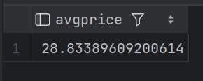

Jedna średnia z wartości unitprice dla całej tabeli products. Grupuje dane.

```sql
select avg(unitprice) over () as avgprice
from products p;
```

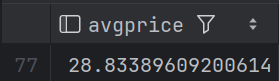

Ta sama średnia z całej tabeli products, ale przez funkcję okienkową jest tyle wierszy ile w products. Nie grupuje danych jak avg().

```sql
select categoryid, avg(unitprice) avgprice
from products p
group by categoryid;
```

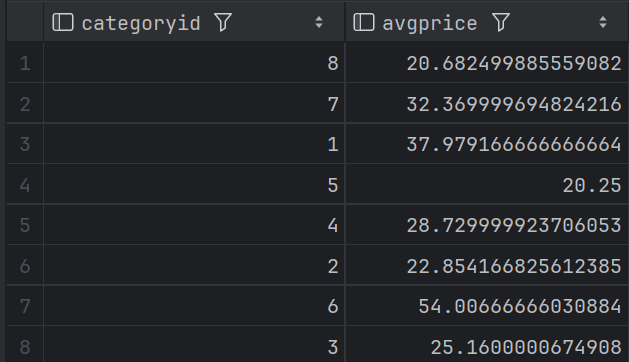

Średnia jest liczona dla każdej kategorii osobno, ale przez grupowanie jest jeden wiersz na jedną kategorię.

```sql
select avg(unitprice) over (partition by categoryid) as avgprice
from products p;
```

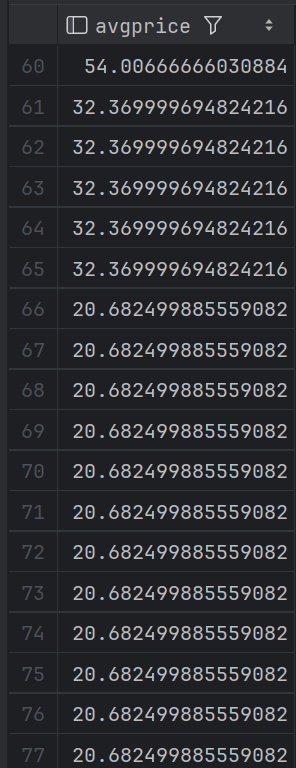

Średnia liczona dla każdej kategorii osobno, ale nie ma grupowania danych, więc jest tyle wierszy, ile w początkowej tabeli products.

---

# Zadanie 2 - obserwacja

Wykonaj i porównaj wyniki następujących poleceń.

```sql
--1)

select p.productid, p.ProductName, p.unitprice,
       (select avg(unitprice) from products) as avgprice
from products p
where productid < 10

--2)
select p.productid, p.ProductName, p.unitprice,
       avg(unitprice) over () as avgprice
from products p
where productid < 10
```

Jaka jest różnica? Czego dotyczy warunek w każdym z przypadków? Napisz polecenie równoważne:

- 1. z wykorzystaniem funkcji okna
- 2. z wykorzystaniem podzapytania

---

> Wyniki:

```sql
select p.productid, p.ProductName, p.unitprice,
       (select avg(unitprice) from products) as avgprice
from products p
where productid < 10
```

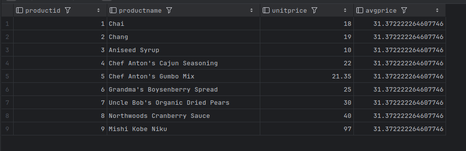

Warunek `WHERE` dotyczy tylko zapytania zewnętrznego, czyli decyduje o tym, które wiersze ostatecznie zostaną zwrócone. Podzapytanie wewnętrzne nie ma żadnego własnego warunku `WHERE`, dlatego średnia jest obliczana dla wszystkich produktów w tabeli.

Polecenie równoważne z wykorzystaniem funkcji okna:

```sql
with avg_all as (
    select productid, productname, unitprice,
           avg(unitprice) over () as avgprice
    from products
)
select * from avg_all
where productid < 10
```

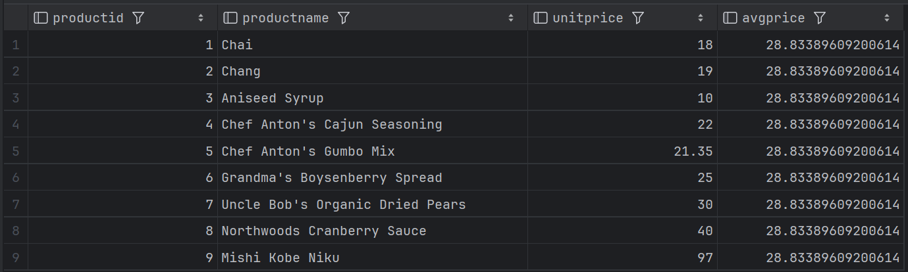

---

```sql
select p.productid, p.ProductName, p.unitprice,
       avg(unitprice) over () as avgprice
from products p
where productid < 10
```

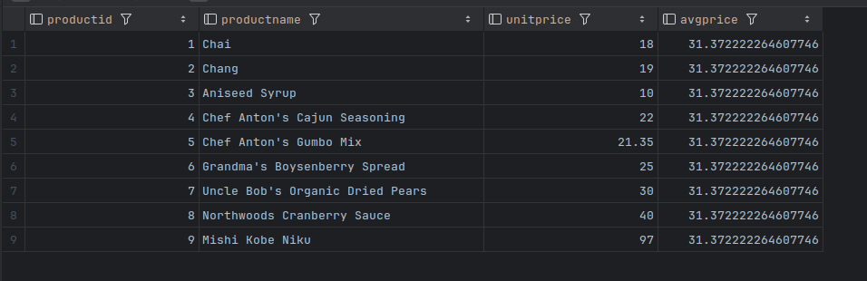

Funkcje okna są obliczane pod sam koniec przetwarzania zapytania, w szczególności po klauzuli `WHERE`, która filtruje wiersze przed uruchomieniem tej funkcji. Dlatego wartość `avgprice` jest tu średnią ceną wyłącznie dla produktów o id mniejszym niż 10.

Polecenie równoważne z wykorzystaniem podzapytania:

```sql
select p.productid, p.ProductName, p.unitprice,
       (select avg(unitprice) from products where productid < 10) as avgprice
from products p
where productid < 10
```

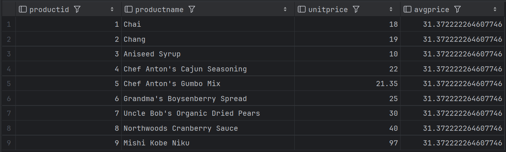

---

# Zadanie 3

Baza: Northwind, tabela: products

Napisz polecenie, które zwraca: id produktu, nazwę produktu, cenę produktu, średnią cenę wszystkich produktów.

Napisz polecenie z wykorzystaniem z wykorzystaniem podzapytania, join'a oraz funkcji okna. Porównaj czasy oraz plany wykonania zapytań.

Przetestuj działanie w różnych SZBD (MS SQL Server, PostgreSql, SQLite)

W SSMS włącz dwie opcje: Include Actual Execution Plan oraz Include Live Query Statistics


W DataGrip użyj opcji Explain Plan/Explain Analyze

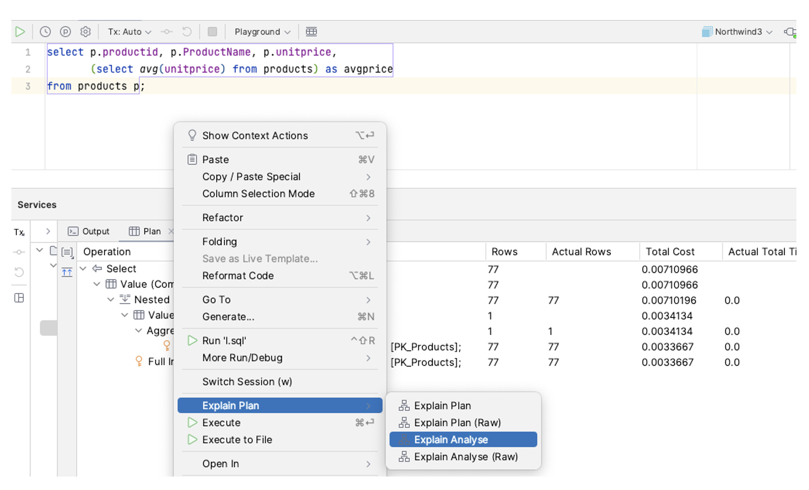


---

> Wyniki:

```sql
--- 1
SELECT
    ProductID,
    ProductName,
    UnitPrice,
    (SELECT AVG(UnitPrice) FROM Products) AS AvgPrice
FROM Products;
```

```sql
--- 2
SELECT
    p.ProductID,
    p.ProductName,
    p.UnitPrice,
    avg_table.AvgPrice
FROM Products p
         CROSS JOIN (
    SELECT AVG(UnitPrice) AS AvgPrice
    FROM Products
) avg_table;
```

```sql
--- 3
SELECT
    ProductID,
    ProductName,
    UnitPrice,
    AVG(UnitPrice) OVER () AS AvgPrice
FROM Products;
```

MS SQL Server

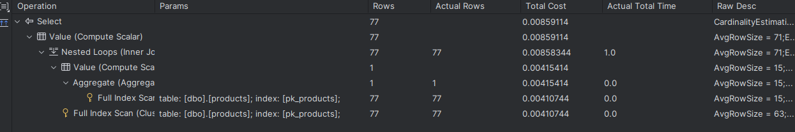
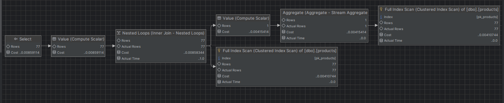

Plan zawiera dwa Full Index Scan na tabeli products. Pierwszy skan odczytuje dane główne, drugi wykonuje agregację w ramach Compute Scalar, obliczając średnią. Wyniki łączone są przez Nested Loops (Inner Join), a na zewnątrz dodatkowy Compute Scalar dołącza wartość średniej do każdego wiersza. Podzapytanie jest więc materializowane jako osobna gałąź planu.

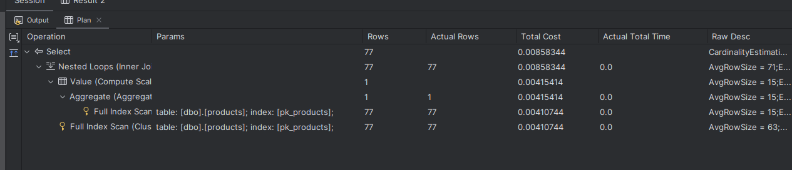
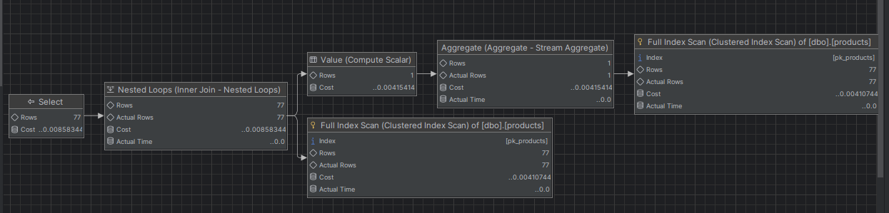

Plan jest podobny do powyższego: dwa Full Index Scan, Stream Aggregate wyliczający średnią, Compute Scalar oraz Nested Loops (Inner Join). SQL Server zoptymalizował oba zapytania do prawie tego samego planu. Różnicą jest brak jednego Compute Scalar, który nie musi występować, bo CROSS JOIN złączy średnią sam.

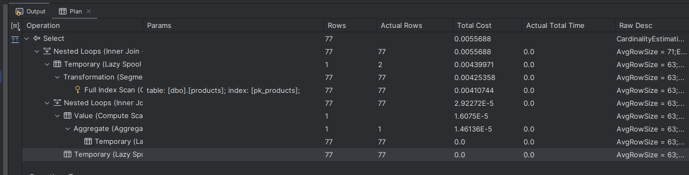
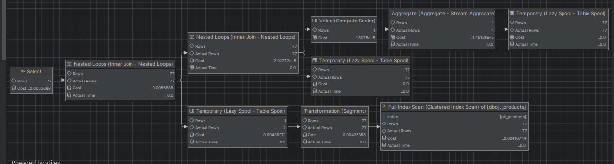

Jeden Full Index Scan odczytuje dane, następnie Transformation (Segment) dzieli wiersze na partycje (tutaj: jedna partycja, to cała tabela), Temporary (Lazy Spool) buforuje dane, a Stream Aggregate wylicza średnią raz z bufora. Wyniki łączone są przez dwa Nested Loops.

Fumkcja okna ma najszybszy czas wykonania, a pozostałe dwa plany są bardzo podobne do siebie przez co też czas wykonania jets prawie identyczny.

PostgreSql

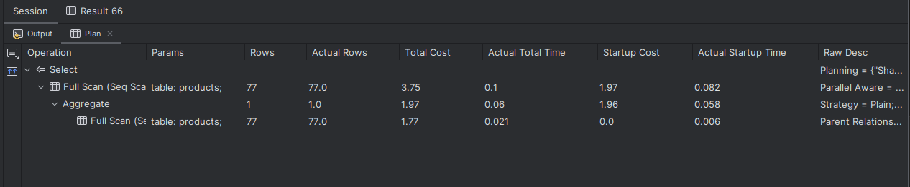
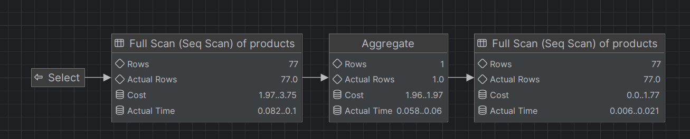

Plan zawiera dwa Full Scan of products. Jeden skan dla zapytania głównego, drugi dla podzapytania wewnątrz Aggregate. Oba potem są łączone.

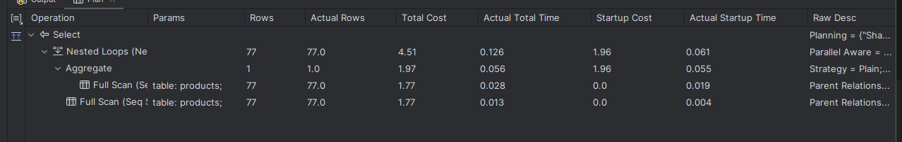
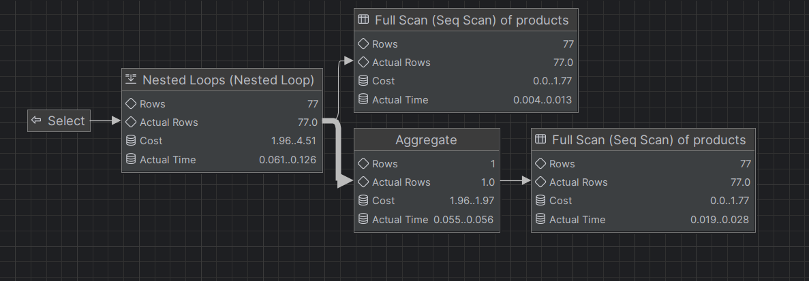

Podobnie jak wyżej: dwa Full Scan of products, jeden pod Aggregate, złączone przez Nested Loop (zagnieżdżone pętle).

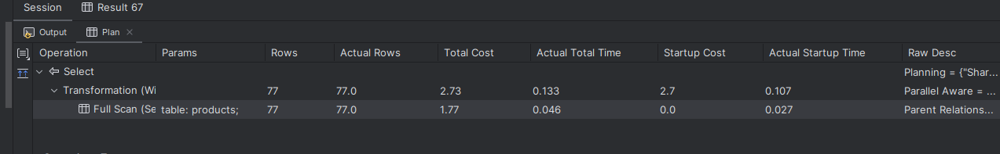
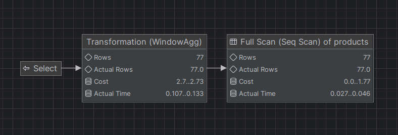

Tabela skanowana tylko raz - WindowAgg oblicza średnią w jednym przebiegu.

Wszystkie wersje mają bardzo zbliżony do siebie czas wykonania.

SQLite

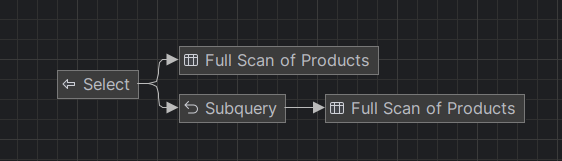

Plan zawiera dwa odczyty tabeli - Full Scan of Products dla zapytania głównego i podzapytania, potem je łączy do jednej tabeli.

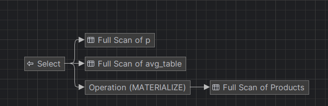

Plan zawiera trzy gałęzie - SQLite materializuje podzapytanie jako tabele tymczasową po przeskanowaniu tabeli Products, odczytuje ją (tymczasową tabele) i znowu wykonuje Full Scan of Products i dokleja wynik z avg_table.

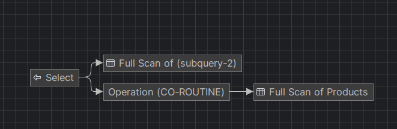

SQLite implementuje funkcję okna jako coroutine - jeden odczyt danych, który oblicza średnią. Zapytanie główne czyta wyniki obliczane przez funkcję okna i je wykorzystuje.

SQLite nie podaje kosztów zapytań.

---

# Zadanie 4

Baza: Northwind, tabela products

Napisz polecenie, które zwraca: id produktu, nazwę produktu, cenę produktu, średnią cenę produktów w kategorii, do której należy dany produkt. Wyświetl tylko pozycje (produkty) których cena jest większa niż średnia cena.

Napisz polecenie z wykorzystaniem podzapytania, join'a oraz funkcji okna. Porównaj zapytania. Porównaj czasy oraz plany wykonania zapytań.

Przetestuj działanie w różnych SZBD (MS SQL Server, PostgreSql, SQLite)

---

> Wyniki:

# Podzapytanie

```sql
select p1.productid, p1.productname, p1.unitprice,
       (select avg(unitprice) from products p2 where p1.categoryid = p2.categoryid) as avgprice
from products p1
where p1.unitprice > (select avg(unitprice) from products p2 where p1.categoryid = p2.categoryid)
```

# Join

```sql
select p.productid, p.productname, p.unitprice, c.avgprice
from products p
join (
    select categoryid, avg(unitprice) as avgprice
    from products
    group by categoryid
) c on p.categoryid = c.categoryid
where p.unitprice > c.avgprice
```

# Funkcja okna

```sql
with avg as (
    select productid, productname, unitprice,
           avg(unitprice) over (partition by categoryid) as avgprice
    from products
)
select productid, productname, unitprice, avgprice
from avg
where unitprice > avgprice
```

# MS SQL Server

## Podzapytanie

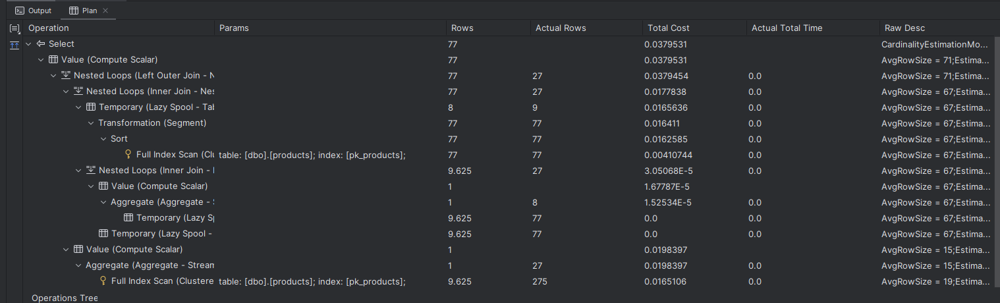
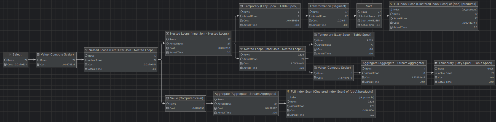

**Koszt**: 0.038

**Czas**: 0.0ms

Plan wykonania dla tego zapytania jest złożony i stosunkowo kosztowny. Wymusza on np. podwójny odczyt tabeli products `Full Index Scan` – dla zapytania głównego i podzapytania. Oznacza to, że silnik bazy danych musiał sięgnąć do tabeli `products` dwa razy, raz żeby pobrać listę produktów i drugi raz, żeby zebrać dane do wyliczenia średnich. Optymalizator częściowo ratuje wydajność, buforując wyliczone średnie dla każdej kategorii w pamięci `Lazy Spool`, by nie liczyć ich wielokrotnie. Czas wykonania to 0.0 ms wyłącznie dzięki małemu rozmiarowi tabeli, wynoszącemu 77 wierszy. Przy dużej ilości danych, duża liczba operacji Nested Loops zapewne drastycznie obniżyłaby wydajność tego zapytania.

## Join

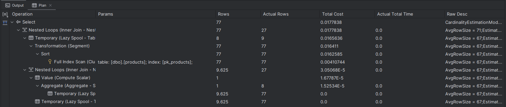
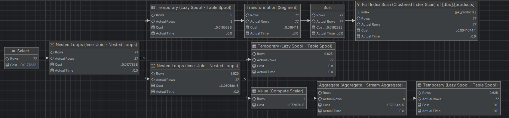

**Koszt**: 0.018

**Czas**: 0.0ms

Plan wykonania dla tego zapytania jest zauważalnie prostszy. Koszt spadł dwuktornie w porównaniu do wersji z podzapytaniem. Najważniejszą różnicą jest to, że silnik bazy danych wykonał tylko jeden odczyt tabeli z dysku `Full Index Scan`. Optymalizator odczytał tabelę products tylko raz, posortował dane i umieścił je w buforze pamięci tymczasowej `Lazy Spool`. Następnie wykorzystał ten bufor do wyliczenia średnich i złączenia danych `Nested Loops`. Czas wykonania to wciąż 0.0 ms ze względu na 77 wierszy w tabeli, jednak wyeliminowanie podwójnego fizycznego skanowania tabeli sprawia, że ta metoda jest bez porównania wydajniejsza i o wiele lepiej poradziłaby sobie przy dużej ilości danych.

## Funkcja okna

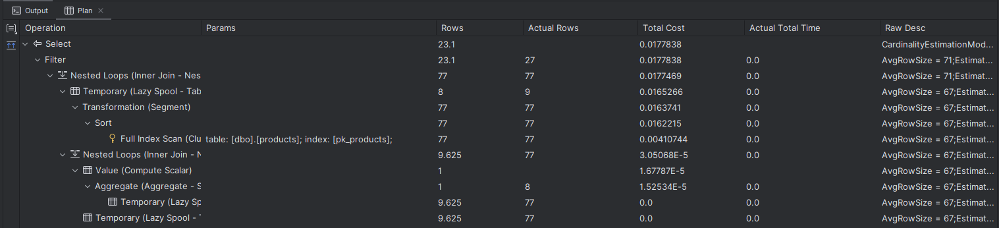
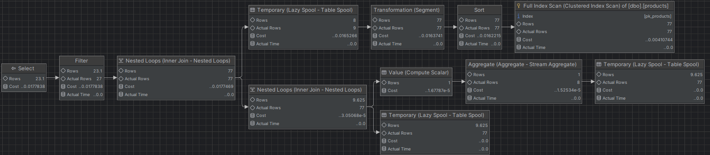

**Koszt**: 0.018

**Czas**: 0.0ms

To podejście okazało się tak samo wydajne jak `JOIN`, plany wykonania wyglądają prawie identycznie. Z planu wykonania wynika, że baza skanuje tabelę products tylko jeden raz, co jest dużą oszczędnością w porównaniu do podzapytania. Baza dzieli dane na segmenty według kategorii, a następnie, zamiast zwijać wiersze jak przy zwykłym grupowaniu, wylicza średnią raz dla każdej kategorii i dopisuje ją do każdego produktu. Na samym końcu nakładany jest filtr, który odrzuca produkty tańsze niż średnia. Dzięki zastosowaniu konstrukcji `WITH`, mamy pewność, że filtr zadziała na już przeliczonych danych, co widać po strukturze drzewa operacji.

---

# PostgreSql

## Podzapytanie

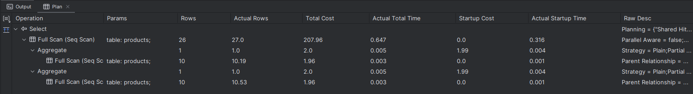
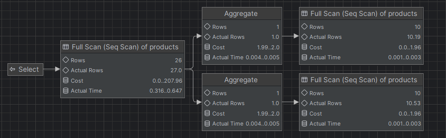

**Koszt**: 207.96

**Czas**: 0.647ms

Z planu wykonania wynika, że to zapytanie jest bardzo nieoptymalne. Główny węzeł wykonuje pełne skanowanie tabeli wiersz po wierszu `Full Scan (Seq Scan)`. Ponieważ podzapytanie zostało użyte w kodzie dwukrotnie (raz w `SELECT`, drugi raz w `WHERE`), diagram rozgałęzia się na dwa osobne tory obliczeniowe, co prowadzi do tego, że dla każdego z 77 odczytanych produktów najpierw od nowa przeszukuje tabelę i liczy średnią dla jego kategorii `Aggregate`, aby sprawdzić warunek z klauzuli `WHERE`. Następnie, jeśli wiersz spełnia warunek, baza zamiast zapamiętać ten wynik, uruchamia drugi tor i liczy dokładnie tę samą średnią od nowa, by wyświetlić ją w `SELECT`. Stąd bierze się tak wysoki koszt całkowity. Choć przy małej tabeli czas wykonania to zaledwie 0.647ms, tego typu struktura zapytania drastycznie obniżyłaby wydajność przy pracy na dużej ilości danych.

## Join

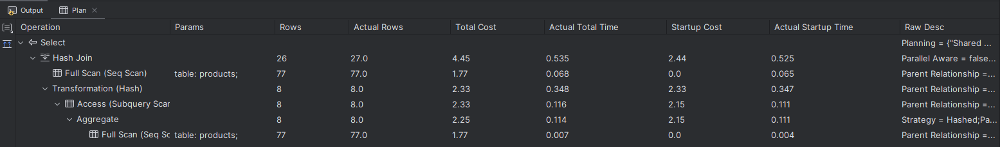
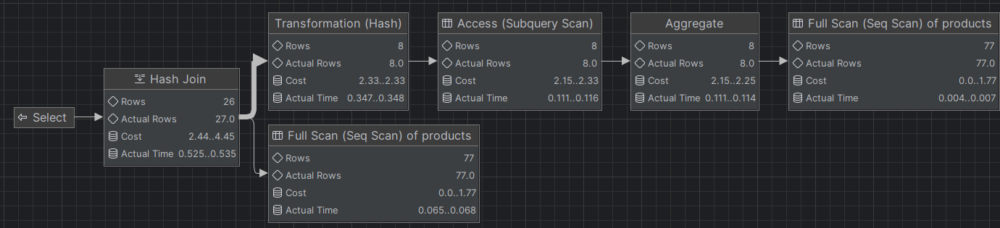

**Koszt**: 4.45

**Czas**: 0.535ms

Zastosowanie złączenia `JOIN` z grupowaniem zoptymalizowało zapytanie, redukując koszt całkowity z 207.96 do zaledwie 4.45. Z planu wykonania wynika, operacja dzieli się na dwa etapy. Najpierw baza jednokrotnie wylicza średnie dla poszczególnych kategorii `Aggregate` i umieszcza je w pamięci operacyjnej `Transformation (Hash)`. Następnie wykonuje pojedynczy odczyt wszystkich produktów i łączy je z obliczonymi wcześniej średnimi za pomocą operatora `Hash Join`. Takie podejście eliminuje problem wielokrotnego skanowania tabeli i powtarzania tych samych obliczeń, co czyni zapytanie wydajnym.

## Funkcja okna

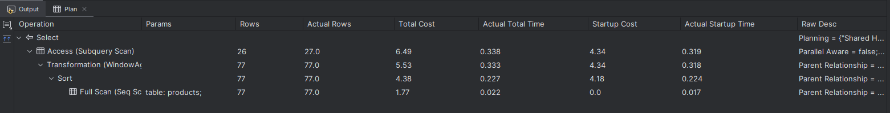
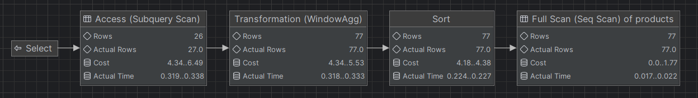

**Koszt**: 6.49

**Czas**: 0.338ms

Plan wykonania dla funkcji okna ma strukturę w pełni liniową, bez żadnych rozgałęzień. Baza danych wykonuje skanowanie tabeli `Seq Scan`, a następnie sortuje dane według ID kategorii `Sort`. Na tak posortowanym zbiorze uruchamiany jest operator `WindowAgg`, który wylicza średnie dla poszczególnych kategorii. Cały, przeliczony zestaw danych przekazywany jest wyżej `Subquery Scan`, gdzie następuje końcowe filtrowanie odrzucające produkty poniżej średniej. Choć koszt całkowity `6.49` jest minimalnie wyższy niż w przypadku złączenia `4.45`, rozwiązanie to pozostaje wysoce optymalne, eliminując konieczność wielokrotnego skanowania tabeli.

---

# SQLite

## Podzapytanie

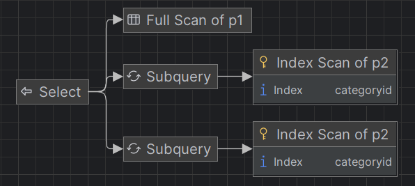

Z planu wynika, że zapytanie jest nieoptymalne. Baza wykonuje pełne skanowanie tabeli głównej `Full Scan of p1`, a następnie dla każdego odczytanego wiersza uruchamia dwa oddzielne podzapytania `Subquery`. Chociaż SQLite optymalizuje te podzapytania używając indeksu `Index Scan of p2 na categoryid`, to konieczność ciągłego powtarzania tych samych obliczeń sprawia, że rozwiązanie to jest bardzo niewydajne.

## Join

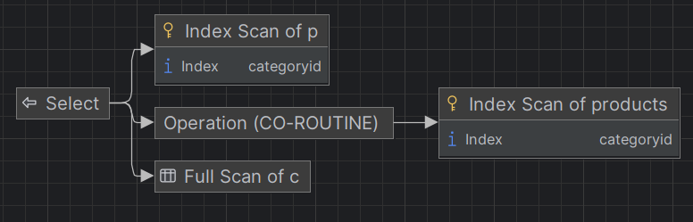

Z planu wynika, że zastosowanie złączenia `JOIN` znacząco optymalizuje działanie bazy. SQLite wydziela obliczanie średnich do operacji `Operation (CO-ROUTINE)`, grupując dane przy pomocy indeksu `Index Scan of products`. Wynik tych obliczeń traktowany jest jako tymczasowy zbiór `Full Scan of c`, który następnie jest łączony z główną tabelą produktów, co również wspiera indeks `Index Scan of p`. Dzięki temu baza liczy średnie tylko raz dla każdej kategorii.

## Funkcja okna

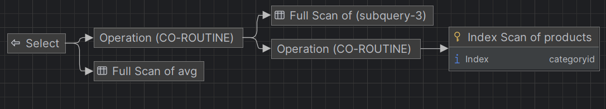

Z planu wykonania wynika, że SQLite radzi sobie z funkcją okna bardzo sprawnie. Najpierw baza wykorzystuje indeks `Index Scan of products`, aby szybko pogrupować produkty według kategorii i policzyć dla nich średnie. Cały ten przeliczony zbiór danych (pochodzący z klauzuli WITH) jest tymczasowo zapisywany w pamięci jako wirtualna tabela `avg`. W drugim kroku zapytanie główne wykonuje już tylko jeden, prosty odczyt tej gotowej tabeli `Full Scan of avg` odrzucając te produkty, których cena jest niższa lub równa wyliczonej średniej.

---

# Zadanie 5

Oryginalna baza Northwind jest bardzo mała. Warto zaobserwować działanie na nieco większym zbiorze danych.

Baza Northwind3 zawiera dodatkową tabelę product_history

- 2,2 mln wierszy

Bazę Northwind3 można pobrać z moodle (zakładka - Backupy baz danych)

Można też wygenerować tabelę product_history przy pomocy skryptu

Skrypt dla SQL Srerver

Stwórz tabelę o następującej strukturze:

```sql
create table product_history(
   id int identity(1,1) not null,
   productid int,
   productname varchar(40) not null,
   supplierid int null,
   categoryid int null,
   quantityperunit varchar(20) null,
   unitprice decimal(10,2) null,
   quantity int,
   value decimal(10,2),
   date date,
 constraint pk_product_history primary key clustered
    (id asc )
)
```

Wygeneruj przykładowe dane:

Dla 30000 iteracji, tabela będzie zawierała nieco ponad 2mln wierszy (dostostu ograniczenie do możliwości swojego komputera)

Skrypt dla SQL Srerver

```sql
declare @i int
set @i = 1
while @i <= 30000
begin
    insert product_history
    select productid, ProductName, SupplierID, CategoryID,
         QuantityPerUnit,round(RAND()*unitprice + 10,2),
         cast(RAND() * productid + 10 as int), 0,
         dateadd(day, @i, '1940-01-01')
    from products
    set @i = @i + 1;
end;

update product_history
set value = unitprice * quantity
where 1=1;
```

Skrypt dla Postgresql

```sql
create table product_history(
   id int generated always as identity not null
       constraint pkproduct_history
            primary key,
   productid int,
   productname varchar(40) not null,
   supplierid int null,
   categoryid int null,
   quantityperunit varchar(20) null,
   unitprice decimal(10,2) null,
   quantity int,
   value decimal(10,2),
   date date
);
```

Wygeneruj przykładowe dane:

Skrypt dla Postgresql

```sql
do $$
begin
  for cnt in 1..30000 loop
    insert into product_history(productid, productname, supplierid,
           categoryid, quantityperunit,
           unitprice, quantity, value, date)
    select productid, productname, supplierid, categoryid,
           quantityperunit,
           round((random()*unitprice + 10)::numeric,2),
           cast(random() * productid + 10 as int), 0,
           cast('1940-01-01' as date) + cnt
    from products;
  end loop;
end; $$;

update product_history
set value = unitprice * quantity
where 1=1;
```

Wykonaj polecenia: `select count(*) from product_history`, potwierdzające wykonanie zadania

---

> Wyniki:

SQL Srerver

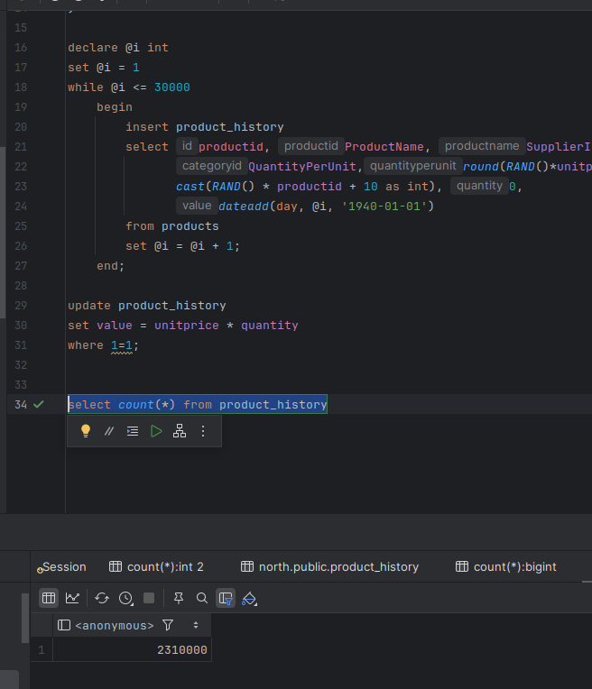

Postgresql

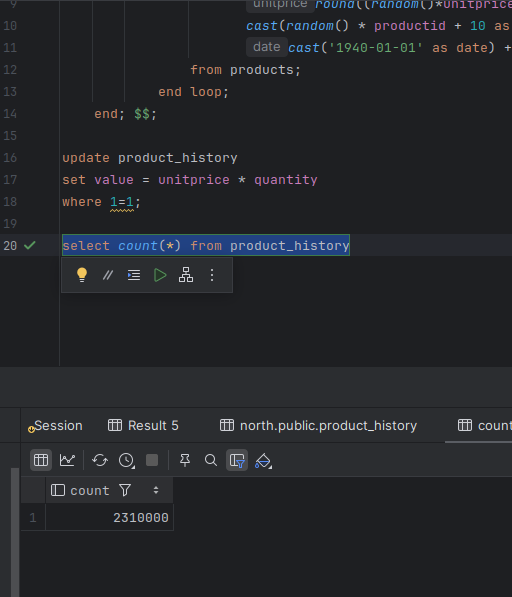

O wiele dłużej polecenie wykonywało się w sql serwerze (pare minut) niż w postgresie (pare sekund).

# Zadanie 6

Baza: Northwind, tabela product_history

Napisz polecenie, które zwraca: id pozycji, id produktu, nazwę produktu, id_kategorii, cenę produktu, średnią cenę produktów w kategorii do której należy dany produkt. Wyświetl tylko pozycje (produkty) których cena jest większa niż średnia cena.

W przypadku długiego czasu wykonania ogranicz zbiór wynikowy do kilkuset/kilku tysięcy wierszy

pomocna może być konstrukcja `with`

```sql
with t as (

....
)
select * from t
where id between ....
```

Napisz polecenie z wykorzystaniem podzapytania, join'a oraz funkcji okna. Porównaj zapytania. Porównaj czasy oraz plany wykonania zapytań.

Przetestuj działanie w różnych SZBD (MS SQL Server, PostgreSql, SQLite)

---

> Wyniki:

Zgodnie z poleceniem ograniczono analizowany zbiór do 10 000 wierszy za pomocą klauzuli `WITH`.

# Podzapytanie

```sql
with t as (select * from product_history where id between 1 and 10000)
select t1.id,
       t1.productid,
       t1.productname,
       t1.categoryid,
       t1.unitprice,
       (select avg(unitprice) from t t2 where t1.categoryid = t2.categoryid) as avgprice
from t t1
where t1.unitprice > (select avg(unitprice) from t t2 where t1.categoryid = t2.categoryid)
```

# Join

```sql
with t as (select * from product_history where id between 1 and 10000)
select t.id,
       t.productid,
       t.productname,
       t.categoryid,
       t.unitprice,
       c.avgprice
from t
         join (select categoryid, avg(unitprice) as avgprice
               from t
               group by categoryid) as c on t.categoryid = c.categoryid
where t.unitprice > c.avgprice
```

# Funkcja okna

```sql
with t as (select * from product_history where id between 1 and 10000),
     t_avg as (select id,
                      productid,
                      productname,
                      categoryid,
                      unitprice,
                      avg(unitprice) over (partition by categoryid) as avgprice
               from t)
select id, productid, productname, categoryid, unitprice, avgprice
from t_avg
where unitprice > avgprice
```

# MS SQL Server

## Podzapytanie

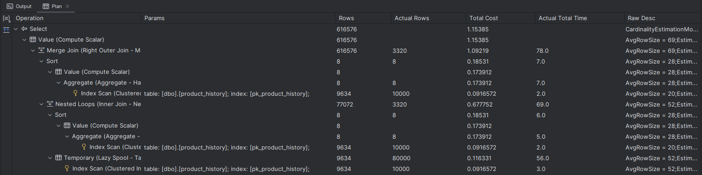
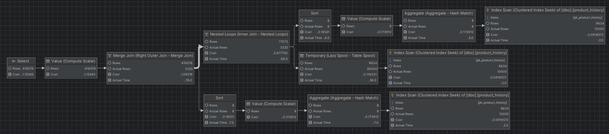

**Koszt**: 1.154

**Czas**: 77ms

## Join

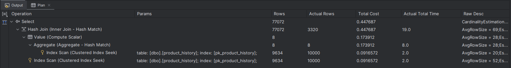
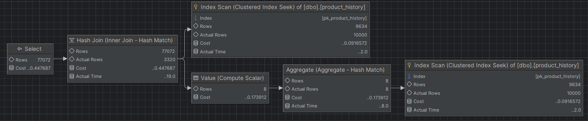

**Koszt**:

**Czas**: ms

## Funkcja okna

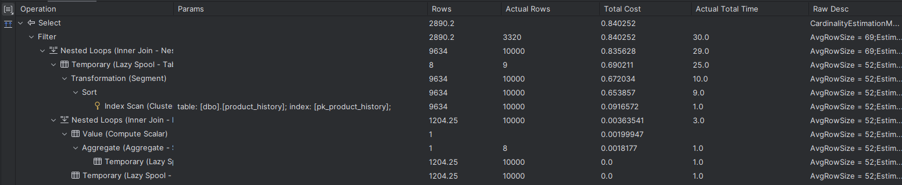
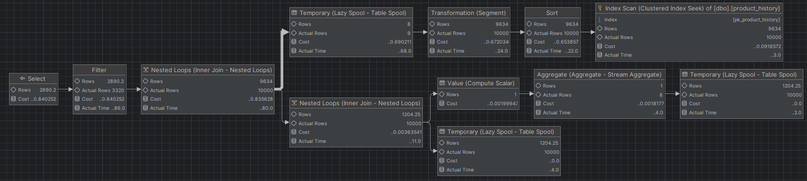

**Koszt**:

**Czas**: ms

---

# PostgreSql

## Podzapytanie

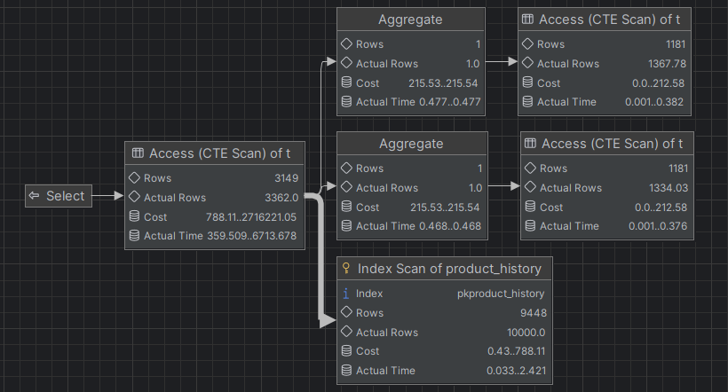
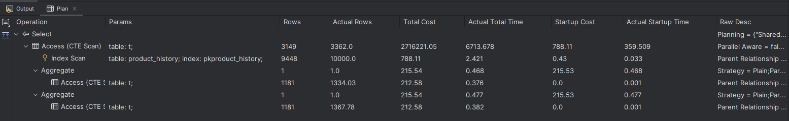

**Koszt**:

**Czas**: ms

## Join

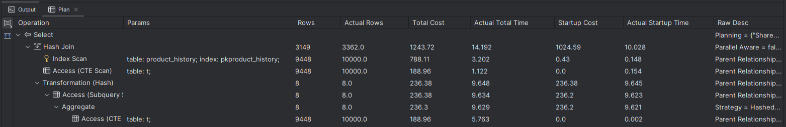
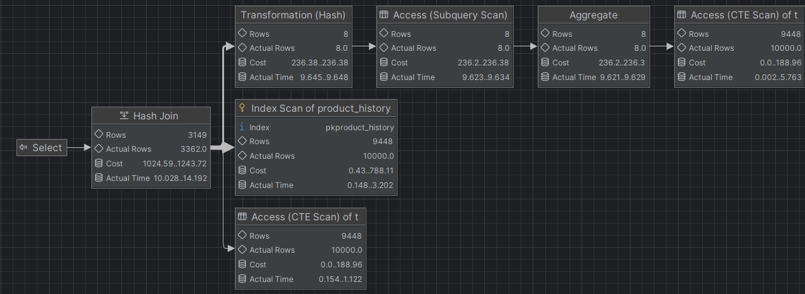

**Koszt**:

**Czas**: ms

## Funkcja okna

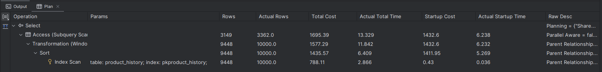
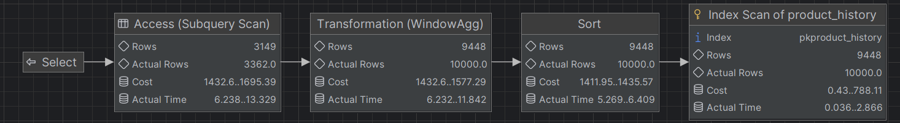

**Koszt**:

**Czas**: ms

---

# SQLite

## Podzapytanie

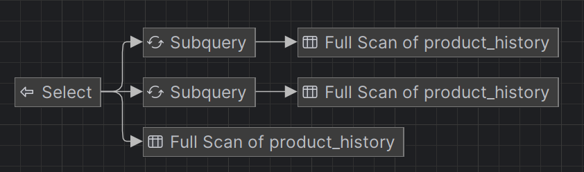

## Join

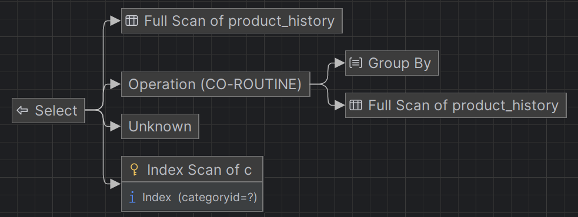

## Funkcja okna

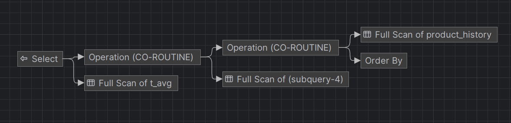

---

|         |     |
| ------- | --- |
| zadanie | pkt |
| 1       | 1   |
| 2       | 1   |
| 3       | 1   |
| 4       | 1   |
| 5       | 1   |
| 6       | 2   |
| razem:  | 7   |
