## SQL - Funkcje okna (Window functions) <br> Lab 2

---

**Imiona i nazwiska:**
Karolina Węgrzyn, Patrycja Markiewicz

---

Celem ćwiczenia jest zapoznanie się z działaniem funkcji okna (window functions) w SQL, analiza wydajności zapytań i porównanie z rozwiązaniami przy wykorzystaniu "tradycyjnych" konstrukcji SQL

Swoje odpowiedzi wpisuj w miejsca oznaczone jako:

---

> Wyniki:

```sql
--  ...
```

---

### Ważne/wymagane są komentarze.

Zamieść kod rozwiązania oraz zrzuty ekranu pokazujące wyniki, (dołącz kod rozwiązania w formie tekstowej/źródłowej)

Zwróć uwagę na formatowanie kodu

---

## Oprogramowanie - co jest potrzebne?

Do wykonania ćwiczenia potrzebne jest następujące oprogramowanie:

- MS SQL Server - wersja 2019, 2022
- PostgreSQL - wersja 15/16/17
- SQLite
- Narzędzia do komunikacji z bazą danych
  - SSMS - Microsoft SQL Managment Studio
  - DtataGrip lub DBeaver
- Przykładowa baza Northwind/Northwind3
  - W wersji dla każdego z wymienionych serwerów

Oprogramowanie dostępne jest na przygotowanej maszynie wirtualnej

## Dokumentacja/Literatura

- Kathi Kellenberger,  Clayton Groom, Ed Pollack, Expert T-SQL Window Functions in SQL Server 2019, Apres 2019
- Itzik Ben-Gan, T-SQL Window Functions: For Data Analysis and Beyond, Microsoft 2020

- Kilka linków do materiałów które mogą być pomocne
   - [https://learn.microsoft.com/en-us/sql/t-sql/queries/select-over-clause-transact-sql?view=sql-server-ver16](https://learn.microsoft.com/en-us/sql/t-sql/queries/select-over-clause-transact-sql?view=sql-server-ver16)
  - [https://www.sqlservertutorial.net/sql-server-window-functions/](https://www.sqlservertutorial.net/sql-server-window-functions/)
  - [https://www.sqlshack.com/use-window-functions-sql-server/](https://www.sqlshack.com/use-window-functions-sql-server/)
  - [https://www.postgresql.org/docs/current/tutorial-window.html](https://www.postgresql.org/docs/current/tutorial-window.html)
  - [https://www.postgresqltutorial.com/postgresql-window-function/](https://www.postgresqltutorial.com/postgresql-window-function/)
  - [https://www.sqlite.org/windowfunctions.html](https://www.sqlite.org/windowfunctions.html)
  - [https://www.sqlitetutorial.net/sqlite-window-functions/](https://www.sqlitetutorial.net/sqlite-window-functions/)

- W razie potrzeby - opis Ikonek używanych w graficznej prezentacji planu zapytania w SSMS jest tutaj:
  - [https://docs.microsoft.com/en-us/sql/relational-databases/showplan-logical-and-physical-operators-reference](https://docs.microsoft.com/en-us/sql/relational-databases/showplan-logical-and-physical-operators-reference)

## Przygotowanie

Uruchom SSMS
- Skonfiguruj połączenie z bazą Northwind na lokalnym serwerze MS SQL 

Uruchom DataGrip (lub Dbeaver)

- Skonfiguruj połączenia z bazą Northwind3
  - na lokalnym serwerze MS SQL
  - na lokalnym serwerze PostgreSQL
  - z lokalną bazą SQLite

Można też skorzystać z innych narzędzi klienckich (wg własnego uznania)

Oryginalna baza Northwind jest bardzo mała. Warto zaobserwować działanie na nieco większym zbiorze danych.

Korzystamy ze "zmodyfikowanej wersji" bazy northwind

Baza Northwind3 zawiera dodatkową tabelę product_history

- 2,2 mln wierszy

Bazę Northwind3 można pobrać z moodle (zakładka - Backupy baz danych)

# Zadanie 1

Funkcje rankingu, `row_number()`, `rank()`, `dense_rank()`

```sql
select productid, productname, unitprice, categoryid,
    row_number() over(partition by categoryid order by unitprice desc) as rowno,
    rank() over(partition by categoryid order by unitprice desc) as rankprice,
    dense_rank() over(partition by categoryid order by unitprice desc) as denserankprice
from products;
```

Wykonaj polecenie, zaobserwuj wynik. Porównaj funkcje row_number(), rank(), dense_rank(). Skomentuj wyniki.

Spróbuj uzyskać ten sam wynik bez użycia funkcji okna

Do analizy użyj wybranego systemu/bazy danych - wybierz MS SQLserver, Postgres lub SQLite)

---

> Wyniki:

**MS SQL Server**

```sql
select productid, productname, unitprice, categoryid,
    row_number() over(partition by categoryid order by unitprice desc) as rowno,
    rank() over(partition by categoryid order by unitprice desc) as rankprice,
    dense_rank() over(partition by categoryid order by unitprice desc) as denserankprice
from products;
```

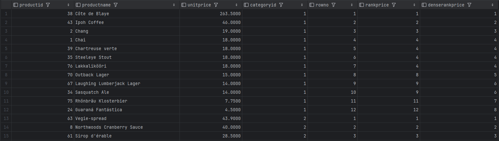

Tabela jest dzielona na okna dla każdej kategorii, a wewnątrz każdej grupy produkty zostaja posortowane malejąco po cenie.

Funkcja `row_number()` zwraca kolejne, unikalne liczby całkowite, ignorując remisy, dlatego wynikiem działania tej funkcji są cyfry od 1 do liczby unikalnych produktó w kategorii.

Funkcja `rank()` nadaje kolejne pozycje, ale uwzględniając remisy. Na powyższym screenie możemy zauważyć, że 4 produkty mają przyporządkowane miejsce 4. Co istotne, następny element po remisie w przypadku tej funkcji nie jest kolejną liczbą porządkową, tylko liczbą, która pomija tyle miejsc, ile wierszy współdzieliło poprzednią pozycję - dlatego w tym konkretnym przypadku jest to wartość 8.

Funkcja `dense_rank()` podobnie jak `rank()`, uwzględnia remisy, ale nie tworzy luk w numeracji. Czyli po czterech produktach remisujących na miejscu 4, następny w kolejności produkt otrzymuje miejsce 5, czyli kolejną liczbę porządkowa.

---

Polecenie równoważne bez użycia funkcji okna.

```sql
select
    productid,
    productname,
    unitprice,
    categoryid,

    (select count(*) + 1
     from products p2
     where p2.categoryid = p1.categoryid
       and (p2.unitprice > p1.unitprice
                or (p2.unitprice = p1.unitprice
                        and p2.productid < p1.productid))
    ) as rowno,

    (select count(*) + 1
    from products p2
    where p2.categoryid = p1.categoryid
      and p2.unitprice > p1.unitprice
    ) as rankprice,

    (select count(distinct p2.unitprice) + 1
     from products p2
     where p2.categoryid = p1.categoryid
       and p2.unitprice > p1.unitprice
     ) as denserankprice

from products p1
order by p1.categoryid, rowno
```

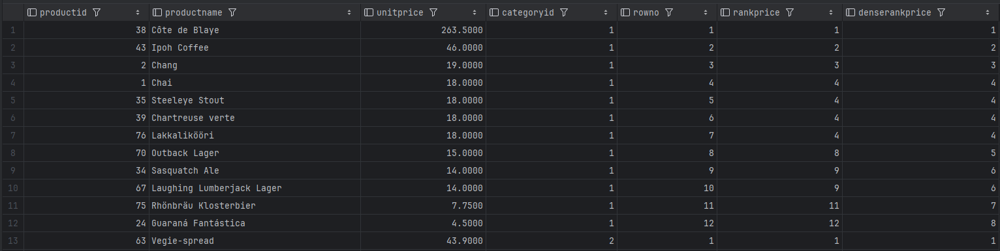

Jak widać wynik jest taki sam jak w przypadku funkcji okna.

| Metoda       | Koszt | Czas (ms) |
| :----------- | :---- | :-------- |
| Podzapytania | 0.964 | 2.0       |
| Funkcje okna | 0.016 | 0.0       |

Wersja z podzapytaniami jest wielokrotnie droższa dla silnika bazy danych ponieważ przy podzapytaniach baza musi przeliczać całą tabelę dla każdego pojedynczego wiersza. Funkcje okna wypadają dużo lepiej.

---

# Zadanie 2

Baza: Northwind, tabela product_history

Dla każdego produktu, podaj 4 najwyższe ceny tego produktu w danym roku. Zbiór wynikowy powinien zawierać:

- rok
- id produktu
- nazwę produktu
- cenę
- datę (datę uzyskania przez produkt takiej ceny)
- pozycję w rankingu

- Uporządkuj wynik wg roku, nr produktu, pozycji w rankingu

W przypadku długiego czasu wykonania ogranicz zbiór wynikowy.

Spróbuj uzyskać ten sam wynik bez użycia funkcji okna, porównaj wyniki, czasy i plany zapytań (koszty).

Przetestuj działanie w różnych SZBD (MS SQL Server, PostgreSql, SQLite)

---

> Wyniki:

```sql
;WITH rankedprices AS (
    SELECT
        YEAR(date) as year,
        productid,
        productname,
        unitprice,
        date,
        ROW_NUMBER() OVER (
            PARTITION BY productid, YEAR(date)
            ORDER BY unitprice DESC
            ) AS ranknumber
    FROM product_history
)
SELECT * FROM rankedprices
WHERE ranknumber <= 4
ORDER BY year, productid, ranknumber;
```

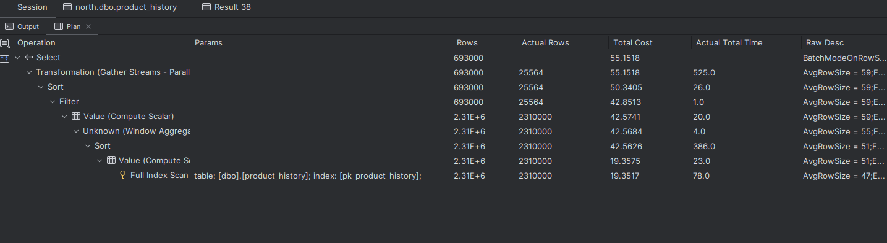

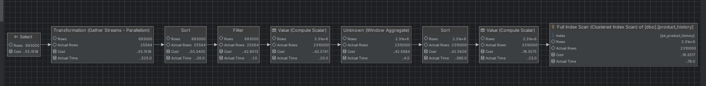

```sql
SELECT
    ph1.year,
    ph1.productid,
    ph1.productname,
    ph1.unitprice,
    ph1.date,
    (
        SELECT COUNT(*)
        FROM product_history ph2
        WHERE ph2.productid = ph1.productid
          AND YEAR(ph2.date) = ph1.year
          AND ph2.unitprice >= ph1.unitprice
    ) AS ranknumber
FROM (
         SELECT
             productid,
             YEAR(date) AS year,
             unitprice,
             productname,
             date
         FROM product_history
     ) ph1
WHERE (
          SELECT COUNT(*)
          FROM product_history ph2
          WHERE ph2.productid = ph1.productid
            AND YEAR(ph2.date) = ph1.year
            AND ph2.unitprice > ph1.unitprice
      ) < 4
ORDER BY ph1.year, ph1.productid, ranknumber;
```

Dla całego zbioru danych udało się tylko uzyskać wyniki dla funkcji okna:

- Total Cost: 55.1518
- Actual Total Time: 525.0

Drugi sposób jest bardzo nieefektywny - nie udało się uzyskać wyniku zapytania. Wyniki pomiędzy dwoma sposobami porównamy tylko dla jednego wybranego roku, tj. 1997.

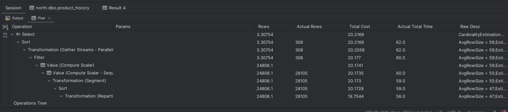

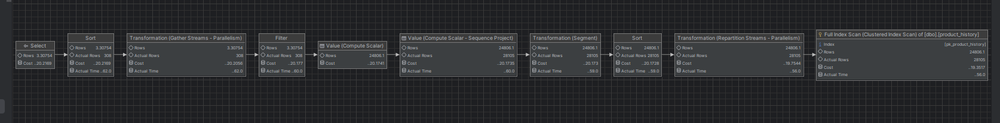

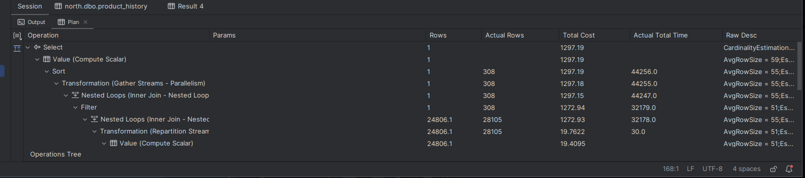

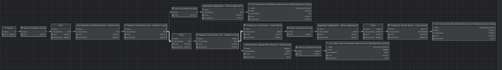

| Metoda           | Koszt   | Czas (ms) |
| :--------------- | :------ | :-------- |
| Funkcje okna     | 20.2169 | 62.0      |
| Bez funkcji okna | 1297.19 | 44256.0   |

Dla tak ograniczonych danych już możemy zauważyć ogromną różnicę w czasie i koszcie wykonania tych zapytań.

---

# Zadanie 3

Funkcje `lag()`, `lead()`

Wykonaj polecenia, zaobserwuj wynik. Jak działają funkcje `lag()`, `lead()`

```sql
select productid, productname, categoryid, date, unitprice,
       lag(unitprice) over (partition by productid order by date)
as previousprodprice,
       lead(unitprice) over (partition by productid order by date)
as nextprodprice
from product_history
where productid = 1 and year(date) = 2022
order by date;

with t as (select productid, productname, categoryid, date, unitprice,
                  lag(unitprice) over (partition by productid
order by date) as previousprodprice,
                  lead(unitprice) over (partition by productid
order by date) as nextprodprice
           from product_history
           )
select * from t
where productid = 1 and year(date) = 2022
order by date;
```

Jak działają funkcje `lag()`, `lead()`?

Spróbuj uzyskać ten sam wynik bez użycia funkcji okna

Do analizy użyj wybranego systemu/bazy danych - wybierz MS SQLserver, Postgres lub SQLite)

---

> Wyniki:

**MS SQL Server**

Funkcja `lag()` (opóźnienie) pobiera wartość z poprzedniego wiersza w określonym oknie.
Funkcja `lead()` (wyprzedzenie) pobiera wartość z następnego wiersza w określonym oknie.
Domyślnie obie funkcje przeskakują o 1 wiersz, ale można ten parametr zmienić. Jeśli poprzedniego lub następnego wiersza nie ma to funkcja zwróci NULL.

```sql
select productid, productname, categoryid, date, unitprice,
       lag(unitprice) over (partition by productid order by date)
as previousprodprice,
       lead(unitprice) over (partition by productid order by date)
as nextprodprice
from product_history
where productid = 1 and year(date) = 2022
order by date;
```

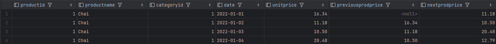
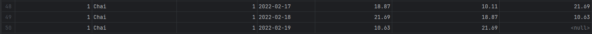

Wartości NULL na skrajnych pozycjach wynikają z faktu, że baza najpierw odfiltrowuje dane zostawiając tylko 2022 rok, a dopiero na tak przycietym zbiorze uruchamia funkcje okna. Z tego powodu funkcja `lag()` w pierwszym wierszu nie widzi odciętych danych z 2021 roku i musi zwrócić wartość pustą. Z kolei w ostatnim wierszu funkcja `lead()` nie ma już dostępu do rekordów z 2023 roku, co analogicznie skutkuje wynikiem NULL.

```sql
with t as (select productid, productname, categoryid, date, unitprice,
                  lag(unitprice) over (partition by productid
order by date) as previousprodprice,
                  lead(unitprice) over (partition by productid
order by date) as nextprodprice
           from product_history
           )
select * from t
where productid = 1 and year(date) = 2022
order by date;
```

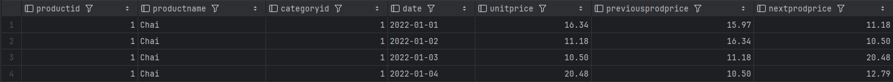
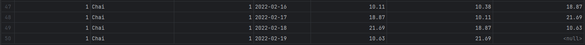

W zapytaniu z klauzulą WITH funkcje okna obliczane są dla całego `product_history` jeszcze przed nałożeniem filtru na rok 2022. Dzięki temu funkcja `lag()` w pierwszym wierszu poprawnie zaciąga cenę z końca 2021 roku, która była dostępna przed filtrowaniem. Z kolei NULL dla funkcji `lead()` w ostatnim wierszu wynika wyłącznie z faktu, ze w samej tabeli fizycznie brakuje danych z 2023 roku, z których można by pobrać kolejną wartość.

Zapytanie równoważne bez użycia funkcji okna.

```sql
select
    p1.productid,
    p1.productname,
    p1.categoryid,
    p1.date,
    p1.unitprice,

    (select top 1 p2.unitprice
     from product_history p2
     where p2.productid = p1.productid
       and p2.date < p1.date
     order by p2.date desc
     ) as previousprodprice,

    (select top 1 p3.unitprice
     from product_history p3
     where p3.productid = p1.productid
       and p3.date > p1.date
     order by p3.date asc
     ) as nextprodprice

from product_history p1
where p1.productid = 1
  and YEAR(p1.date) = 2022
order by p1.date;
```

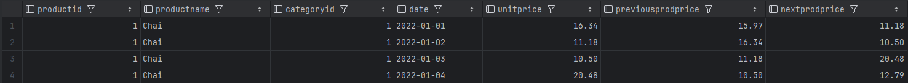
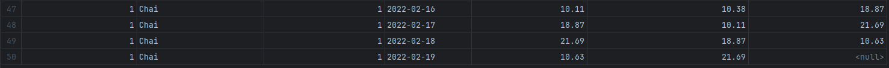

Wynik tego zapytania jest dokładnie taki sam jak w przypadku zapytania z klauzulą WITH i funkcjami okna.

| Metoda                              | Koszt   | Czas (ms) |
| :---------------------------------- | :------ | :-------- |
| Funkcje okna (bezpośrednio z WHERE) | 19.3605 | 18.0      |
| Funkcje okna (w klauzuli WITH)      | 20.1186 | 105.0     |
| Bez funkcji okna                    | 204.898 | 1151.0    |

Wydajność zależy od momentu filtrowania danych. Bezpośrednie użycie funkcji okna jest najszybsze, bo silnik działa na już przyciętym zbiorze, podczas gdy klauzula WITH zmusza go do wcześniejszego przetworzenia całej historii. Z kolei podzapytania bez funkcji okna są skrajnie nieefektywne, ponieważ wymuszaja wielokrotne skanowanie tabeli wiersz po wierszu

---

# Zadanie 4

Baza: Northwind, tabele customers, orders, order details

Napisz polecenie które wyświetla inf. o zamówieniach

Zbiór wynikowy powinien zawierać:

- nazwę klienta, nr zamówienia,
- datę zamówienia,
- wartość zamówienia (wraz z opłatą za przesyłkę),
- nr poprzedniego zamówienia danego klienta,
- datę poprzedniego zamówienia danego klienta,
- wartość poprzedniego zamówienia danego klienta.

Do analizy użyj wybranego systemu/bazy danych - wybierz MS SQLserver, Postgres lub SQLite)

---

> Wyniki:

```sql
;WITH ordervalues as (
    SELECT
        o.orderid,
        o.customerid,
        o.orderdate,
        SUM(od.unitprice * od.quantity * (1 - od.discount)) + o.freight AS ordertotal
    FROM orders o
    JOIN orderdetails od ON o.orderid = od.orderid
    GROUP BY o.orderid, o.customerid, o.orderdate, o.freight
)
SELECT
    c.companyname as clientname,
    ov.orderid,
    ov.orderdate,
    ov.ordertotal,
    LAG(ov.orderid) OVER (PARTITION BY ov.customerid ORDER BY ov.orderdate) AS previousorderid,
    LAG(ov.orderdate) OVER (PARTITION BY ov.customerid ORDER BY ov.orderdate) AS previousorderdate,
    LAG(ov.ordertotal) OVER (PARTITION BY ov.customerid ORDER BY ov.orderdate) AS previousordertotal
FROM ordervalues ov
JOIN customers c ON ov.customerid = c.customerid
ORDER BY c.companyname, ov.orderdate;
```

---

# Zadanie 5

Funkcje `first_value()`, `last_value()`

Baza: Northwind, tabele customers, orders, order details

Wykonaj polecenia, zaobserwuj wynik. Jak działają funkcje `first_value()`, `last_value()`.

Skomentuj uzyskane wyniki. Czy funkcja `first_value` pokazuje w tym przypadku najdroższy produkt w danej kategorii, czy funkcja `last_value()` pokazuje najtańszy produkt?

Co jest przyczyną takiego działania funkcji `last_value`.

Co trzeba zmienić żeby funkcja last_value pokazywała najtańszy produkt w danej kategorii?

Do analizy użyj wybranego systemu/bazy danych - wybierz MS SQLserver, Postgres lub SQLite)

```sql
select productid, productname, unitprice, categoryid,
    first_value(productname) over (partition by categoryid
order by unitprice desc) first,
    last_value(productname) over (partition by categoryid
order by unitprice desc) last
from products
order by categoryid, unitprice desc;
```

---

> Wyniki:

```sql
--  ...
```

---

# Zadanie 6

Baza: Northwind, tabele orders, order details

Napisz polecenie które wyświetla inf. o zamówieniach

Zbiór wynikowy powinien zawierać:

- Id klienta,
- nr zamówienia,
- datę zamówienia,
- wartość zamówienia (wraz z opłatą za przesyłkę),
- dane zamówienia klienta o najniższej wartości w danym miesiącu
  - nr zamówienia o najniższej wartości w danym miesiącu
  - datę tego zamówienia
  - wartość tego zamówienia
- dane zamówienia klienta o najwyższej wartości w danym miesiącu
  - nr zamówienia o najniższej wartości w danym miesiącu
  - datę tego zamówienia
  - wartość tego zamówienia

Do analizy użyj wybranego systemu/bazy danych - wybierz MS SQLserver, Postgres lub SQLite)

---

> Wyniki:

```sql
;WITH ordervalues as (
    SELECT
        o.orderid,
        o.customerid,
        o.orderdate,
        SUM(od.unitprice * od.quantity * (1 - od.discount)) + o.freight AS ordertotal,
        YEAR(o.orderdate) AS orderyear,
        MONTH(o.orderdate) AS ordermonth
    FROM orders o
    JOIN orderdetails od ON o.orderid = od.orderid
    GROUP BY o.orderid, o.customerid, o.orderdate, o.freight
)
SELECT
    ov.customerid as clientid,
    ov.orderid,
    ov.orderdate,
    ov.ordertotal,
    FIRST_VALUE(ov.orderid) OVER (
        PARTITION BY ov.customerid, ov.orderyear, ov.ordermonth
        ORDER BY ov.ordertotal ASC
        ) AS minorderid,
    FIRST_VALUE(ov.orderdate) OVER (
        PARTITION BY ov.customerid, ov.orderyear, ov.ordermonth
        ORDER BY ov.ordertotal ASC
        ) AS minorderdate,
    FIRST_VALUE(ov.ordertotal) OVER (
        PARTITION BY ov.customerid, ov.orderyear, ov.ordermonth
        ORDER BY ov.ordertotal ASC
        ) AS minordertotal,
    FIRST_VALUE(ov.orderid) OVER (
        PARTITION BY ov.customerid, ov.orderyear, ov.ordermonth
        ORDER BY ov.ordertotal DESC
        ) AS maxorderid,
    FIRST_VALUE(ov.orderdate) OVER (
        PARTITION BY ov.customerid, ov.orderyear, ov.ordermonth
        ORDER BY ov.ordertotal DESC
        ) AS maxorderdate,
    FIRST_VALUE(ov.ordertotal) OVER (
        PARTITION BY ov.customerid, ov.orderyear, ov.ordermonth
        ORDER BY ov.ordertotal DESC
        ) AS maxordertotal
FROM ordervalues ov
ORDER BY ov.customerid, ov.orderyear, ov.ordermonth, ov.orderid;
```

---

# Zadanie 7

Baza: Northwind, tabela product_history

Napisz polecenie które pokaże wartość sprzedaży każdego produktu narastająco od początku każdego miesiąca. Użyj funkcji okna

Zbiór wynikowy powinien zawierać:

- id pozycji
- id produktu
- datę
- wartość sprzedaży produktu w danym dniu
- wartość sprzedaży produktu narastające od początku miesiąca

Spróbuj uzyskać ten sam wynik bez użycia funkcji okna, porównaj wyniki, czasy i plany zapytań (koszty).

Przetestuj działanie w różnych SZBD (MS SQL Server, PostgreSql, SQLite)

---

> Wyniki:

```sql
--  ...
```

---

# Zadanie 8

Wykonaj kilka "własnych" przykładowych analiz.

Czy są jeszcze jakieś ciekawe/przydatne funkcje okna (z których nie korzystałeś w ćwiczeniu)? Spróbuj ich użyć w zaprezentowanych przykładach.

Do analizy użyj wybranego systemu/bazy danych - wybierz MS SQLserver, Postgres lub SQLite)

---

> Wyniki:

Średnia wartości zamówień z ostatnich 5 zamówień klienta.

```sql
SELECT
    o.customerid,
    o.orderid,
    o.orderdate,
    SUM(od.unitprice * od.quantity * (1 - od.discount)) + o.freight AS ordertotal,
    AVG(SUM(od.unitprice * od.quantity * (1 - od.discount)) + o.freight)
        OVER (
            PARTITION BY o.customerid
            ORDER BY o.orderdate
            ROWS BETWEEN 4 PRECEDING AND CURRENT ROW
            ) AS moving_avg
FROM orders o
JOIN orderdetails od ON o.orderid = od.orderid
GROUP BY o.customerid, o.orderid, o.orderdate, o.freight
ORDER BY o.customerid, o.orderdate;
```

CUME_DIST() - procent zamówień mniejszych lub równych danej wartości

Dla każdego zamówienia klienta liczymy pozycję zamówienia w procentach w stosunku do wszystkich zamówień tego klienta.

```sql
SELECT
    o.customerid,
    o.orderid,
    o.orderdate,
    SUM(od.unitprice * od.quantity * (1 - od.discount)) + o.freight AS ordertotal,
    CUME_DIST() OVER (
        PARTITION BY o.customerid
        ORDER BY SUM(od.unitprice * od.quantity * (1 - od.discount)) + o.freight
        ) AS percent_rank
FROM orders o
JOIN orderdetails od ON o.orderid = od.orderid
GROUP BY o.customerid, o.orderid, o.orderdate, o.freight
ORDER BY o.customerid, ordertotal, o.orderdate;
```

PERCENT_RANK() - ranking procentowy

Ranking zamówień klienta w stosunku do najwyższej wartości zamówienia.

```sql
SELECT
    o.customerid,
    o.orderid,
    SUM(od.unitprice * od.quantity * (1 - od.discount)) + o.freight AS ordertotal,
    PERCENT_RANK() OVER (
        PARTITION BY o.customerid
        ORDER BY SUM(od.unitprice * od.quantity * (1 - od.discount)) + o.freight
        ) AS percent_rank
FROM orders o
JOIN orderdetails od ON o.orderid = od.orderid
GROUP BY o.customerid, o.orderid, o.freight
ORDER BY o.customerid, ordertotal;
```

Umożliwia to szybkie wyświetlenie np. top 10% największych zamówień klienta:

```sql
WHERE percent_rank >= 0.9
```

---

Punktacja

|         |     |
| ------- | --- |
| zadanie | pkt |
| 1       | 1   |
| 2       | 2   |
| 3       | 1   |
| 4       | 1   |
| 5       | 1   |
| 6       | 1   |
| 7       | 2   |
| 8       | 2   |
| razem   | 11  |
