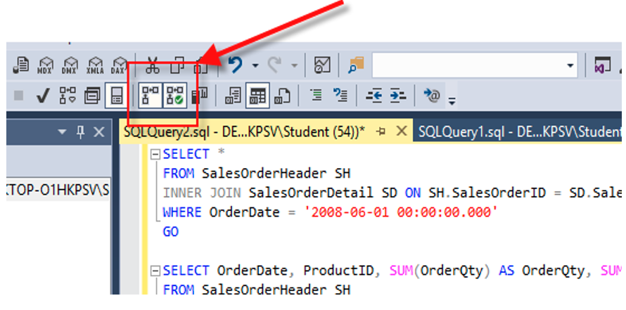
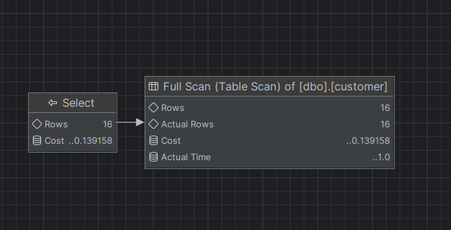
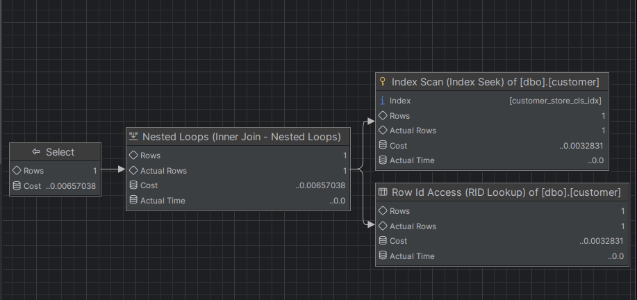
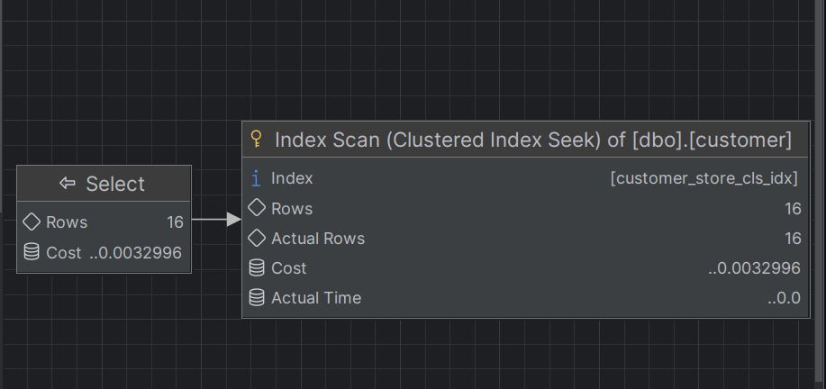
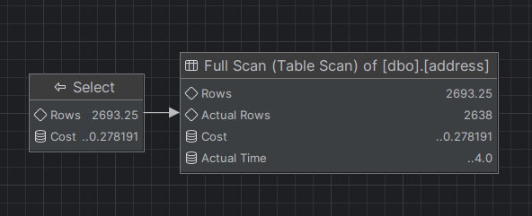
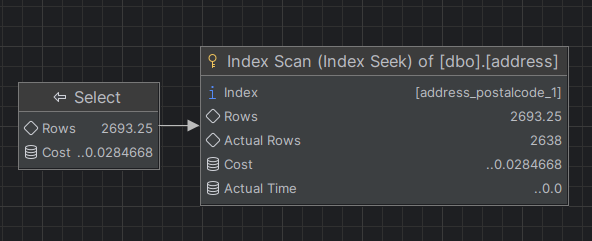
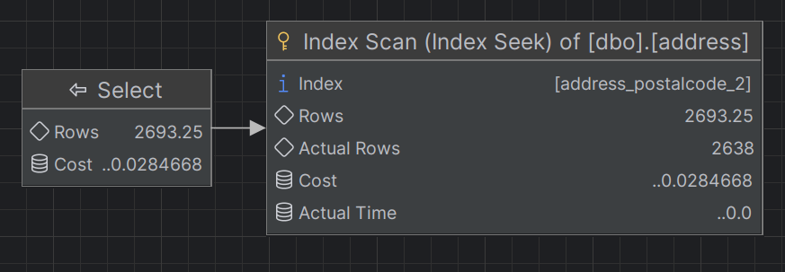
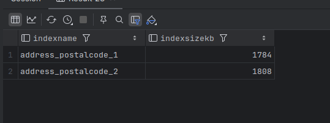

# Indeksy,  optymalizator <br>Lab1

<!-- <style scoped>
 p,li {
    font-size: 12pt;
  }
</style>  -->

<!-- <style scoped>
 pre {
    font-size: 8pt;
  }
</style>  -->


---

**Imiona i nazwiska:**
Karolina Węgrzyn, Patrycja Markiewicz

--- 

Celem ćwiczenia jest zapoznanie się z planami wykonania zapytań (execution plans), oraz z budową i możliwością wykorzystaniem indeksów.

Swoje odpowiedzi wpisuj w miejsca oznaczone jako:

---
> Wyniki: 

```sql
--  ...
```

---

Ważne/wymagane są komentarze.

Zamieść kod rozwiązania oraz zrzuty ekranu pokazujące wyniki
- dołącz kod rozwiązania w formie tekstowej/źródłowej
- najlepiej plik  .md 
	- ewentualnie sql

Zwróć uwagę na formatowanie kodu

## Oprogramowanie - co jest potrzebne?

Do wykonania ćwiczenia potrzebne jest następujące oprogramowanie
- MS SQL Server
- SSMS - SQL Server Management Studio    
	- ewentualnie inne narzędzie umożliwiające komunikację z MS SQL Server i analizę planów zapytań
- przykładowa baza danych AdventureWorks2017.
    
Oprogramowanie dostępne jest na przygotowanej maszynie wirtualnej


## Przygotowanie  
    
Stwórz swoją bazę danych o nazwie lab1. 

```sql
create database lab1  
go  
  
use lab1 
go
```


# Część 1

Celem tej części ćwiczenia jest zapoznanie się z planami wykonania zapytań (execution plans) oraz narzędziem do automatycznego generowania indeksów.

## Dokumentacja/Literatura

Przydatne materiały/dokumentacja. Proszę zapoznać się z dokumentacją:
- [https://docs.microsoft.com/en-us/sql/tools/dta/tutorial-database-engine-tuning-advisor](https://docs.microsoft.com/en-us/sql/tools/dta/tutorial-database-engine-tuning-advisor)
- [https://docs.microsoft.com/en-us/sql/relational-databases/performance/start-and-use-the-database-engine-tuning-advisor](https://docs.microsoft.com/en-us/sql/relational-databases/performance/start-and-use-the-database-engine-tuning-advisor)
- [https://www.simple-talk.com/sql/performance/index-selection-and-the-query-optimizer](https://www.simple-talk.com/sql/performance/index-selection-and-the-query-optimizer)
- [https://blog.quest.com/sql-server-execution-plan-what-is-it-and-how-does-it-help-with-performance-problems/](https://blog.quest.com/sql-server-execution-plan-what-is-it-and-how-does-it-help-with-performance-problems/)


Operatory (oraz reprezentujące je piktogramy/Ikonki) używane w graficznej prezentacji planu zapytania opisane są tutaj:
- [https://docs.microsoft.com/en-us/sql/relational-databases/showplan-logical-and-physical-operators-reference](https://docs.microsoft.com/en-us/sql/relational-databases/showplan-logical-and-physical-operators-reference)

<div style="page-break-after: always;"></div>


Wykonaj poniższy skrypt, aby przygotować dane:

```sql
select * into [salesorderheader]  
from [adventureworks2017].sales.[salesorderheader]  
go  
  
select * into [salesorderdetail]  
from [adventureworks2017].sales.[salesorderdetail]  
go
```


# Zadanie 1 - Obserwacja


Wpisz do MSSQL Managment Studio (na razie nie wykonuj tych zapytań):

```sql
-- zapytanie 1  
select *  
from salesorderheader sh  
inner join salesorderdetail sd on sh.salesorderid = sd.salesorderid  
where orderdate = '2008-06-01 00:00:00.000'  
go  

-- zapytanie 1.1
select *  
from salesorderheader sh  
inner join salesorderdetail sd on sh.salesorderid = sd.salesorderid  
where orderdate = '2013-01-28 00:00:00.000' 
go  
  
-- zapytanie 2  
select orderdate, productid, sum(orderqty) as orderqty, 
       sum(unitpricediscount) as unitpricediscount, sum(linetotal)  
from salesorderheader sh  
inner join salesorderdetail sd on sh.salesorderid = sd.salesorderid  
group by orderdate, productid  
having sum(orderqty) >= 100  
go  
  
-- zapytanie 3  
select salesordernumber, purchaseordernumber, duedate, shipdate  
from salesorderheader sh  
inner join salesorderdetail sd on sh.salesorderid = sd.salesorderid  
where orderdate in ('2008-06-01','2008-06-02', '2008-06-03', '2008-06-04', '2008-06-05')  
go  
  
-- zapytanie 4  
select sh.salesorderid, salesordernumber, purchaseordernumber, duedate, shipdate  
from salesorderheader sh  
inner join salesorderdetail sd on sh.salesorderid = sd.salesorderid  
where carriertrackingnumber in ('ef67-4713-bd', '6c08-4c4c-b8')  
order by sh.salesorderid  
go
```


Włącz dwie opcje: **Include Actual Execution Plan** oraz **Include Live Query Statistics**:


<!-- ![[_img/index1-1.png | 500]] -->





Teraz wykonaj poszczególne zapytania (najlepiej każde analizuj oddzielnie). Co można o nich powiedzieć? Co sprawdzają? Jak można je zoptymalizować?  

---
> Wyniki: 

```sql
--  ...
```

---

# Zadanie 2 - Dobór indeksów / optymalizacja

Do wykonania tego ćwiczenia potrzebne jest narzędzie SSMS


Zapytania 1, 2, 3, 4 z  poprzedniego zadania 

```sql
select *  
from salesorderheader sh  
inner join salesorderdetail sd on sh.salesorderid = sd.salesorderid  
where orderdate = '2008-06-01 00:00:00.000'  
go  
  
-- zapytanie 2  
select orderdate, productid, sum(orderqty) as orderqty, 
       sum(unitpricediscount) as unitpricediscount, sum(linetotal)  
from salesorderheader sh  
inner join salesorderdetail sd on sh.salesorderid = sd.salesorderid  
group by orderdate, productid  
having sum(orderqty) >= 100  
go  
  
-- zapytanie 3  
select salesordernumber, purchaseordernumber, duedate, shipdate  
from salesorderheader sh  
inner join salesorderdetail sd on sh.salesorderid = sd.salesorderid  
where orderdate in ('2008-06-01','2008-06-02', '2008-06-03', '2008-06-04', '2008-06-05')  
go  
  
-- zapytanie 4  
select sh.salesorderid, salesordernumber, purchaseordernumber, duedate, shipdate  
from salesorderheader sh  
inner join salesorderdetail sd on sh.salesorderid = sd.salesorderid  
where carriertrackingnumber in ('ef67-4713-bd', '6c08-4c4c-b8')  
order by sh.salesorderid  
go

```


Zaznacz wszystkie zapytania, i uruchom je w **Database Engine Tuning Advisor**:

<!-- ![[_img/index1-12.png | 500]] -->


Sprawdź zakładkę **Tuning Options**, co tam można skonfigurować?

---
> Wyniki: 

```sql
--  ...
```

---


Użyj **Start Analysis**:

<!-- ![[_img/index1-3.png | 500]] -->


Zaobserwuj wyniki w **Recommendations**.

Przejdź do zakładki **Reports**. Sprawdź poszczególne raporty. Główną uwagę zwróć na koszty i ich poprawę:


<!-- ![[_img/index4-1.png | 500]] -->


Zapisz poszczególne rekomendacje:

Uruchom zapisany skrypt w Management Studio.

Opisz, dlaczego dane indeksy zostały zaproponowane do zapytań:

---
> Wyniki: 

```sql
--  ...
```

---


Sprawdź jak zmieniły się Execution Plany. Opisz zmiany:

---
> Wyniki: 

```sql
--  ...
```

---

# Część 2

Celem ćwiczenia jest zapoznanie się z różnymi rodzajami  indeksów  oraz możliwością ich wykorzystania

## Dokumentacja/Literatura

Przydatne materiały/dokumentacja. Proszę zapoznać się z dokumentacją:
- [https://docs.microsoft.com/en-us/sql/relational-databases/indexes/indexes](https://docs.microsoft.com/en-us/sql/relational-databases/indexes/indexes)
- [https://docs.microsoft.com/en-us/sql/relational-databases/sql-server-index-design-guide](https://docs.microsoft.com/en-us/sql/relational-databases/sql-server-index-design-guide)
- [https://www.simple-talk.com/sql/performance/14-sql-server-indexing-questions-you-were-too-shy-to-ask/](https://www.simple-talk.com/sql/performance/14-sql-server-indexing-questions-you-were-too-shy-to-ask/)
- [https://www.sqlshack.com/sql-server-query-execution-plans-examples-select-statement/](https://www.sqlshack.com/sql-server-query-execution-plans-examples-select-statement/)

# Zadanie 3 - Indeksy klastrowane I nieklastrowane


Skopiuj tabelę `Customer` do swojej bazy danych:

```sql
select * into customer from adventureworks2017.sales.customer
```

Wykonaj analizy zapytań:

```sql
--- 1
select * from customer where storeid = 594  

--- 2
select * from customer where storeid between 594 and 610
```

Zanotuj czas zapytania oraz jego koszt koszt:

---
> Wyniki:

| Zapytanie    | Koszt    | Czas (ms) |
| :----------- | :----    | :-------- |
| 1            | 0.139158 |       1.0 |
| 2            | 0.139158 |       1.0 | 




Dodaj indeks:

```sql
create  index customer_store_cls_idx on customer(storeid)
```

Jak zmienił się plan i czas? Czy jest możliwość optymalizacji?

---
> Wyniki:

| Zapytanie    | Koszt    | Czas (ms) |
| :----------- | :----    | :-------- |
| 1            | 0.00657038 |       0.0 |
| 2            | 0.0507122 |       0.0 | 



Po dodaniu indeksu serwer wykorzystał go do wyszukiwania rekordów, przez co czas i koszt obu zapytań zmalał. Dla 2 zapytania koszt był troche większy, bo serwer musiał odczytać większą ilość rekordów z indeksu. Widać również z planu, że indeks nie zawierał wszystkich kolumn potrzebnych w tym zapytaniu, dlatego reszte danych serwer musiał odczytać bezpośrednio z tabeli. 

Możliwością optymalizacji jest zastosowanie indeksu klastrowanego, bo serwer bezpośrednio będzie wiedział gdzie jest szukany rekord - uporządkowanie wg kolumny storeid oraz ten typ indeksu zawiera pełne wiersze tabeli.

Dodaj indeks klastrowany:

```sql
create clustered index customer_store_cls_idx on customer(storeid)
```

Czy zmienił się plan/koszt/czas? Skomentuj dwa podejścia w wyszukiwaniu krotek.

---
> Wyniki:
> 
| Zapytanie    | Koszt     | Czas (ms) |
| :----------- | :----     | :-------- |
| 1            | 0.0032831 |       0.0 |
| 2            | 0.0032996 |       0.0 | 



Dla indeksu klastrowanego koszt jeszcze bardziej zmalał - udana optymalizacja. Widać z planu, że wszystkie informacje zostały odczytane bezpośrednio z indeksu.

# Zadanie 4 - dodatkowe kolumny w indeksie

Celem zadania jest porównanie indeksów zawierających dodatkowe kolumny.

Skopiuj tabelę `Address` do swojej bazy danych:

```sql
select * into address from  adventureworks2017.person.address
```

W tej części będziemy analizować następujące zapytanie:

```sql
select addressline1, addressline2, city, stateprovinceid, postalcode  
from address  
where postalcode between '98000' and '99999'
```

```sql
create index address_postalcode_1  
on address (postalcode)  
include (addressline1, addressline2, city, stateprovinceid);  
go  
  
create index address_postalcode_2  
on address (postalcode, addressline1, addressline2, city, stateprovinceid);  
go
```


Czy jest widoczna różnica w planach/kosztach zapytań? 
- w sytuacji gdy nie ma indeksów
- przy wykorzystaniu indeksu:
	- address_postalcode_1
	- address_postalcode_2

Jeśli tak to jaka? 

Aby wymusić użycie indeksu użyj `WITH(INDEX(Address_PostalCode_1))` po `FROM`

```sql
select addressline1, addressline2, city, stateprovinceid, postalcode
from address  WITH(INDEX(Address_PostalCode_1))
where postalcode between '98000' and '99999'


select addressline1, addressline2, city, stateprovinceid, postalcode
from address  WITH(INDEX(Address_PostalCode_2))
where postalcode between '98000' and '99999'
```


> Wyniki: 

### Bez indeksów



### address_postalcode_1



### address_postalcode_2



| Zapytanie    | Koszt     | Czas (ms) |
| :----------- | :----     | :-------- |
| Bez indeksów | 0.278191 |       4.0 |
| address_postalcode_1| 0.0284668 |       0.0 | 
| address_postalcode_2| 0.0284668  |       0.0 | 

W przypadku braku indeksów koszt jest najwyższy, bo serwer musi wykonać Full Table Scan, aby znaleźć pasujące wiersze do warunku.

Indeksy address_postalcode_1 i address_postalcode_2 mają te same koszty (niższe niż dla zapytania bez indeksów) i plany. Dla pierwszego serwer przeszukuje indeks po postalcode, a reszta potrzebnych kolumn też znajduje się w indeksie - include. Dla drugiego indeksu wszystkie potrzebne kolumny są częścią indeksu, więc też pokrywają całe zapytanie.


Sprawdź rozmiar Indeksów:

```sql
select i.name as indexname, sum(s.used_page_count) * 8 as indexsizekb  
from sys.dm_db_partition_stats as s  
inner join sys.indexes as i on s.object_id = i.object_id and s.index_id = i.index_id  
where i.name = 'address_postalcode_1' or i.name = 'address_postalcode_2'  
group by i.name  
go
```


Który jest większy? Jak można skomentować te dwa podejścia do indeksowania? Które kolumny na to wpływają?


> Wyniki: 



Większy jest address_postalcode_2. Dla niego wszystkie kolumny (addressline1, addressline2, city, stateprovinceid - one wpływają an rozmiar) są częścią klucza indeksu, czyli każda z nich jest przechowywana w strukturze B+ drzewa. W indeksie address_postalcode_1 te same kolumny są w include, czyli są dołączone tylko do liści indeksu, a nie do całej struktury drzewa - przez co indeks ma mniejszy rozmiar.

# Zadanie 5  - kolejność atrybutów


Skopiuj tabelę `Person` do swojej bazy danych:

```sql
select businessentityid  
      ,persontype  
      ,namestyle  
      ,title  
      ,firstname  
      ,middlename  
      ,lastname  
      ,suffix  
      ,emailpromotion  
      ,rowguid  
      ,modifieddate  
into person  
from adventureworks2017.person.person
```
---

Wykonaj analizę planu dla trzech zapytań:

```sql
select * from [person] where lastname = 'Agbonile'  
  
select * from [person] where lastname = 'Agbonile' and firstname = 'Osarumwense'  
  
select * from [person] where firstname = 'Osarumwense'
```

Co można o nich powiedzieć?


---
> Wyniki: 

```sql
--  ...
```

Przygotuj indeks obejmujący te zapytania:

```sql
create index person_first_last_name_idx  
on person(lastname, firstname)
```

Sprawdź plan zapytania. Co się zmieniło?


---
> Wyniki: 

```sql
--  ...
```


Przeprowadź ponownie analizę zapytań tym razem dla parametrów: `FirstName = ‘Angela’` `LastName = ‘Price’`. (Trzy zapytania, różna kombinacja parametrów). 

Czym różni się ten plan od zapytania o `'Osarumwense Agbonile'` . Dlaczego tak jest?


---
> Wyniki: 

```sql
--  ...
```


---

Punktacja:

|         |     |
| ------- | --- |
| zadanie | pkt |
| 1       | 2   |
| 2       | 2   |
| 3       | 2   |
| 4       | 2   |
| 5       | 2   |
| razem   | 10  |
|         |     |
