# Indeksy, optymalizator <br>Lab 2

<!-- <style scoped>
 p,li {
    font-size: 12pt;
  }
</style>  -->

<!-- <style scoped>
 pre {
    font-size: 8pt;
  }
</style>  -->

---

**Imiona i nazwiska:**
Karolina Węgrzyn, Patrycja Markiewicz

---

Celem ćwiczenia jest zapoznanie się z planami wykonania zapytań (execution plans), oraz z budową i możliwością wykorzystaniem indeksów
(kontynuacja poprzedniego ćwiczenia)

Swoje odpowiedzi wpisuj w miejsca oznaczone jako:

---

> Wyniki:

```sql
--  ...
```

---

Ważne/wymagane są komentarze.

Zamieść kod rozwiązania oraz zrzuty ekranu pokazujące wyniki, (dołącz kod rozwiązania w formie tekstowej/źródłowej)

Zwróć uwagę na formatowanie kodu

## Oprogramowanie - co jest potrzebne?

Do wykonania ćwiczenia potrzebne jest następujące oprogramowanie

- MS SQL Server
- SSMS - SQL Server Management Studio
  - ewentualnie inne narzędzie umożliwiające komunikację z MS SQL Server i analizę planów zapytań

Oprogramowanie dostępne jest na przygotowanej maszynie wirtualnej

## Przygotowanie

Uruchom Microsoft SQL Managment Studio.

Stwórz swoją bazę danych o nazwie lab2.

```sql
create database lab2
go

use lab2
go
```

Warto przełączyć bazę w tryb simple

```sql
alter database lab2
set recovery simple;
```

<div style="page-break-after: always;"></div>

# Zadanie 1 - indeksy

Wykonaj poniższy skrypt, aby przygotować dane:

```sql
select * into product_history
from northwind3.dbo.product_history


select * into categories  
from northwind3.dbo.categories


create clustered index categ_clust_idx  
on categories(categoryid)
```

sprawdź liczbę wierszy w tabeli

```sql
select count(*) from product_history
```

Jest 2310000 wierszy.

Sprawdź jakie indeksy istnieją dla tej tabeli

```sql
exec sp_helpindex 'dbo.product_history'
```

```sql
Select
    i.name as index_name,
    i.type_desc,
    i.is_unique,
    c.name as column_name,
    ic.key_ordinal,
    ic.is_included_column
from sys.indexes i
join sys.index_columns ic
    on i.object_id = ic.object_id
   and i.index_id = ic.index_id
join sys.columns c
    on ic.object_id = c.object_id
   and ic.column_id = c.column_id
where i.object_id = object_id('dbo.product_history')
order by i.name, ic.key_ordinal;
```

Brak indeksów dla tej tabeli.

włącz statystyki IO i TIME

```sql
SET STATISTICS IO ON

SET STATISTICS TIME ON;
```

podczas analiz sprawdzaj jak zachowują się zapytania, zwróć uwagę na

- plan
- koszt
- czas (ewentualnie, jeśli coś da się zaobserwować)
- liczbę odczytywanych stron !!!!

porównaj zapytania

### a)

```sql
--- 1
select count(*) from product_history
where id = 1000000

--- 2
select count(*) from product_history
where id between 999000 and 10000000
```

1.  

2.  

| Zapytanie | Koszt  | Czas (ms) | Odczytane strony |
| :-------- | :----- | :-------- | :--------------- |
| 1         | 19.659 | 72        | 25837            |
| 2         | 19.895 | 91        | 25837            |

Oba zapytania wykonują pełny skan tabeli, odczytując identyczną ilość stron. Warunek WHERE nie ma tu żadnego znaczenia – agregacja przy COUNT(\*) wymaga przejścia przez całą tabelę. Odrobinę wyższy czas zapytania 2 wynika z szerszego zakresu filtrowania.

### b)

```sql
--- 3
select * from product_history
where id = 1000000

--- 4
select * from product_history
where id between 999000 and 10000000
```

3.  

4.  

| Zapytanie | Koszt   | Czas (ms) | Odczytane strony |
| :-------- | :------ | :-------- | :--------------- |
| 3         | 19.659  | 67        | 25837            |
| 4         | 21.2591 | 9         | 70               |

Zapytanie 3 skanuje całe 25837 stron – bez indeksu SQL Server nie wie gdzie szukać konkretnej wartości. Zapytanie 4 odczytuje tylko 70 stron prawdopodobnie dzięki temu, że kolumna id może być fizycznie skorelowana z kolejnością wstawiania wierszy (wiersze były wstawiane sekwencyjnie). Przez co silnik natrafiając na górną granicę zakresu, kończy skan wcześniej. Wyższy koszt zapytania 4 wynika z konieczności zwrócenia wszystkich kolumn dla większej liczby wierszy.

### c)

sprawdź jak zachowają się zapytania z pkt a) i b) jeśli dla kolumny `id` stworzysz indeks

- klastrowy
- nieklastrowy

```sql
create clustered index product_history_clust_idx
on product_history(id)

drop index product_history_clust_idx on product_history

create index product_history_idx
on product_history(id)

drop index product_history_idx on product_history
```

po zakończeniu pozostaw indeks klastrowy

- klastrowy

| Zapytanie | Koszt     | Czas (ms) | Odczytane strony |
| :-------- | :-------- | :-------- | :--------------- |
| 1         | 0.0032842 | 5         | 3                |
| 2         | 11.2587   | 33        | 14800            |
| 3         | 0.0032831 | 0         | 3                |
| 4         | 12.3069   | 9         | 14               |

1.  

2.  

3.  

4.  

Indeks klastrowy porządkuje fizycznie dane według id, co daje znaczną poprawę dla zapytań punktowych (1 i 3) oraz dla SELECT _ z BETWEEN (14 stron, czyta tylko strony z danymi, które faktycznie istnieją). Dla COUNT(_) z szerokim zakresem poprawa jest mniejsza – nadal musi przejść przez wszystkie 14800 stron należących do zakresu, bo każdy wiersz musi zostać policzony (czy istnieje czy nie).

- nieklastrowy

| Zapytanie | Koszt     | Czas (ms) | Odczytane strony |
| :-------- | :-------- | :-------- | :--------------- |
| 1         | 0.0032842 | 0         | 3                |
| 2         | 4.39569   | 84        | 2935             |
| 3         | 0.006570  | 5         | 4                |
| 4         | 21.6821   | 7         | 70               |

1.  

2.  

3.  

4.  

Indeks nieklastrowy sprawdza się dobrze dla COUNT(_) z zakresem – odczytuje 2935 stron, a nie aż 14800 jak dla indeksu klastrowego, ale ma dłuższy czas wykonania. Natomiast dla SELECT _ z zakresem indeks zostaje zignorowany, bo koszt odwołań do tabeli (żeby zwrócić całe wiersze) po przeszukaniu indeksu byłby wyższy niż Full Table Scan.

### d)

indeks dla kolumny `date`

```sql
create index product_history_date_idx
on product_history(date)

drop index product_history_date_idx on product_history
```

porównaj polecenia

```sql
--- 1
select id, productid, productname, date
from product_history
where date >= '2001-01-01' and date <= '2001-01-31'

--- 2
select id, productid, productname, date
from product_history
where year(date) = 2001 and month(date) = 1

--- 3
select id, productid, productname, date
from product_history
where date >= '2001-01-01' and date <= '2001-12-31'

--- 4
select id, productid, productname, date
from product_history
where year(date) = 2001
```

podczas analiz sprawdzaj jak zachowują się zapytania, zwróć uwagę na

- plan
- indeksy i sposób ich użycia
- koszt
- czas (ewentualnie, jeśli coś da się zaobserwować)
- liczbę odczytywanych stron !!!!

spróbuj skomentować wyniki tych analiz, dlaczego tak się dzieje

| Zapytanie | Koszt   | Czas (ms) | Odczytane strony |
| :-------- | :------ | :-------- | :--------------- |
| 1         | 7.51795 | 1         | 1547             |
| 2         | 20.3818 | 79        | 26067            |
| 3         | 20.3513 | 151       | 19234            |
| 4         | 20.1782 | 77        | 26067            |

1.  

2.  

3.  

4.  

Tutaj porównujemy sposoby filtrowania danych. Dla 1 zapytania został wykorzystany Index Seek - najlepsza wydajność, a dla reszty on nie mógł zostać użyty z powodu zastosowania funkcji na kolumnie indeksowanej lub dużego zakresu danych. Przez co widzimy tam większą liczbę odczytów oraz większy koszt i czas wykonania.

### e)

powtórz eksperymenty z pkt d) , ale tym razem użyj indeksu zawierającego dodatkowe kolumny

```sql
create index product_history_date_incl_idx
on product_history(date) include(productid, productname)

drop index product_history_date_incl_idx on product_history

```

co się zmieniło?

| Zapytanie | Koszt     | Czas (ms) | Odczytane strony |
| :-------- | :-------- | :-------- | :--------------- |
| 1         | 0.0140558 | 0         | 7                |
| 2         | 9.58029   | 59        | 11413            |
| 3         | 0.134938  | 1         | 7                |
| 4         | 9.37673   | 71        | 11413            |

1.  

2.  

3.  

4.  

Zastosowanie indeksu z kolumnami w INCLUDE poprawiło wydajność zapytań wykorzystujących warunek zakresowy na kolumnie date, bo indeks stał się pokrywający i nie wymagał dodatkowych odwołań do tabeli. W efekcie zmniejszyła się liczba odczytanych stron oraz koszt zapytań. Jednak dla zapytań wykorzystujących funkcje na kolumnie indeksowanej, indeks nie został efektywnie użyty, dlatego wydajność nie uległa znaczącej poprawie.

### f)

indeks dla kolumny `categoryid`

```sql
create index product_history_cat_idx
on product_history(categoryid)

drop index product_history_cat_idx on product_history
```

przeanalizuj polecenia

```sql
select id, productid, productname, date 
from product_history p
where categoryid = 8


select id, productid, productname, date, categoryname
from product_history p join categories c on p.categoryid = c.categoryid
where p.categoryid = 8
```

| Zapytanie | Koszt   | Czas (ms) | Odczytane strony |
| :-------- | :------ | :-------- | :--------------- |
| 1         | 20.5734 | 7         | 42               |
| 2         | 23.8679 | 14        | 44               |

1.  

2.  

Wyniki obu zapytań są bardzo podobne. W zapytaniu z JOIN pojawia się dodatkowy koszt związany z koniecznością łączenia tabel, jednak dzięki wcześniejszemu odfiltrowaniu rekordów z wykorzystaniem indeksu liczba przetwarzanych danych jest niewielka, dlatego wpływ tej operacji na wydajność jest niewielki.

### dodatkowo

możesz sprawdzić strukturę indeksu

np.

```sql
exec sp_helpindex 'dbo.product_history';

select
    i.name as index_name,
    ips.index_depth,
    ips.index_level,
    ips.page_count
from sys.indexes i
cross apply sys.dm_db_index_physical_stats(
    db_id(),
    i.object_id,
    i.index_id,
    null,    'detailed'
) ips
where i.object_id = object_id('dbo.product_history')
  and i.name = 'product_history_date_idx';
```


Każdy indeks ma głębokość 3, co oznacza że każde wyszukiwanie punktowe wymaga przejścia przez 3 poziomy, stąd wyniki 3 odczytanych stron dla zapytań punktowych.
Największą liczbę stron liści zajmuje indeks klastrowy (25837), bo jego liście to bezpośrednio strony danych tabeli. Indeks nieklastrowy na tej samej kolumnie id zajmuje 2856 stron liści, bo przechowuje wyłącznie klucze ze wskaźnikami, bez reszty danych wiersza.
Indeks pokrywający date_incl_idx zajmuje 11253 stron liści - trzykrotnie więcej niż zwykły date_idx (3720 stron). Różnica wynika z dodatkowych kolumn przechowywanych w liściach, ale przez to możemy uniknąć odwołań do tabeli podczas zapytań.

jeśli chcesz zaobserwować odczyty logiczne/fizyczne możesz zwolnić pulę buforów przed wykonaniem polecenia

```sql
CHECKPOINT;
DBCC DROPCLEANBUFFERS;
```

i teraz porównaj liczby czytanych stron np. wykonując dwukrotnie polecenie

```sql
select * from product_history
```

1 odczyt - logical reads 12, physical reads 1

2 odczyt - logical reads 12, physical reads 0

<div style="page-break-after: always;"></div>

# Zadanie 2

Celem zadania jest poznanie indeksów typu column store

Utwórz tabelę testową:

```sql
create table saleshistory(
 id int identity(1,1) not null primary key,
 salesorderid int not null,
 salesorderdetailid int not null,
 carriertrackingnumber nvarchar(25) null,
 orderqty smallint not null,
 productid int not null,
 specialofferid int not null,
 unitprice money not null,
 unitpricediscount money not null,
 linetotal numeric(38, 6) not null,
 rowguid uniqueidentifier not null,
 modifieddate datetime not null
 )
```

Sprawdź jakie indeksy istnieją dla tej tabeli

```sql
exec sp_helpindex 'dbo.saleshistory'
```

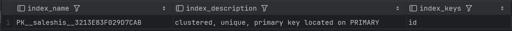

```sql
Select
    i.name as index_name,
    i.type_desc,
    i.is_unique,
    c.name as column_name,
    ic.key_ordinal,
    ic.is_included_column
from sys.indexes i
join sys.index_columns ic
    on i.object_id = ic.object_id
   and i.index_id = ic.index_id
join sys.columns c
    on ic.object_id = c.object_id
   and ic.column_id = c.column_id
where i.object_id = object_id('dbo.saleshistory')
order by i.name, ic.key_ordinal;
```


W tabeli `saleshistory` istnieje jeden indeks klastrowy, który został założony automatycznie dla klucza głównego czyli `id`.

Wypełnij tablicę danymi:

```sql
-- w ssms

insert into saleshistory
 select sh.*
 from adventureworks2017.sales.salesorderdetail sh
go 100
```

(UWAGA `GO 100` oznacza 100 krotne wykonanie polecenia. Jeżeli podejrzewasz, że twój serwer może to zbyt przeciążyć, zacznij od GO 10, GO 20, GO 50

albo

```sql
declare @i int = 1;

while @i <= 100
begin
    insert into saleshistory
    select *
    from adventureworks2017.sales.salesorderdetail;

    set @i += 1;
end;
```

sprawdź liczbę wierszy w tabeli

```sql
select count(*) from saleshistory
```

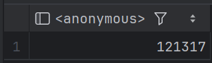

włącz statystyki IO i TIME

```sql
SET STATISTICS IO ON

SET STATISTICS TIME ON;
```

Sprawdź jak zachowa się zapytanie

- sprawdź plan
- koszt
- czas
- liczbę odczytywanych stron

```sql
-- 1
select productid, sum(unitprice), avg(unitprice), sum(orderqty), avg(orderqty)
from saleshistory
group by productid
order by productid
```

Załóż indeks typu column store:

```sql
-- 2
create nonclustered columnstore index saleshistory_columnstore
 on saleshistory(unitprice, orderqty, productid)
```

Sprawdź różnicę pomiędzy przetwarzaniem w zależności od indeksów. Porównaj plany i opisz różnicę.
Co to są indeksy colums store? Jak działają? (poszukaj materiałów w internecie/literaturze)

UWAGA: ciekawsze efekty możesz zaobserwować dla jeszcze większych tabel (jeśli twój komp na to pozwala możesz zwiększyć wolumen generowanych danych)

Indeks columnstore wykorzystuje przechowywanie i przetwarzanie danych oparte na kolumnach, aby zwiększyć wydajność zapytań nawet do 10 razy w hurtowni danych w porównaniu z tradycyjnym przechowywaniem zorientowanym na wiersze, co osiąga dzięki wykorzystaniu segmentów kolumn wydzielonych z grup wierszy. Każda taka grupa zawiera jeden segment dla każdej kolumny w tabeli, przy czym każdy segment jest kompresowany i przechowywany na nośniku fizycznym wraz z dedykowanymi metadanymi, które umożliwiają silnikowi bazy danych szybką eliminację segmentów bez konieczności ich fizycznego odczytywania.

Źródło: [Microsoft Learn - Columnstore indexes overview](https://learn.microsoft.com/pl-pl/sql/relational-databases/indexes/columnstore-indexes-overview?view=sql-server-ver17)

Zastosowano 100 krotne wykonanie polecenia insert.

1. Bez indeksu typu columnstore:
   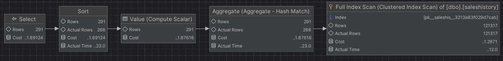

2. Z indeksem typu columnstore:
   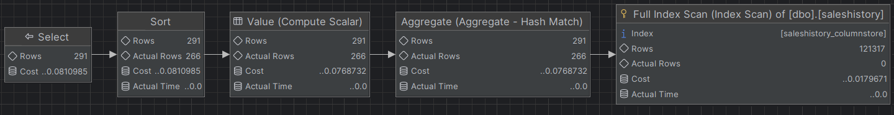

Bez indeksu typu columnstore optymalizator korzysta z tradycyjnego skanowania wierszowego, czyli operacji `Clustered Index Scan`. Zmusza to bazę do załadowania do pamięci całej tabeli wraz ze zbędnymi kolumnami. Zastosowanie indeksu typu columnstore pozwala na uzycie operacji `Index Scan`, więc silnik bazy pobiera wtedy tylko potrzebne segmenty kolumnowe.

| Zapytanie   | Koszt     | Czas (ms) | Odczytane strony        |
| :---------- | :-------- | --------- | ----------------------- |
| Bez indeksu | 1.89124   | 25        | 1561                    |
| Z indeksem  | 0.0810985 | 13        | 139 (lob logical reads) |

Całkowity szacowany koszt zapytania uległ znacznemu zmniejszeniu. Odczyty stron z pamięci spadły do 139, a czas wykonania zadania przez serwer skrócił się prawie o połowę.

<div style="page-break-after: always;"></div>

# Zadanie 3 – własne eksperymenty

Należy zaprojektować/zaimplementować tabelę w bazie danych, lub wybrać dowolny schemat/bazę/tabelę (poza używanymi na zajęciach), a następnie wypełnić ją danymi w taki sposób, przetestować/przeanalizować działanie indeksów różnego typu. Warto wygenerować sobie tabele o większym rozmiarze.

Możesz też powtórzyć np. eksperymenty wykonywane w zadaniu 1, ale tym razem dla innego serwera.

Wedle uznania i zainteresowań, ważne żeby poeksplorować tematykę i spróbować

Do analizy, proszę uwzględnić następujące rodzaje indeksów:

- Klastrowane (np.  dla atrybutu nie będącego kluczem głównym)
- Nieklastrowane
- Indeksy wykorzystujące kilka atrybutów, indeksy include
- Filtered Index (Indeks warunkowy)
- Kolumnowe

## Analiza

Proszę przygotować zestaw zapytań do danych, które:

- wykorzystują poszczególne indeksy
- które przy wymuszeniu indeksu działają gorzej, niż bez niego (lub pomimo założonego indeksu, tabela jest w pełni skanowana)
  Odpowiedź powinna zawierać:
- Schemat tabeli
- Opis danych (ich rozmiar, zawartość, statystyki)
- Opis indeksu
- Przygotowane zapytania, wraz z wynikami z planów (zrzuty ekranow)
- Inf o kosztach, czytanych stornach
- Komentarze do zapytań, ich wyników
- ew. sprawdzenie, co proponuje Database Engine Tuning Advisor (porównanie czy udało się Państwu znaleźć odpowiednie indeksy do zapytania)

> Wyniki:

### Schemat tabeli

Zaprojektowana została tabela `CustomerTransactions`, która symuluje system rejestracji zamówień w międzynarodowym sklepie internetowym. Zbiór danych składa się z 1000000 rekordów.

```sql
create table customertransactions (
    transactionid int identity(1,1) not null constraint pk_trans primary key nonclustered,
    customerid int not null,
    transactiondate datetime not null,
    amount decimal(10,2) not null,
    status varchar(20) not null,
    storeregion varchar(10) not null
);
go

set nocount on;
begin tran;
insert into customertransactions (customerid, transactiondate, amount, status, storeregion)
select top 1000000
    abs(checksum(newid())) % 10000 + 1,
    dateadd(day,-(abs(checksum(newid())) % 1000), getdate()),
    (abs(checksum(newid())) % 5000) + 10.50,
    case abs(checksum(newid())) % 4
        when 0 then 'completed'
        when 1 then 'pending'
        when 2 then 'cancelled'
        else 'error'
    end,
    case abs(checksum(newid())) % 3
        when 0 then 'eu'
        when 1 then 'usa'
        else 'asia'
    end
from sys.all_columns a
cross join sys.all_columns b;
commit tran;
go

select count(*) as totalrows from customertransactions
```

Jak widać poprawnie wygenerowaliśmy 1mln rekordów.

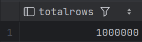

### Opis danych

- **transactionid** - unikalny numer transakcji i klucz główny tabeli
- **customerid** - numer identyfikacyjny klienta
- **transactiondate** - data oraz godzina zakupu
- **amount** - wartość pieniężna operacji
- **status** - status zamówienia: completed, pending, cancelled lub error
- **storeregion** - obszar sprzedaży: eu, usa lub asia

### Statystyki

| Kategoria        | Wartość   |
| ---------------- | --------- |
| Liczba rekordów  | 1000000   |
| Unikalni klienci | 10000     |
| Zakres dat       | 1 000 dni |
| Regiony          | 3         |
| Statusy          | 4         |

### Rozmiar danych

Aby sprawdzić rozmiar miejsca na dysku zajmowanego przez tabelę użyto poniższego polecenia:

```sql
exec sp_spaceused 'customertransactions'
```

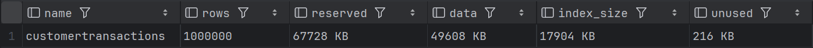

Tabela zajmuje łącznie około 66MB, z czego dane stanowią około 48MB. Póki co w tabeli mamy jeden indeks nieklastrowany na kluczu głównym i zajmuje on ponad 17MB, więc całkiem sporo. Można też zwrócić uwagę na wartość unused równą zaledwie 216KB, z czego można wnioskowac, że strony danych są prawie całkowicie wypełnione.

### **Przykład 1 - Indeks klastrowany**

Sprawdzimy, jak baza danych radzi sobie z wyszukiwaniem transakcji z konkretnego przedziału czasowego. Chcemy sprawdzić, czy fizyczne posortowanie miliona wierszy według daty skróci czas dostępu do danych.

#### Zapytanie bez indeksu

```sql
select * from customertransactions
where transactiondate between '2026-01-01' and '2026-01-31'
```

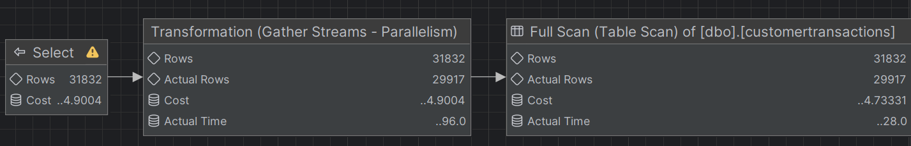

Server wykonuje Table Scan czyli musi przejść przez każdy z miliona wierszy, aby sprawdzić, czy data pasuje do zakresu.

#### Tworzenie indeksu klastrowanego

Teraz poukładamy tabelę fizycznie według daty. Wybieramy indeks klastrowany, ponieważ w tabeli może być tylko jeden, a data jest najczęstszym kryterium filtrowania + jest nam potrzebna w tym konkretnym przyapdku.

```sql
create clustered index ix_transactiondate_clustered
    on customertransactions(transactiondate)
```

Indeks klastrowany przebudowuje tabelę. Od teraz transakcje nie leżą w bazie chaotycznie, ale są poukładane chronologicznie. Dzieki temu baza szukając stycznia wie dokładnie, w którym miejscu na dysku ten styczeń się zaczyna i kończy.

#### Zapytanie z indeksem

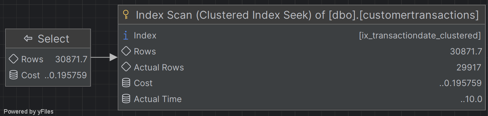

Dzięki zastosowaniu indeksu klastrowanego serwer zamiast Table Scana użył Clustered Index Seeka. Dzięki temu baza nie traci czasu na przeglądanie miliona wierszy, zamiast tego wskakuje bezpośrednio w odpowiednie miejsce na dysku, gdzie zaczynają się dane z wybranego zakresu dat.

| Zapytanie   | Koszt    | Czas (ms) | Odczytane strony |
| ----------- | -------- | --------- | ---------------- |
| Bez indeksu | 4.9004   | 134       | 6201             |
| Z indeksem  | 0.195759 | 1         | 7                |

Zastosowanie indeksu klastrowanego znacząco poprawiło wydajność zapytania. Liczba odczytanych stron spadła z 6201 do zaledwie 7, jest to ogromne zmniejszenie ilości danych pobieranych z pamięci. Ogólny koszt zapytania spadł o prawie 100%, a czas wykonania do 1 ms. Optymalizacja zapytań opartych na zakresach dat przy użyciu indeksu klastrowanego jest w tym przypadku w pełni skuteczna.

### **Przykład 2 - Indeks nieklastrowany**

Sprawdzimy, jak baza danych radzi sobie z wyszukiwaniem transakcji dla konkretnego klienta. Chcemy sprawdzić czy utworzenie indeksu nieklastrowanego na id klienta przyspieszy dostęp do jego danych w tabeli, która jest już fizycznie posortowana wg daty.

#### Zapytanie bez indeksu

```sql
select * from customertransactions
where customerid = 1234
```

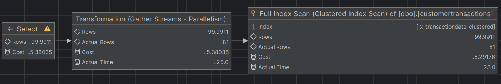

Server wykonuje Clustered Index Scan czyli musi przejść przez każdy z miliona wierszy ułożonych chronologicznie, aby znaleźć wszystkie transakcje dla wybranego klienta.

#### Tworzenie indeksu nieklastrowanego

Tworzymy osobną strukturę dla kolumny z id klienta. Wybieramy indeks nieklastrowany, ponieważ nasza tabela ma już swój fizyczny porządek wg daty, a my potrzebujemy szybkiego sposobu na wyszukiwanie po id klienta.

```sql
create nonclustered index ix_customerid_nonclustered
    on customertransactions(customerid)
```

#### Zapytanie z indeksem

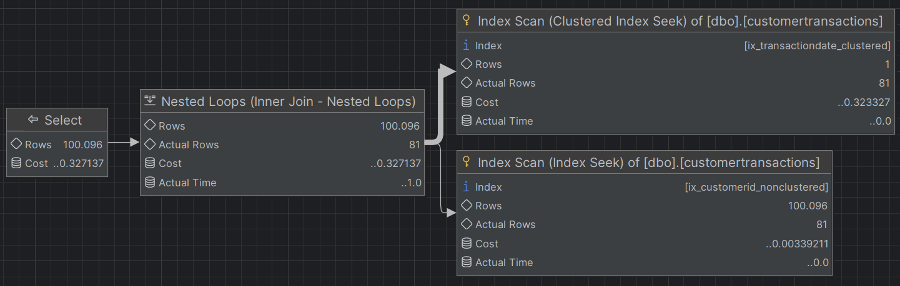

Utworzenie indeksu nieklastrowanego całkowicie zmieniło plan wykonania. Baza zrezygnowała z pełnego skanowania za pomocą Clustered Index Scan. Zamiast tego używa operacji Index Seek, aby szybko odnaleźć identyfikator klienta w nowym indeksie, a następnie przez pętlę pobiera brakujące kolumny z tabeli głównej.

| Zapytanie   | Koszt    | Czas (ms) | Odczytane strony |
| ----------- | -------- | --------- | ---------------- |
| Bez indeksu | 5.38035  | 28        | 7115             |
| Z indeksem  | 0.327137 | 1         | 260              |

Zastosowanie indeksu nieklastrowanego znacząco poprawiło wydajność zapytania. Liczba odczytów logicznych spadła z 7115 do 260. Koszt zapytania spadł o ponad 93%, a czas wykonania zmniejszył się do zaledwie 1 ms. Optymalizacja zapytań wyszukujących pojedyncze wartości przy użyciu indeksu nieklastrowanego jest w tym przypadku w skuteczna i chroni bazę przed niepotrzebnym skanowaniem miliona rekordów.

#### Inny problem

W poprzednim zapytaniu użyliśmy `select *`, więc mimo posiadania indeksu, baza danych musiała pobrać brakujące dane z głównej tabeli. Teraz sprawdzimy scenariusz, w którym ograniczamy zapytanie tylko do tych kolumn, które indeks ma już pod ręka. W ramach testu wyszukamy konkretnego klienta, ale zwrócimy wyłącznie kolumnę z datą transakcji.

#### Zapytanie

```sql
select transactiondate from customertransactions
where customerid = 1234
```

#### Bez indeksu

Aby nie musieć usuwać indeksu po customerid wymuszono użycie indeksu klastrowanego po dacie.

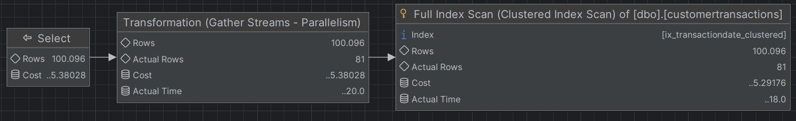

Silnik wykonał pełne skanowanie całej tabeli w poszukiwaniu transakcji wybranego klienta.

#### Z indeksem

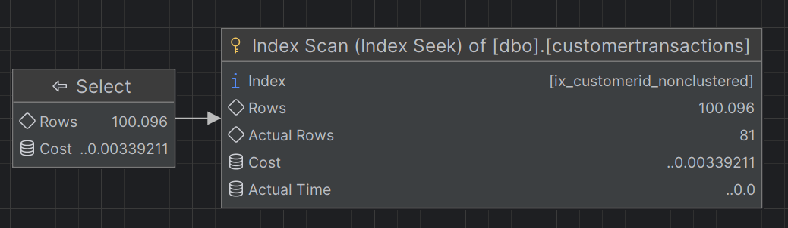

W tym przypadku widzimy wyłącznie operację Index Seek, ponieważ zapytanie prosi tylko o datę, więc baza znajduje wszystko w samym indeksie i całkowicie omija odpytywanie głównej tabeli.

| Zapytanie   | Koszt      | Czas (ms) | Odczytane strony |
| ----------- | ---------- | --------- | ---------------- |
| Bez indeksu | 5.38028    | 23        | 7115             |
| Z indeksem  | 0.00339211 | 0         | 3                |

Można powiedzieć, że w przypadku tego zapytania zastosowanie indeksu na customerid zadziałało jak covering index, dzięki czemu obciążenie serwera zostało zedukowane do absolutnego minimum. Liczba odczytanych stron spadła z 7115 do 3. Koszt operacji zmniejszył się do ułamka procenta, a czas wykonania wyniósł 0 ms.

### **Przykład 3 - Indeks z INCLUDE**

Będziemy chcieli teraz wyświetlić historię klienta, obejmującą datę, kwotę oraz status transakcji.

Indeksy, które na ten moment posiada baza:
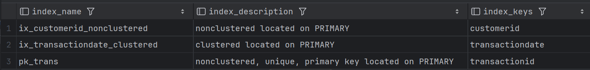

#### Zapytanie

```sql
select transactiondate, amount, status from customertransactions
where customerid = 1234
```

#### Brak dedykowanego indeksu

Na początek wymuszamy zignorowanie indeksu na id klienta, aby sprawdzic, ile kosztuje to zapytanie bez żadnego wsparcia.

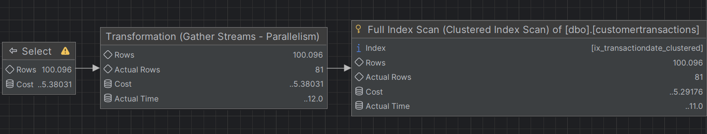

Silnik musiał wykonać pełne skanowanie głównej tabeli przez Clustered Index Scan.

#### Zwykły indeks nieklastrowany

Teraz pozwalamy bazie użyć indeksu nieklastrowanego na kolumnie customerid.

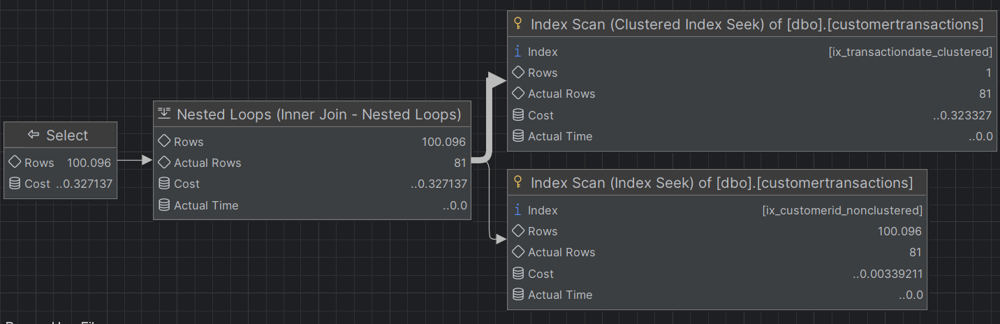

Baza użyła indeksu, aby szybko znaleźć id klienta, ale ponieważ w indeksie brakuje informacji o kwocie i statusie, musiała za każdym razem sięgać do głównej tabeli po te dane.

#### Indeks z INCLUDE

Aby wyeliminowac skoki do tabeli, tworzymy nowy indeks. Dołączamy do niego brakujące kolumny za pomocą klauzuli INCLUDE.

```sql
create nonclustered index ix_customerid_include
    on customertransactions(customerid) include (amount, status)
```

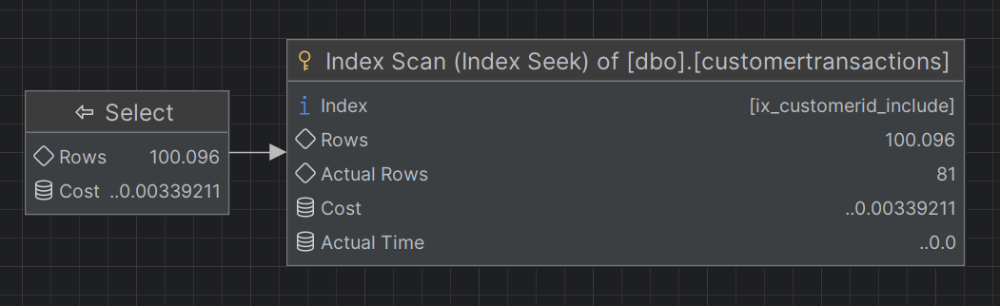

Utworzenie indeksu z dołączonymi kolumnami całkowicie wyeliminowało skoki do tabeli głownej. Baza danych znalazła wszystkie potrzebne informacje w liściach nowego indeksu, ograniczając plan do pojedynczej operacji Index Seek.

| Zapytanie        | Koszt      | Czas (ms) | Odczytane strony |
| ---------------- | ---------- | --------- | ---------------- |
| Brak indeksu     | 5.38031    | 49        | 7115             |
| Zwykły indeks    | 0.327137   | 1         | 260              |
| Indeks z INCLUDE | 0.00339211 | 0         | 3                |

Zestawienie wyników wyraźnie pokazuje przewagę ostatniego indeksu. Zwykły indeks poprawił wydajność względem pełnego skanowania tabeli, redukując odczyty z 7115 do 260 stron, jednak nadal wymagał doczytywania danych. Zastosowanie INCLUDE całkowicie wyeliminowało ten problem, zmniejszając liczbę odczytów do 3 stron. Koszt zapytania spadł praktycznie do zera, a czas wykonania do 0 ms.

### **Przykład 4 - Filtered Index**

W tym przykładzie sprawdzimy, jak zoptymalizować zapytania o rzadkie zdarzenia. Zamiast indeksować całą tabelę, stworzymy strukturę, która fizycznie przechowuje tylko informacje o transakcjach z błędem.

#### Przygotowanie danych

Przed analizą zmniejszono liczbę rekordów o statusie error do poziomu ok 1% całego zbioru, aby zasymulować realne warunki występowania błędów.

```sql
update customertransactions
set status = 'completed'
where status = 'error'
and transactionid % 100 <> 0

update statistics customertransactions

select status, count(*)
from customertransactions
group by status
```

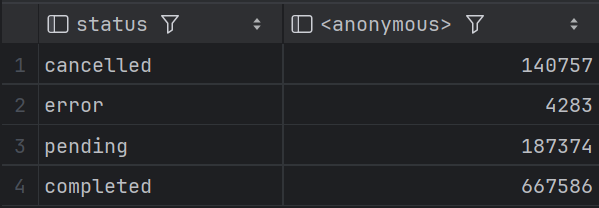

#### Zapytanie

Szukamy wszystkich błędnych transakcji w celu ich weryfikacji.

```sql
select transactionid, customerid, amount
from customertransactions
where status = 'error'
```

#### Bez dedykowanego indeksu

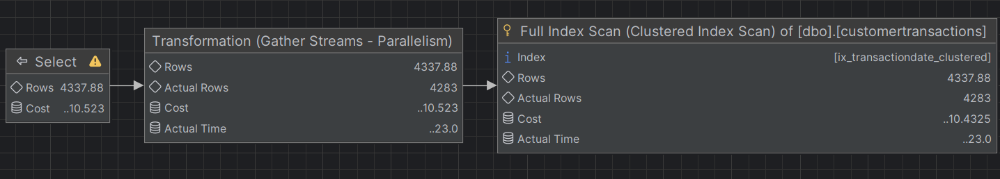

Silnik bazy danych wykonuje pełne skanowanie głównej tabeli za pomocą Clustered Index Scan.

#### Tworzenie indeksu filtrowanego

```sql
create nonclustered index ix_errors
on customertransactions (transactionid)
include (customerid, amount)
where status = 'error'
```

#### Indeks filtrowany

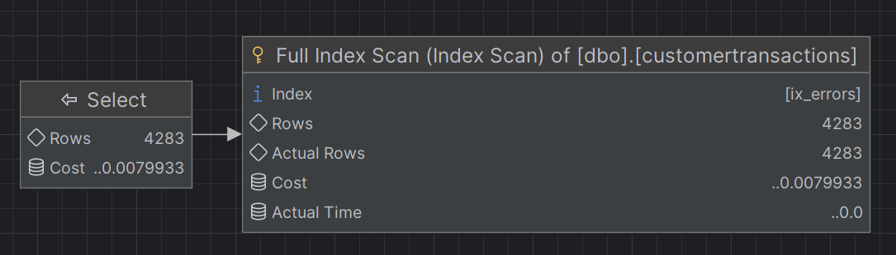

Plan zapytania uprościł się. Baza wykonała operację Index Scan na indeksie filtrowanym. Wydaje się to być w tym przypadku optymalne, ponieważ indeks zawiera wyłącznie szukane błędy, więc silnik odczytuje po kolei całą jego zawartość bez konieczności nawigowania po drzewie indeksu jak byloby w przypadku Index Seeka.

| Zapytanie    | Koszt     | Czas (ms) | Odczytane strony |
| ------------ | --------- | --------- | ---------------- |
| Brak indeksu | 10.523    | 27        | 14215            |
| Z indeksem   | 0.0079933 | 2         | 34               |

Jak widać indeksy warunkowe dla danych o wysokiej selektywności bardzo dobrze sobie radzą. Liczba odczytanych stron spadła z ponad 14 tys do zaledwie 34, a koszt zapytania zmniejszył się ponad tysiąckrotnie.

### **Przykład 5 - Indeks kolumnowy**

W tym przykładzie analizujemy wydajność zapytania, które wymaga pogrupowania i zagregowania dużej liczby rekordów dla poszczególnych klientów.

#### Zapytanie

```sql
select
    customerid,
    count(*) as tran_count,
    sum(amount) as total_spent
from customertransactions
group by customerid
```

#### Bez indeksu

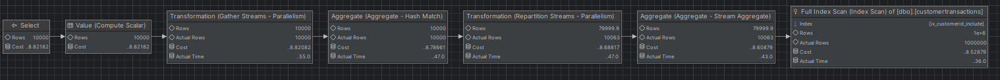

Silnik bazy danych użył indeksu ix_customerid_include, ponieważ zawiera on kolumny potrzebne w zapytaniu i jest fizycznie mniejszy niż cała tabela, mimo to, przetwarzanie miliona rekordów wiersz po wierszu nadal jest mało wydajne. Zmusza to bazę do stworzenia skomplikowanego planu, który wymaga podziału pracy na wiele wątków i wieloetapowej agregacji.

#### Tworzenie indeksu kolumnowego

```sql
create nonclustered columnstore index ncci_customer_analytics
    on customertransactions(customerid, amount)
```

#### Z indeksem

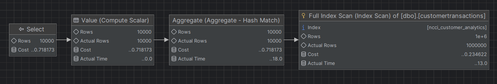

Plan zapytania uległ znacznemu uproszczeniu. Silnik wykonuje operację Index Scan na nowym indeksie kolumnowym. Operatory zrównoleglenia i przesyłania strumieni zostały wyeliminowane z planu, a proces agregacji jest realizowany jednoetapowo.

| Zapytanie   | Koszt    | Czas (ms) | Odczytane strony         |
| ----------- | -------- | --------- | ------------------------ |
| Bez indeksu | 8.82182  | 75        | 11645                    |
| Z indeksem  | 0.718173 | 42        | 1448 (lob logical reads) |

Utworzenie indeksu kolumnowego zredukowało szacunkowy koszt zapytania ponad 12-krotnie oraz skróciło czas wykonania niemal o połowę. Znacząco spadła również liczba odczytów z 11645 standardowych stron na 1448 stron lob. Jak widać indeksy kolumnowe są bardzo skuteczne przy przetwarzaniu i agregacji dużych zbiorów danych.

|         |                                                                          |     |
| ------- | ------------------------------------------------------------------------ | --- |
| zadanie | pkt                                                                      |     |
| 1       | 6                                                                        |     |
| 2       | 2                                                                        |     |
| 3       | 5 (3 pkt. za eksperymenty + 2 dodatkowe za ciekawe/oryginalne przyklady) |     |
| razem   | 13                                                                       |     |
