# Indeksy,  optymalizator <br>Lab 2

<!-- <style scoped>
 p,li {
    font-size: 12pt;
  }
</style>  -->

<!-- <style scoped>
 pre {
    font-size: 8pt;
  }
</style>  -->


---

**Imiona i nazwiska:**
Karolina Węgrzyn, Patrycja Markiewicz

--- 

Celem ćwiczenia jest zapoznanie się z planami wykonania zapytań (execution plans), oraz z budową i możliwością wykorzystaniem indeksów
(kontynuacja poprzedniego ćwiczenia)

Swoje odpowiedzi wpisuj w miejsca oznaczone jako:

---
> Wyniki: 

```sql
--  ...
```

---

Ważne/wymagane są komentarze.

Zamieść kod rozwiązania oraz zrzuty ekranu pokazujące wyniki, (dołącz kod rozwiązania w formie tekstowej/źródłowej)

Zwróć uwagę na formatowanie kodu

## Oprogramowanie - co jest potrzebne?

Do wykonania ćwiczenia potrzebne jest następujące oprogramowanie
- MS SQL Server
- SSMS - SQL Server Management Studio    
	- ewentualnie inne narzędzie umożliwiające komunikację z MS SQL Server i analizę planów zapytań
    
Oprogramowanie dostępne jest na przygotowanej maszynie wirtualnej

## Przygotowanie  

Uruchom Microsoft SQL Managment Studio.
    
Stwórz swoją bazę danych o nazwie lab2. 

```sql
create database lab2  
go  
  
use lab2  
go
```

Warto przełączyć bazę w tryb simple 

```sql
alter database lab2  
set recovery simple;
```
<div style="page-break-after: always;"></div>

# Zadanie 1 - indeksy


Wykonaj poniższy skrypt, aby przygotować dane:

```sql
select * into product_history  
from northwind3.dbo.product_history  


select * into categories  
from northwind3.dbo.categories  


create clustered index categ_clust_idx  
on categories(categoryid)
```

sprawdź liczbę wierszy w tabeli

```sql
select count(*) from product_history
```

Jest 2310000 wierszy.

Sprawdź jakie indeksy istnieją dla tej tabeli

```sql
exec sp_helpindex 'dbo.product_history'
```

```sql
Select  
    i.name as index_name,  
    i.type_desc,  
    i.is_unique,  
    c.name as column_name,  
    ic.key_ordinal,  
    ic.is_included_column  
from sys.indexes i  
join sys.index_columns ic  
    on i.object_id = ic.object_id  
   and i.index_id = ic.index_id  
join sys.columns c  
    on ic.object_id = c.object_id  
   and ic.column_id = c.column_id  
where i.object_id = object_id('dbo.product_history')  
order by i.name, ic.key_ordinal;
```

Brak indeksów dla tej tabeli.


włącz statystyki  IO i TIME 

```sql
SET STATISTICS IO ON

SET STATISTICS TIME ON;
```

podczas analiz sprawdzaj jak zachowują się zapytania, zwróć uwagę na
- plan
- koszt
- czas (ewentualnie, jeśli coś da się zaobserwować) 
- liczbę odczytywanych stron !!!!

porównaj zapytania

###  a)

```sql
--- 1
select count(*) from product_history
where id = 1000000

--- 2
select count(*) from product_history
where id between 999000 and 10000000
```

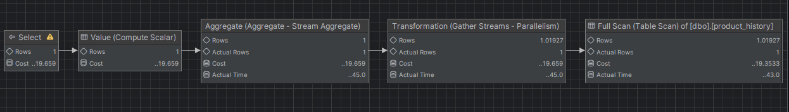

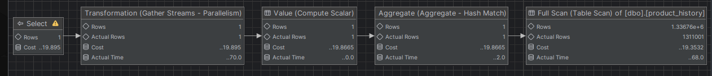


| Zapytanie | Koszt    | Czas (ms) | Odczytane strony  |
| :-------- | :------- | :-------- | :---------------- |
| 1         | 19.659   | 72       |       25837       |
| 2         | 19.895  | 91       |          25837     |

Oba zapytania wykonują pełny skan tabeli, odczytując identyczną ilość stron. Warunek WHERE nie ma tu żadnego znaczenia – agregacja przy COUNT(*) wymaga przejścia przez całą tabelę. Odrobinę wyższy czas zapytania 2 wynika z szerszego zakresu filtrowania.

### b)

```sql
--- 3
select * from product_history
where id = 1000000
 
--- 4
select * from product_history
where id between 999000 and 10000000
```

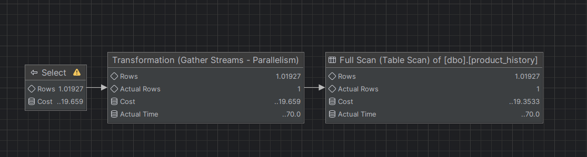

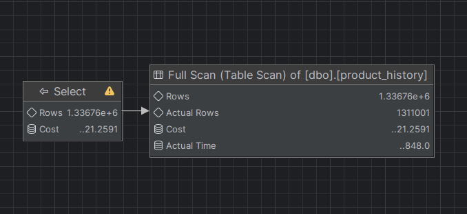


| Zapytanie | Koszt    | Czas (ms) | Odczytane strony  |
| :-------- | :------- | :-------- | :---------------- |
| 3        | 19.659   | 67      |       25837       |
| 4         | 21.2591  | 9       |          70     |

Zapytanie 3 skanuje całe 25837 stron – bez indeksu SQL Server nie wie gdzie szukać konkretnej wartości. Zapytanie 4 odczytuje tylko 70 stron prawdopodobnie dzięki temu, że kolumna id może być fizycznie skorelowana z kolejnością wstawiania wierszy (wiersze były wstawiane sekwencyjnie). Przez co silnik natrafiając na górną granicę zakresu, kończy skan wcześniej. Wyższy koszt zapytania 4 wynika z konieczności zwrócenia wszystkich kolumn dla większej liczby wierszy.

### c)

sprawdź jak zachowają się zapytania z pkt a) i b) jeśli dla kolumny `id` stworzysz indeks
- klastrowy 
- nieklastrowy

```sql
create clustered index product_history_clust_idx  
on product_history(id)

drop index product_history_clust_idx on product_history

create index product_history_idx  
on product_history(id)

drop index product_history_idx on product_history
```

po zakończeniu pozostaw indeks klastrowy

- klastrowy

| Zapytanie | Koszt    | Czas (ms) | Odczytane strony  |
| :-------- | :------- | :-------- | :---------------- |
| 1         | 0.0032842   | 5       |       3       |
| 2         | 11.2587  | 33       |          14800     |
| 3        | 0.0032831   | 0       |       3       |
| 4         | 12.3069  | 9      |          14     |

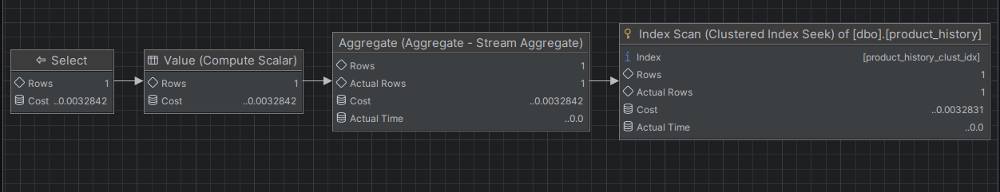

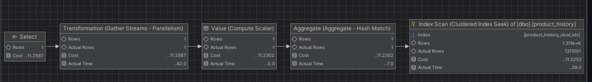

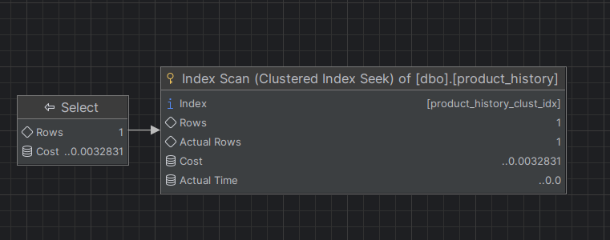

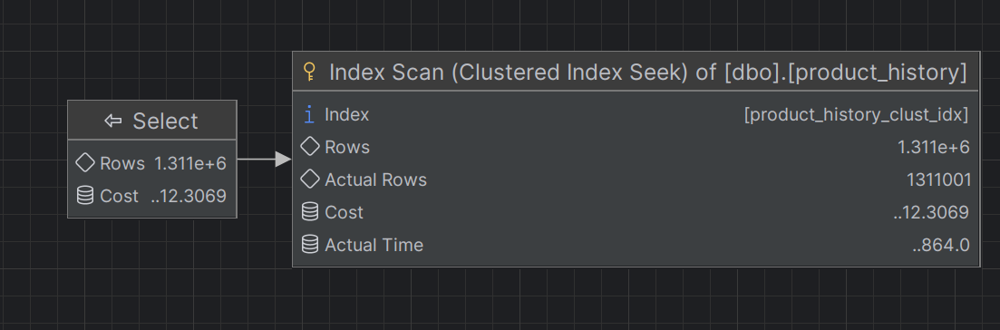

Indeks klastrowy porządkuje fizycznie dane według id, co daje znaczną poprawę dla zapytań punktowych (1 i 3) oraz dla SELECT * z BETWEEN (14 stron, czyta tylko strony z danymi, które faktycznie istnieją). Dla COUNT(*) z szerokim zakresem poprawa jest mniejsza – nadal musi przejść przez wszystkie 14800 stron należących do zakresu, bo każdy wiersz musi zostać policzony (czy istnieje czy nie).

- nieklastrowy

| Zapytanie | Koszt    | Czas (ms) | Odczytane strony  |
| :-------- | :------- | :-------- | :---------------- |
| 1         | 0.0032842   | 0       |       3       |
| 2         | 4.39569  | 84       |          2935     |
| 3        | 0.006570   | 5       |       4       |
| 4         | 21.6821  | 7       |          70     |

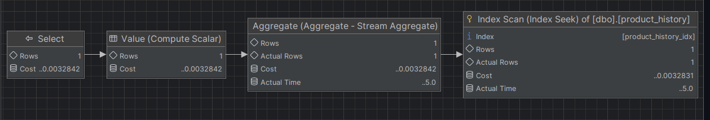

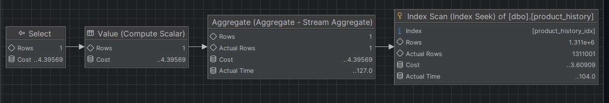

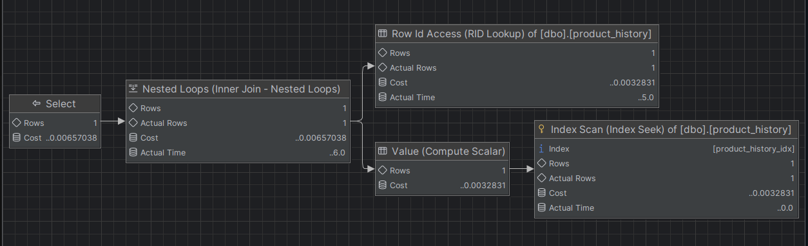

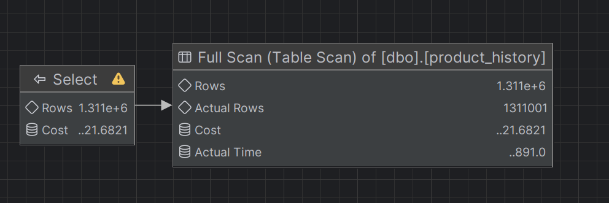

Indeks nieklastrowy sprawdza się dobrze dla COUNT(*) z zakresem – wykonuje Index Seek (odczytuje 2935 stron), a nie Index Scan jak dla indeksu klastrowego, ale ma dłuższy czas wykonania. Natomiast dla SELECT * z zakresem indeks zostaje zignorowany, bo koszt odwołań do tabeli (żeby zwrócić całe wiersze) po przeszukaniu indeksu byłby wyższy niż Full Table Scan, więc silnik wybiera skan tabeli.

### d)

indeks dla kolumny `date`

```sql
create index product_history_date_idx  
on product_history(date)  
  
drop index product_history_date_idx on product_history
```

porównaj polecenia

```sql
--- 1
select id, productid, productname, date  
from product_history  
where date >= '2001-01-01' and date <= '2001-01-31'

--- 2
select id, productid, productname, date  
from product_history  
where year(date) = 2001 and month(date) = 1

--- 3
select id, productid, productname, date  
from product_history  
where date >= '2001-01-01' and date <= '2001-12-31'  

--- 4 
select id, productid, productname, date  
from product_history  
where year(date) = 2001
```

podczas analiz sprawdzaj jak zachowują się zapytania, zwróć uwagę na
- plan
- indeksy i sposób ich użycia
- koszt
- czas (ewentualnie, jeśli coś da się zaobserwować) 
- liczbę odczytywanych stron !!!!

spróbuj skomentować wyniki tych analiz, dlaczego tak się dzieje 

| Zapytanie | Koszt    | Czas (ms) | Odczytane strony  |
| :-------- | :------- | :-------- | :---------------- |
| 1         | 7.51795   | 1       |       1547       |
| 2         | 20.3818  | 79      |          26067     |
| 3        | 20.3513   | 151       |       19234       |
| 4         | 20.1782  | 77       |          26067     |


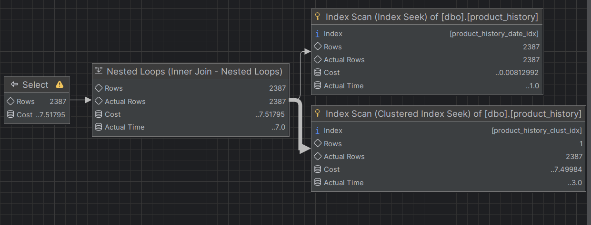

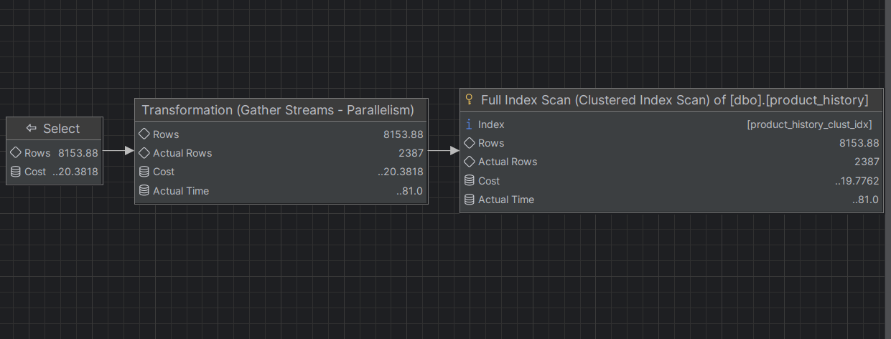

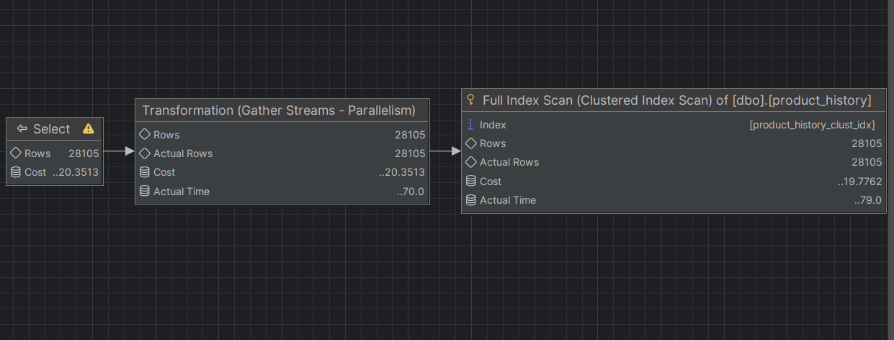

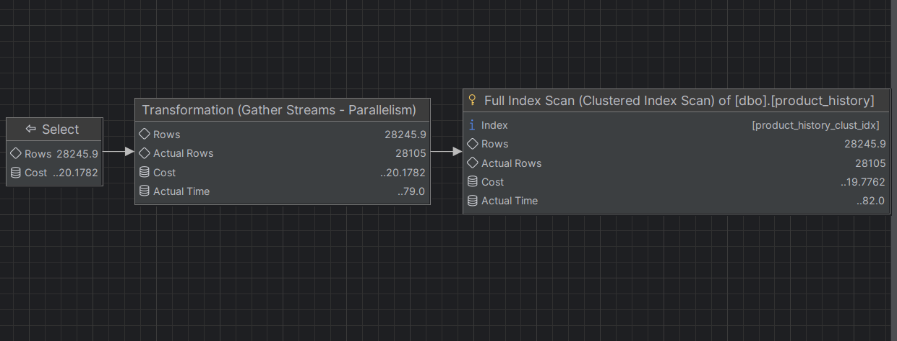

Tutaj porównujemy sposoby filtrowania danych. Dla 1 zapytania został wykorzystany Index Seek - najlepsza wydajność, a dla reszty on nie mógł zostać użyty z powodu zastosowania funkcji na kolumnie indeksowanej lub dużego zakresu danych. Przez co widzimy tam większą liczbę odczytów oraz większy koszt i czas wykonania.

### e)  

powtórz eksperymenty z pkt d) , ale tym razem użyj indeksu zawierającego dodatkowe kolumny

```sql
create index product_history_date_incl_idx  
on product_history(date) include(productid, productname)  
  
drop index product_history_date_incl_idx on product_history

```

co się zmieniło?

| Zapytanie | Koszt    | Czas (ms) | Odczytane strony  |
| :-------- | :------- | :-------- | :---------------- |
| 1         | 0.0140558   | 0      |       7       |
| 2         | 9.58029  | 59       |          11413     |
| 3        | 0.134938   | 1       |       7       |
| 4         | 9.37673  | 71       |          11413     |


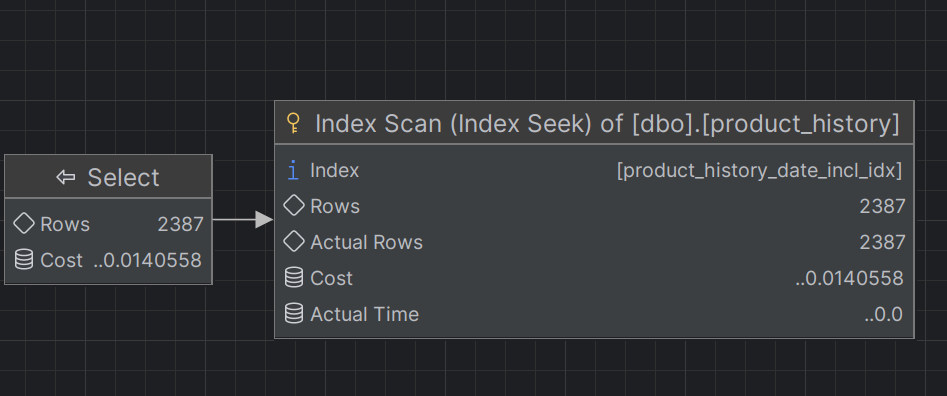

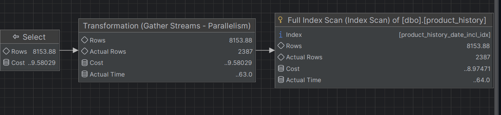

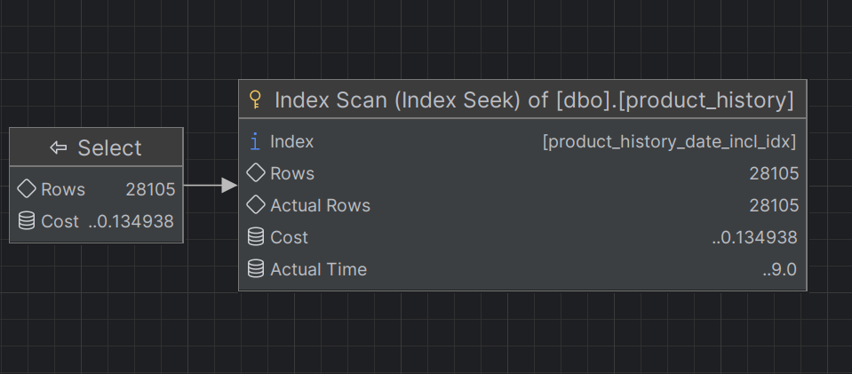

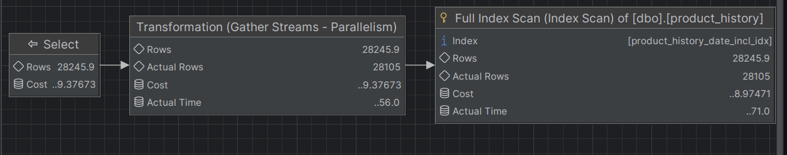

Zastosowanie indeksu z kolumnami w INCLUDE poprawiło wydajność zapytań wykorzystujących warunek zakresowy na kolumnie date, bo indeks stał się pokrywający i nie wymagał dodatkowych odwołań do tabeli. W efekcie zmniejszyła się liczba odczytanych stron oraz koszt zapytań. Jednak dla zapytań wykorzystujących funkcje na kolumnie indeksowanej, indeks nie został efektywnie użyty, dlatego wydajność nie uległa znaczącej poprawie.

### f) 

indeks dla kolumny `categoryid`

```sql
create index product_history_cat_idx  
on product_history(categoryid)  
  
drop index product_history_cat_idx on product_history
```

przeanalizuj polecenia

```sql
select id, productid, productname, date 
from product_history p
where categoryid = 8


select id, productid, productname, date, categoryname
from product_history p join categories c on p.categoryid = c.categoryid
where p.categoryid = 8
```


| Zapytanie | Koszt    | Czas (ms) | Odczytane strony  |
| :-------- | :------- | :-------- | :---------------- |
| 1         | 20.5734   | 7       |       42       |
| 2         | 23.8679  | 14       |          44     | 


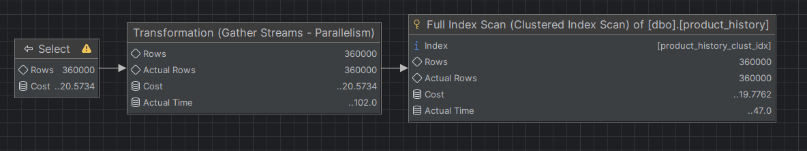

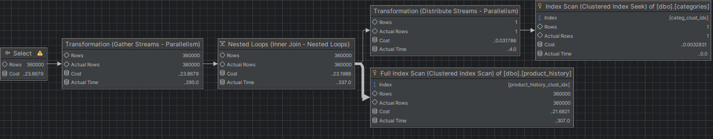

Zastosowanie indeksu na kolumnie categoryid umożliwiło wykorzystanie indeksu w obu zapytaniach, co znacząco ograniczyło liczbę odczytanych stron. W zapytaniu z JOIN dodatkowy koszt wynika z konieczności połączenia tabel, jednak łączenie odbywa się na kolumnie indeksowanej, wpływ na wydajność jest niewielka.

### dodatkowo

możesz sprawdzić strukturę indeksu

np.

```sql
exec sp_helpindex 'dbo.product_history';  
  
select  
    i.name as index_name,  
    ips.index_depth,  
    ips.index_level,  
    ips.page_count  
from sys.indexes i  
cross apply sys.dm_db_index_physical_stats(  
    db_id(),  
    i.object_id,  
    i.index_id,  
    null,    'detailed'  
) ips  
where i.object_id = object_id('dbo.product_history')  
  and i.name = 'product_history_date_idx';
```

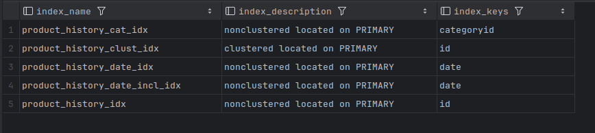

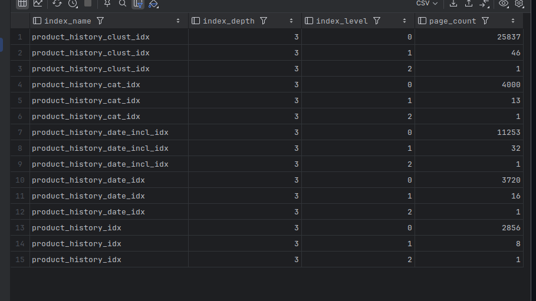

Każdy indeks ma głębokość 3, co oznacza że każde wyszukiwanie punktowe wymaga przejścia przez dokładnie trzy poziomy, stąd wyniki 3 odczytanych stron dla zapytań punktowych.
Największą liczbę stron liści zajmuje indeks klastrowy (25837), bo jego liście to bezpośrednio strony danych tabeli. Indeks nieklastrowy na tej samej kolumnie id zajmuje 2856 stron liści, bo przechowuje wyłącznie klucze ze wskaźnikami, bez reszty danych wiersza.
Indeks pokrywający date_incl_idx zajmuje 11253 strony liści - trzykrotnie więcej niż zwykły date_idx (3720 stron). Różnica wynika z dodatkowych kolumn przechowywanych w liściach, ale przez to możemy uniknąć odwołań do tabeli podczas zapytań.

jeśli chcesz zaobserwować odczyty logiczne/fizyczne możesz zwolnić pulę buforów przed wykonaniem polecenia

```sql
CHECKPOINT;  
DBCC DROPCLEANBUFFERS;
```

i teraz porównaj liczby czytanych stron np. wykonując dwukrotnie polecenie

```sql
select * from product_history
```

1 odczyt - logical reads 12, physical reads 1

2 odczyt - logical reads 12, physical reads 0

# Zadanie 2 

Celem zadania jest poznanie indeksów typu column store

Utwórz tabelę testową:

```sql
create table saleshistory(  
 id int identity(1,1) not null primary key,  
 salesorderid int not null,  
 salesorderdetailid int not null,  
 carriertrackingnumber nvarchar(25) null,  
 orderqty smallint not null,  
 productid int not null,  
 specialofferid int not null,  
 unitprice money not null,  
 unitpricediscount money not null,  
 linetotal numeric(38, 6) not null,  
 rowguid uniqueidentifier not null,  
 modifieddate datetime not null  
 )
```

Sprawdź jakie indeksy istnieją dla tej tabeli

```sql
exec sp_helpindex 'dbo.saleshistory'
```

```sql
Select  
    i.name as index_name,  
    i.type_desc,  
    i.is_unique,  
    c.name as column_name,  
    ic.key_ordinal,  
    ic.is_included_column  
from sys.indexes i  
join sys.index_columns ic  
    on i.object_id = ic.object_id  
   and i.index_id = ic.index_id  
join sys.columns c  
    on ic.object_id = c.object_id  
   and ic.column_id = c.column_id  
where i.object_id = object_id('dbo.saleshistory')  
order by i.name, ic.key_ordinal;
```


Wypełnij tablicę danymi:


```sql
-- w ssms

insert into saleshistory  
 select sh.*  
 from adventureworks2017.sales.salesorderdetail sh  
go 100
```


(UWAGA    `GO 100` oznacza 100 krotne wykonanie polecenia. Jeżeli podejrzewasz, że twój serwer może to zbyt przeciążyć, zacznij od GO 10, GO 20, GO 50 


albo

```sql
declare @i int = 1;  
  
while @i <= 100  
begin  
    insert into saleshistory  
    select *  
    from adventureworks2017.sales.salesorderdetail;  
  
    set @i += 1;  
end;
```

sprawdź liczbę wierszy w tabeli

```sql
select count(*) from saleshistory  
```


włącz statystyki  IO i TIME 

```sql
SET STATISTICS IO ON

SET STATISTICS TIME ON;
```

Sprawdź jak zachowa się zapytanie
- sprawdź plan
- koszt
- czas 
- liczbę odczytywanych stron

```sql
select productid, sum(unitprice), avg(unitprice), sum(orderqty), avg(orderqty)  
from saleshistory  
group by productid  
order by productid
```

Załóż indeks typu column store:

```sql
create nonclustered columnstore index saleshistory_columnstore  
 on saleshistory(unitprice, orderqty, productid)
```

Sprawdź różnicę pomiędzy przetwarzaniem w zależności od indeksów. Porównaj plany i opisz różnicę. 
Co to są indeksy colums store? Jak działają? (poszukaj materiałów w internecie/literaturze)

UWAGA: ciekawsze efekty możesz zaobserwować dla jeszcze większych tabel (jeśli twój komp na to pozwala możesz zwiększyć wolumen generowanych danych)

# Zadanie 3 – własne eksperymenty

Należy zaprojektować/zaimplementować tabelę w bazie danych, lub wybrać dowolny schemat/bazę/tabelę  (poza używanymi na zajęciach), a następnie wypełnić ją danymi w taki sposób, przetestować/przeanalizować działanie indeksów różnego typu. Warto wygenerować sobie tabele o większym rozmiarze.

Możesz też powtórzyć np. eksperymenty wykonywane w zadaniu 1, ale tym  razem dla innego serwera, 

Wedle uznania i zainteresowań, ważne żeby poeksplorować tematykę i spróbować 

Do analizy, proszę uwzględnić następujące rodzaje indeksów:
- Klastrowane (np.  dla atrybutu nie będącego kluczem głównym)
- Nieklastrowane
- Indeksy wykorzystujące kilka atrybutów, indeksy include
- Filtered Index (Indeks warunkowy)
- Kolumnowe

## Analiza

Proszę przygotować zestaw zapytań do danych, które:
- wykorzystują poszczególne indeksy
- które przy wymuszeniu indeksu działają gorzej, niż bez niego (lub pomimo założonego indeksu, tabela jest w pełni skanowana)
Odpowiedź powinna zawierać:
- Schemat tabeli
- Opis danych (ich rozmiar, zawartość, statystyki)
- Opis indeksu
- Przygotowane zapytania, wraz z wynikami z planów (zrzuty ekranow)
- Inf o kosztach, czytanych stornach 
- Komentarze do zapytań, ich wyników
- ew. sprawdzenie, co proponuje Database Engine Tuning Advisor (porównanie czy udało się Państwu znaleźć odpowiednie indeksy do zapytania)


> Wyniki: 

```sql
--  ...
```


|         |                                                                           |     |
| ------- | ------------------------------------------------------------------------- | --- |
| zadanie | pkt                                                                       |     |
| 1       | 6                                                                         |     |
| 2       | 2                                                                         |     |
| 3       | 5  (3 pkt. za eksperymenty + 2 dodatkowe za ciekawe/oryginalne przyklady) |     |
| razem   | 13                                                                        |     |

