# Kolumnowe bazy danych cz. I

## Eksploracja danych, podstawowe agregacje i pierwszy benchmark PostgreSQL i ClickHouse

---

**Imiona i nazwiska:**
Karolina Węgrzyn, Patrycja Markiewicz

---

**Parametry sprzętów:**

- zadania parzyste - 8 rdzeni i 32 GB RAM
- zadania nieparzyste - 8 rdzeni i 16 GB RAM

---

### 1. Pierwsze poznanie tabeli events

#### PostgreSQL

```sql
select column_name, data_type, is_nullable, column_default
from information_schema.columns
where table_name = 'events';
```


```sql
select * from events limit 10;
```


```sql
SELECT
    count(*) AS n,
    min(event_time) AS min_time,
    max(event_time) AS max_time
FROM events;
```


```sql
SELECT
    count(*) AS all_rows,
    count(price) AS non_null_price,
    count(quantity) AS non_null_quantity,
    count(*) - count(price) AS null_price_rows,
    count(*) - count(quantity) AS null_quantity_rows
FROM events;
```


#### ClickHouse

```sql
DESCRIBE TABLE events;
```


Pozaostałe zapytanie były takie same dla ClickHouse jak dla PostgreSQL.


Dla obu baz sprawdzane elementy są takie same - kolumny tabel, liczba rekordów, zakres czasu, brak wartości NULL dla kolumn price i quantity.

### 2. Profil danych zdarzeniowych

#### ClickHouse

Sprawdź, jakie typy zdarzeń występują w danych i ile ich jest:

```sql
select
    event_type,
    count(*) as n
from events
group by event_type
order by n desc;
```

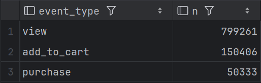

Sprawdź, jakie kraje występują w danych i ile mają zdarzeń:

```sql
select
    country,
    count(*) as n
from events
group by country
order by n desc;
```

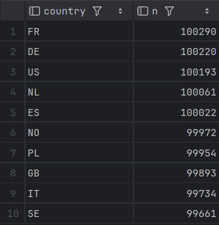

Sprawdź, jakie urządzenia występują w danych i ile mają zdarzeń:

```sql
select
    device,
    count(*) as n
from events
group by device
order by n desc;
```

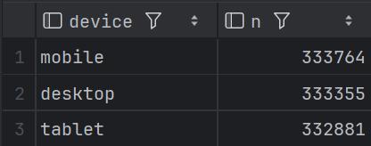

Dla każdego z tych trzech przekrojów wskaż kategorię dominującą:

```sql
(select
     'event_type' as przekroj,
     event_type as dominujaca_wartosc,
     count(*) as n
from events
group by event_type
order by n desc limit 1)

UNION ALL

(select
     'country' as przekroj,
     country as dominujaca_wartosc,
     count(*) as n
from events
group by country
order by n desc limit 1)

UNION ALL

(select
     'device' as przekroj,
     device as dominujaca_wartosc,
     count(*) as n
from events
group by device
order by n desc limit 1);
```

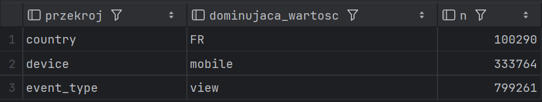

#### PostgreSQL

Sprawdź, jakie typy zdarzeń występują w danych i ile ich jest:

```sql
select
    event_type,
    count(*) as n
from events
group by event_type
order by n desc;
```

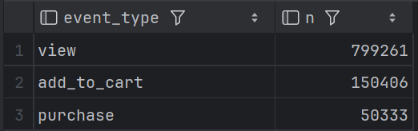

Sprawdź, jakie kraje występują w danych i ile mają zdarzeń:

```sql
select
    country,
    count(*) as n
from events
group by country
order by n desc;
```

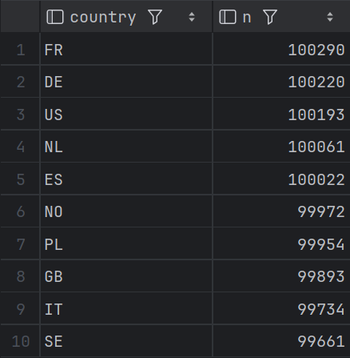

Sprawdź, jakie urządzenia występują w danych i ile mają zdarzeń:

```sql
select
    device,
    count(*) as n
from events
group by device
order by n desc;
```

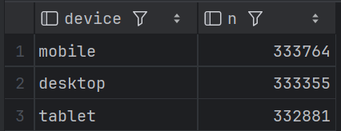

Dla każdego z tych trzech przekrojów wskaż kategorię dominującą:

```sql
(select
     'event_type' as przekroj,
     event_type as dominujaca_wartosc,
     count(*) as n
from events
group by event_type
order by n desc limit 1)

UNION ALL

(select
     'country' as przekroj,
     country as dominujaca_wartosc,
     count(*) as n
from events
group by country
order by n desc limit 1)

UNION ALL

(select
     'device' as przekroj,
     device as dominujaca_wartosc,
     count(*) as n
from events
group by device
order by n desc limit 1);
```

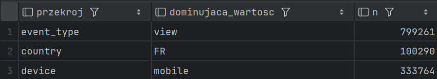

Wyniki zapytań są zgodne dla obu baz. Kod jest dokładnie taki sam w obu przypadkach. Najczęstszym zdarzeniem jest wyświetlenie. Jeśli chodzi o pozostałe przekroje, kategorią dominującą dla krajów jest Francja, a dla urządzeń sprzęt mobilny, chociaż ilości zdarzeń dla krajów i urządzeń są do siebie bardzo zbliżone.

### 3. Aktywność w czasie

#### PostgreSQL

```sql
select count(*), date(event_time)
from events
group by date(event_time);
```

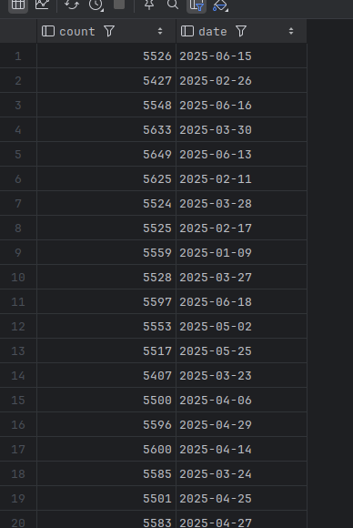

```sql
select count(*), date(event_time)
from events
group by date(event_time)
order by count(*) desc limit 5;
```


```sql
select count(*), date(event_time)
from events
group by date(event_time)
order by count(*) asc limit 5;
```


```sql
select min(p.count) as min, max(p.count) as max, max(p.count) - min(p.count) as diff
from (select count(*) as count
      from events
      group by date(event_time)) as p
```

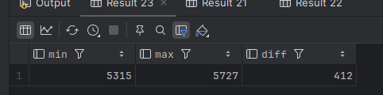

#### ClickHouse

```sql
select count(*), toDate(event_time)
from events
group by toDate(event_time);
```


```sql
select count(*), toDate(event_time)
from events
group by toDate(event_time)
order by count(*) desc limit 5;
```


```sql
select count(*), toDate(event_time)
from events
group by toDate(event_time)
order by count(*) asc limit 5;
```


```sql
select min(p.count) as min, max(p.count) as max, max(p.count) - min(p.count) as diff
from (select count(*) as count
      from events
      group by toDate(event_time)) as p
```


Wyniki zapytań są takie same dla obu baz.
Rozkład wygląda na stabilny, bo różnica miedzy maksymalną liczą zdarzeń a minimalną wynosi zaledwie 412. Nie widać wyraźnych dni odstających.

### 4. Podstawowe KPI sprzedażowe

Przygotuj podstawowe KPI związane ze zdarzeniami zakupowymi.

#### ClickHouse

- policz liczbę zdarzeń typu purchase,
- policz łączny przychód ze zdarzeń typu purchase,
- policz średnią wartość pojedynczego zakupu,
- policz średnią liczbę sztuk w pojedynczym zakupie

```sql
select
    count(*) AS purchases_cnt,
    sum(price * quantity) AS revenue,
    avg(price * quantity) AS avg_order_value,
    avg(quantity) AS avg_quantity
from events
where event_type = 'purchase';
```

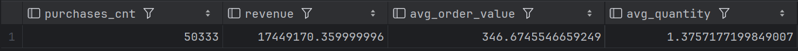

- policz liczbę sesji, w których wystąpił co najmniej jeden zakup

```sql
select
    count(distinct session_id) as purchase_sessions
from events
where event_type = 'purchase'
```

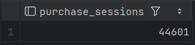

- policz udział sesji zakupowych w ogólnej liczbie sesji jako uproszczony współczynnik konwersji

```sql
select
    (select count(distinct session_id) from events where event_type = 'purchase') * 100.0
    / (select count(distinct session_id) from events) as conv_rate;
```

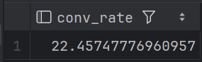

#### PostgreSQL

- policz liczbę zdarzeń typu purchase,
- policz łączny przychód ze zdarzeń typu purchase,
- policz średnią wartość pojedynczego zakupu,
- policz średnią liczbę sztuk w pojedynczym zakupie

```sql
select
    count(*) AS purchases_cnt,
    sum(price * quantity) AS revenue,
    avg(price * quantity) AS avg_order_value,
    avg(quantity) AS avg_quantity
from events
where event_type = 'purchase';
```

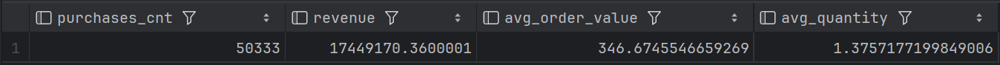

- policz liczbę sesji, w których wystąpił co najmniej jeden zakup

```sql
select
    count(distinct session_id) as purchase_sessions
from events
where event_type = 'purchase'
```

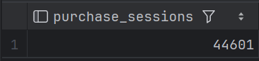

- policz udział sesji zakupowych w ogólnej liczbie sesji jako uproszczony współczynnik konwersji

```sql
select
    (select count(distinct session_id) from events where event_type = 'purchase') * 100.0
    / (select count(distinct session_id) from events) as conv_rate;
```

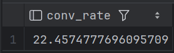

Wyniki w obu bazach są zgodne. Udział sesji zakupowych lepiej opisuje konwersję, ponieważ podczas jednej wizyty klient może wygenerowac dziesiątki zdarzeń `view` przeglądając produkty, ale sfinalizować to tylko jednym zdarzeniem `purchase`. Opieranie się na stosunku zdarzeń zaniżałoby wynik, więc w tym przypadku tylko analiza na poziomie sesji odpowiada na pytanie jaki procent wizyt w sklepie faktycznie zakończył się zakupem.

### 5. KPI w przekrojach biznesowych

#### PostgreSQL

```sql
--- wedlug kraju
SELECT
    country,
    sum(price * quantity) AS revenue
FROM events
WHERE event_type = 'purchase'
GROUP BY country
ORDER BY revenue DESC;
```

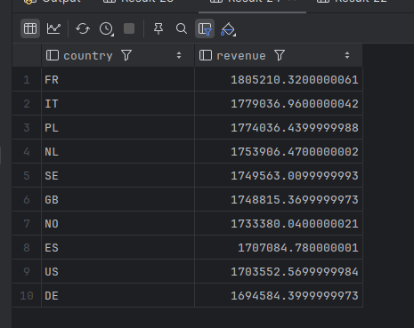

```sql
--- wedlug urzadzenia
SELECT
    device,
    sum(price * quantity) AS revenue
FROM events
WHERE event_type = 'purchase'
GROUP BY device
ORDER BY revenue DESC;
```

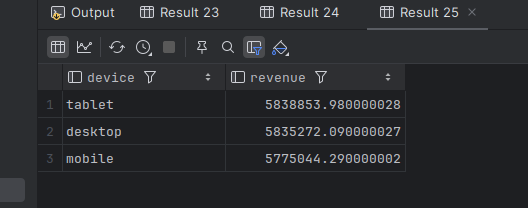

#### ClickHouse

Te same polecenia zostału użyte jak dla PostgreSQL.

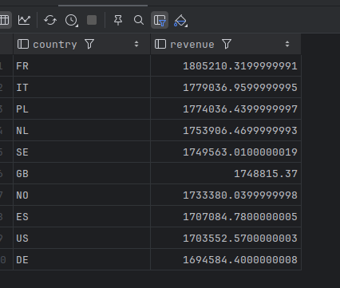

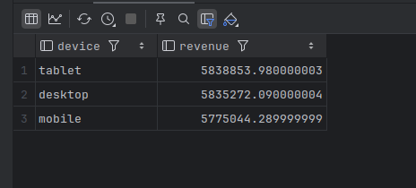

Wyniki dla obu baz są takie same, różnią się jedynie przybliżeniem obliczeń.

W przekroju krajów Francja generuje najwyższy przychód, natomiast Niemcy najniższy.

W przypadku urządzeń tablet ma najwyższy przychód, przy czym desktop znajduje się na bardzo zbliżonym poziomie. Mobile generuje najniższy przychód.

### 6. Użytkownicy o najwyższym przychodzie

Znajdź użytkowników o najwyższym łącznym przychodzie z zakupów.
Wynik powinien zawierać: user_id, liczbę wszystkich zdarzeń użytkownika, liczbę zdarzeń typu purchase,
łączny przychód użytkownika ze zdarzeń typu purchase.
Pokaż co najmniej 20 rekordów o najwyższym przychodzie.

#### ClickHouse

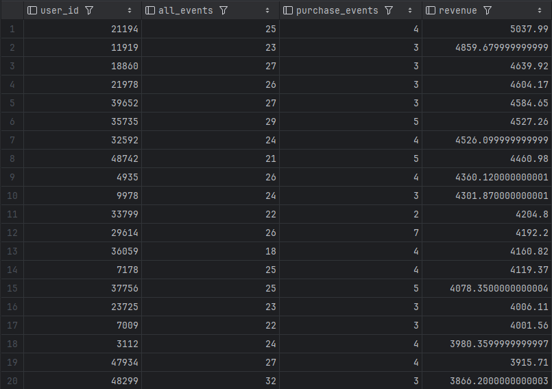

### PostgreSQL

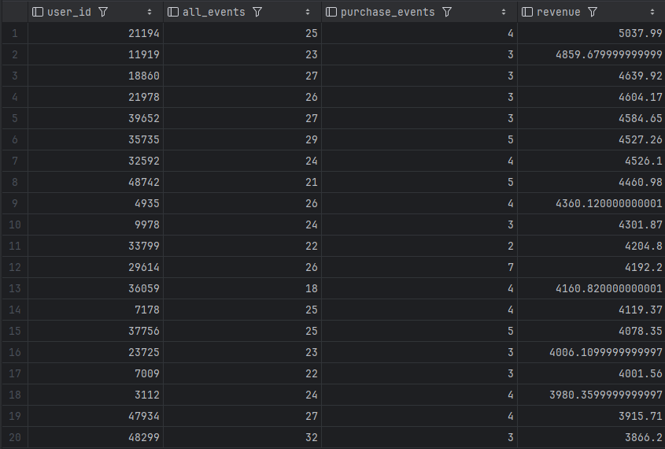

Użytkownik z najwyższym przychodem nie ma największej liczby zdarzeń w tym zestawieniu, ma ich 25. Przykładowo, użytkownik na 20 miejscu wygenerował ich aż 32. Widać wyraźnie, że duża aktywność nie jest gwarancją najwyższego zysku np. klient z zaledwie 2 zakupami na pozycji 11 wygenerował wyższy przychód niż klient, który dokonał aż 7 zakupów (pozycja 12). Przychód zależy przede wszystkim od wartości kupowanych produktów, a nie od samej liczby kliknięć czy ilosci transakcji. Klient, który rzadko wchodzi na stronę, ale kupuje drogie produkty, jest z perspektywy przychodu bardziej wartościowy niż bardzo aktywny użytkownik kupujący dużo tanich rzeczy.

### 7. Benchmark zapytań w PostgreSQL i ClickHouse

- A

```sql
--- PostgreSQL i ClickHouse
SELECT
    count(*) AS n,
    min(event_time) AS min_time,
    max(event_time) AS max_time
FROM events;
```

| Baza       | Pomiar 1 | Pomiar 2 | Pomiar 3 | Średnia |
| :--------- | :------- | :------- | :------- | :------ |
| PostgreSQL | 80       | 75       | 75       | 76.67   |
| ClickHouse | 10       | 8        | 8        | 8.67    |

```sql
--- PostgreSQL
select min(p.count) as min, max(p.count) as max, max(p.count) - min(p.count) as diff
from (select count(*) as count
      from events
      group by date(event_time)) as p;
```

```sql
--- ClickHouse
select min(p.count) as min, max(p.count) as max, max(p.count) - min(p.count) as diff
from (select count(*) as count
      from events
      group by toDate(event_time)) as p;
```

| Baza       | Pomiar 1 | Pomiar 2 | Pomiar 3 | Średnia |
| :--------- | :------- | :------- | :------- | :------ |
| PostgreSQL | 156      | 153      | 152      | 153.67  |
| ClickHouse | 32       | 13       | 13       | 19.3    |

- B

```sql
--- PostgreSQL
SELECT
    DATE(event_time) AS day,
    country,
    device,
    event_type,
    count(*) AS events_cnt,
    count(DISTINCT user_id) AS users_cnt,
    count(DISTINCT session_id) AS sessions_cnt,
    sum(CASE
            WHEN event_type = 'purchase' THEN price * quantity
            ELSE 0
        END) AS revenue
FROM events
where event_type = 'purchase'
GROUP BY
    DATE(event_time),
    country,
    device,
    event_type
ORDER BY revenue DESC
LIMIT 20;
```

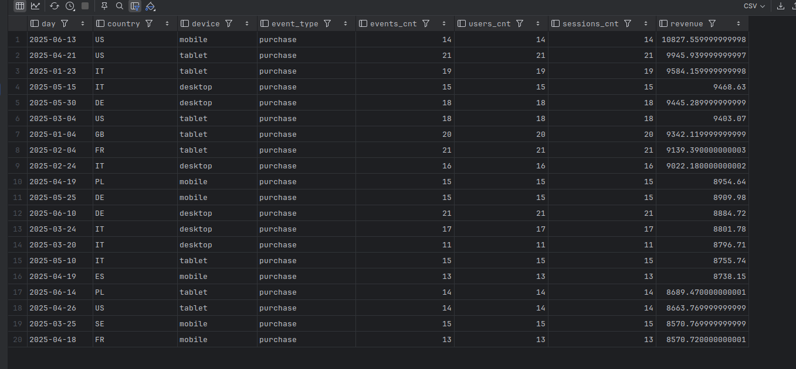

```sql
--- ClickHouse
SELECT
    toDate(event_time) AS day,
    country,
    device,
    event_type,
    count() AS events_cnt,
    count(DISTINCT user_id) AS users_cnt,
    count(DISTINCT session_id) AS sessions_cnt,
    sum(CASE
            WHEN event_type = 'purchase' THEN price * quantity
            ELSE 0
        END) AS revenue
FROM events
GROUP BY
    day,
    country,
    device,
    event_type
ORDER BY revenue DESC
LIMIT 20;
```

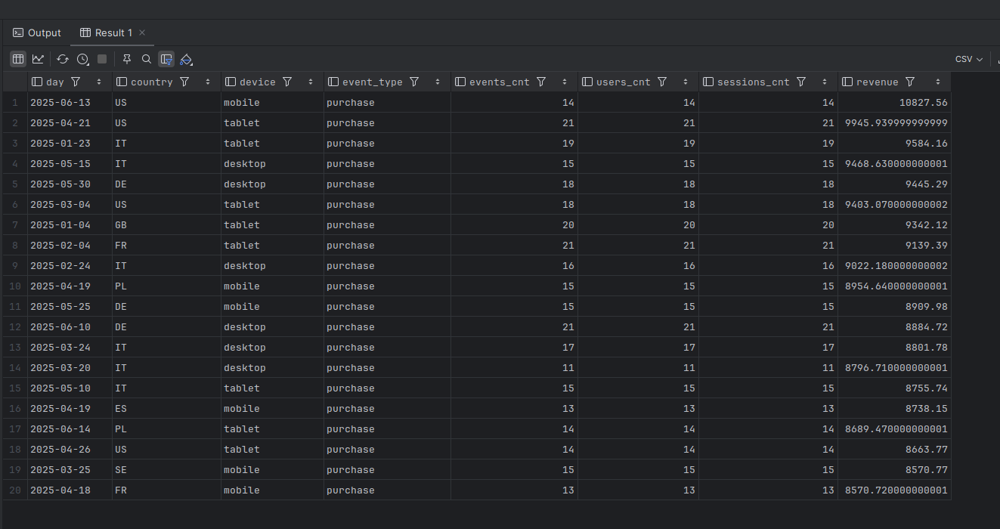

| Baza       | Pomiar 1 | Pomiar 2 | Pomiar 3 | Średnia |
| :--------- | :------- | :------- | :------- | :------ |
| PostgreSQL | 167      | 144      | 150      | 153.67  |
| ClickHouse | 80       | 66       | 59       | 68.3    |

- C

```sql
--- PostgreSQL
SELECT
    DATE(event_time) AS day,
    country,
    event_type,
    COUNT(*) AS events_cnt,
    COUNT(DISTINCT user_id) AS users_cnt,
    COUNT(DISTINCT session_id) AS sessions_cnt,
    SUM(price * quantity) AS revenue
FROM events
WHERE event_type = 'purchase'
  AND country = 'US'
  AND event_time >= NOW() - INTERVAL '300 days'
GROUP BY
    DATE(event_time),
    country,
    event_type
ORDER BY revenue DESC
LIMIT 30;
```

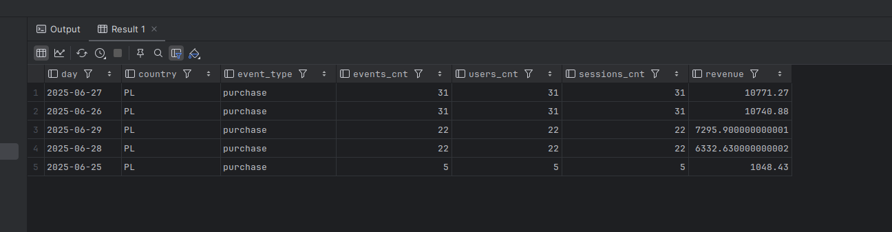

```sql
--- ClickHouse
SELECT
    toDate(event_time) AS day,
    country,
    event_type,
    count() AS events_cnt,
    countDistinct(user_id) AS users_cnt,
    countDistinct(session_id) AS sessions_cnt,
    sum(price * quantity) AS revenue
FROM events
WHERE event_type = 'purchase'
  AND country = 'US'
  AND event_time >= now() - INTERVAL 300 DAY
GROUP BY
    day,
    country,
    event_type
ORDER BY revenue DESC
LIMIT 30;
```

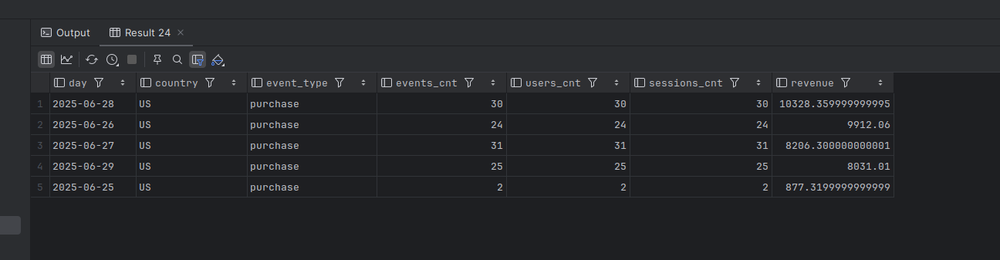

| Baza       | Pomiar 1 | Pomiar 2 | Pomiar 3 | Średnia |
| :--------- | :------- | :------- | :------- | :------ |
| PostgreSQL | 80       | 78       | 92       | 83.3    |
| ClickHouse | 14       | 12       | 13       | 13      |

Wyniki wszystkich zapytań były zgodne między PostgreSQL a ClickHouse (jedynie z drobnymi różnicami wynikającymi z zaokrągleń). ClickHouse był konsekwentnie szybszy we wszystkich przypadkach z wyraźnymi różnicami w czasie wykonania. Największa różnica wystąpiła w zapytaniu A dla drugiego wybranego przykładu, gdzie PostgreSQL potrzebował średnio 153.67 ms wobec 19.3 ms w ClickHouse. Po tym ćwiczeniu można postawić wstępny wniosek, że ClickHouse jest znacznie lepiej przystosowany do agregacji analitycznych na dużych zbiorach danych. Jego kolumnowy model przechowywania danych pozwala przetwarzać tylko niezbędne kolumny, co przekłada się na wyraźną przewagę wydajnościową szczególnie przy złożonych zapytaniach agregujących.
