### 1. Pierwsze poznanie tabeli events 

- PostgreSQL

```sql
select column_name, data_type, is_nullable, column_default
from information_schema.columns
where table_name = 'events';
```

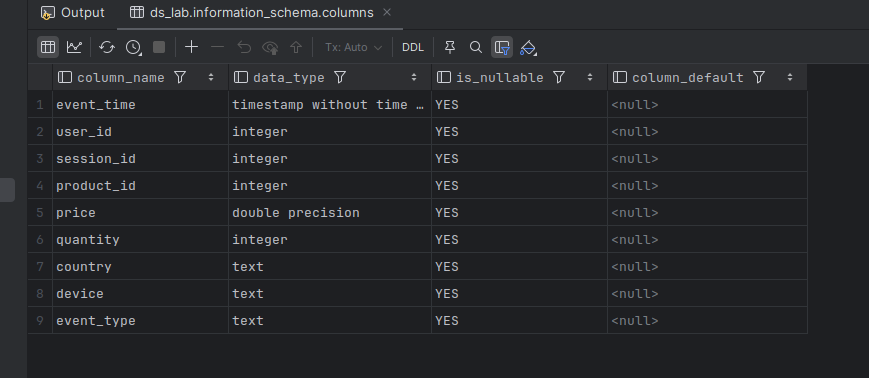


```sql
select * from events limit 10;
```

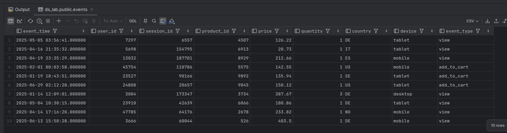


```sql
SELECT
    count(*) AS n,
    min(event_time) AS min_time,
    max(event_time) AS max_time
FROM events;
```

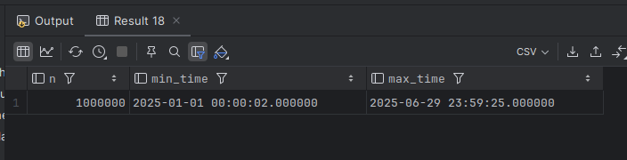


```sql
SELECT
    count(*) AS all_rows,
    count(price) AS non_null_price,
    count(quantity) AS non_null_quantity,
    count(*) - count(price) AS null_price_rows,
    count(*) - count(quantity) AS null_quantity_rows
FROM events;
```

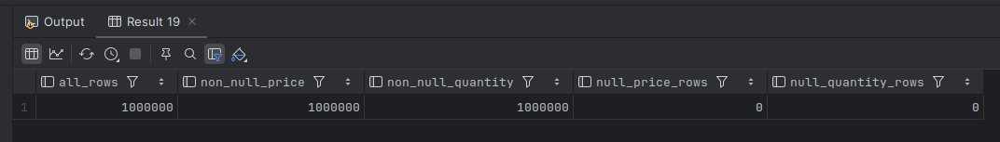

- ClickHouse

```sql
DESCRIBE TABLE events;
```

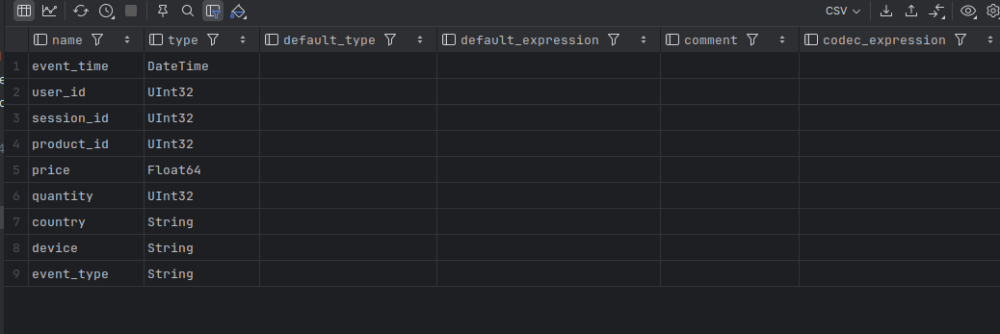

Pozaostałe zapytanie były takie same dla ClickHouse jak dla PostgreSQL.

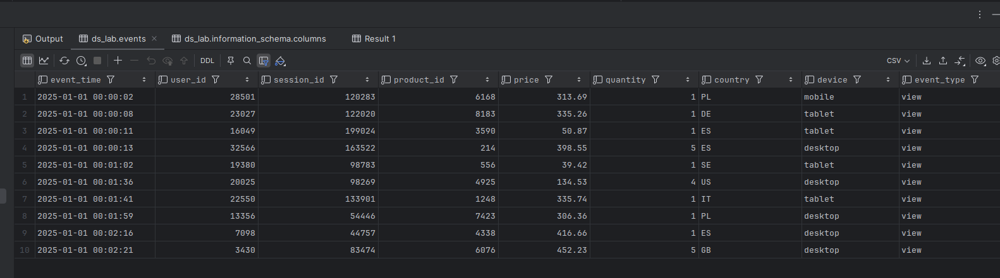

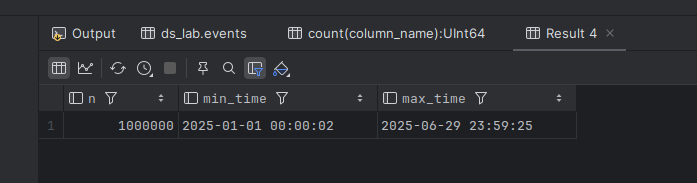

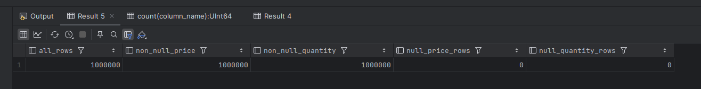

Dla obu baz sprawdzane elementy są takie same - kolumny tabel, liczba rekordów, zakres czasu, brak wartości NULL dla kolumn price i quantity.

### 3. Aktywność w czasie

- PostgreSQL

```sql
select count(*), date(event_time)
from events
group by date(event_time);
```


```sql
select count(*), date(event_time)
from events
group by date(event_time)
order by count(*) desc limit 5;
```

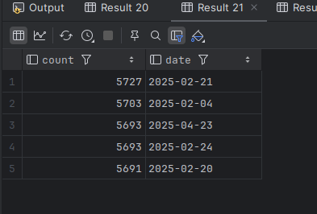

```sql
select count(*), date(event_time)
from events
group by date(event_time)
order by count(*) asc limit 5;
```

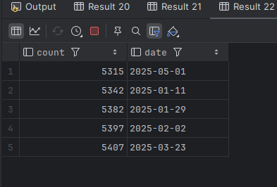

```sql
select min(p.count) as min, max(p.count) as max, max(p.count) - min(p.count) as diff
from (select count(*) as count
      from events
      group by date(event_time)) as p
```


- ClickHouse

```sql
select count(*), toDate(event_time)
from events
group by toDate(event_time);
```

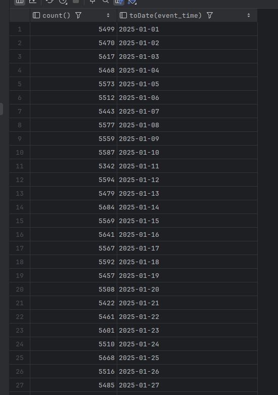

```sql
select count(*), toDate(event_time)
from events
group by toDate(event_time)
order by count(*) desc limit 5;
```

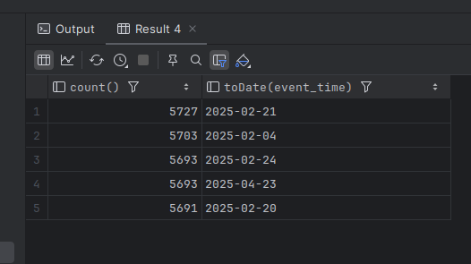

```sql
select count(*), toDate(event_time)
from events
group by toDate(event_time)
order by count(*) asc limit 5;
```

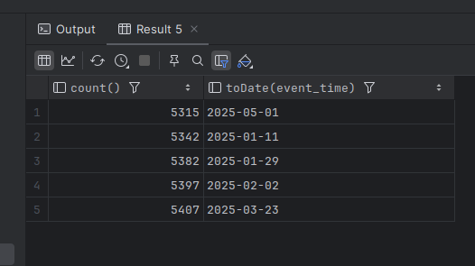

```sql
select min(p.count) as min, max(p.count) as max, max(p.count) - min(p.count) as diff
from (select count(*) as count
      from events
      group by toDate(event_time)) as p
```

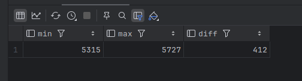

### 5. KPI w przekrojach biznesowych

- PostgreSQL


- ClickHouse

### 7. Benchmark zapytań w PostgreSQL i ClickHouse

- A
  
  
  - B


- C

| Zapytanie | Koszt    | Czas (ms) | Odczytane strony  |
| :-------- | :------- | :-------- | :---------------- |
| 3        | 19.659   | 67      |       25837       |
| 4         | 21.2591  | 9       |          70     |
