# **Kolumnowe bazy danych cz. II**

## **Zaawansowana analityka i dowód wydajności**

**Imię i nazwisko:**
Karolina Węgrzyn, Patrycja Markiewicz

**Grupa:** 1

## **Cel ćwiczenia**

Po tym laboratorium będziesz potrafił:

1.  zbudować lejek konwersji i zinterpretować odpływ między jego
    etapami,

2.  użyć funkcji okna do rankingu i analizy trendu przychodów w czasie,

3.  podzielić użytkowników na segmenty metodą RFM i wyciągnąć z tego
    wnioski biznesowe,

4.  zmierzyć i wyjaśnić różnicę wydajności między ClickHouse a
    PostgreSQL i powiedzieć, skąd ona wynika.

Laboratorium ma celowo prostą strukturę: **zadania 1–3 to analityka w
ClickHouse**, **zadanie 4 to dowód** eksperyment porównawczy oparty na
zapytaniach, które właśnie napisałeś.

**Zanim zaczniesz - przeczytaj to uważnie**

**Której bazy używamy i kiedy**

| **Zadanie**             | **Baza danych**                 |
| ----------------------- | ------------------------------- |
| 0\. Gotowość            | obie — sprawdzasz środowisko    |
| 1\. Lejek konwersji     | ClickHouse                      |
| 2\. Funkcje okna        | Jedna baza do wyboru            |
| 3\. Segmentacja RFM     | Do wyboru ale ClickHouse lepiej |
| 4\. Benchmark i wnioski | obie — porównanie obowiązkowe   |

W tym laboratorium ClickHouse jest bazą wiodącą. PostgreSQL pojawia się
w zadaniu 4 jako punkt odniesienia — po to, żeby różnicę wydajności
zmierzyć, nie zakładać.

**Jak korzystać ze ściągi**

Do zajęć dołączona jest ściąga sql_postgresql_clickhouse_sciaga.pdf.
Zawiera składnię i podpowiedzi do przykładów dla każdego zadania.
Korzystaj z niej jak z dokumentacji - żeby sprawdzić składnię funkcji,
nie żeby skopiować rozwiązanie. Numer sekcji ściągi podany jest przy
każdym zadaniu.

**Oceniane są interpretacja i komentarz.** Sam fakt uruchomienia
zapytania nie jest rozwiązaniem.

**Sprawozdanie**

Oddaj jako PDF albo Markdown. Dla każdego zadania dołącz:

- kod zapytania,

- wynik - tabela lub zrzut ekranu,

- komentarz - pełnymi zdaniami, nie listą słów.

**Termin oddania:** do końca dnia poprzedzającego kolejne zajęcia.

**Punktacja:** razem 10 pkt.

**Założenie startowe**

Środowisko Docker działa, tabela events jest dostępna w obu bazach.
Jeżeli tabela nie jest widoczna w bieżącym kontekście, użyj pełnej
nazwy:

- public.events w PostgreSQL,

- ds_lab.events w ClickHouse.

# **0. Gotowość do zajęć — warunek konieczny (0 pkt)**

Pokaż, że środowisko działa: kontenery postgres i clickhouse mają status
Up, tabela events jest widoczna w obu bazach, połączenie z klienta SQL
działa.

**Brak gotowości środowiska** uniemożliwia wykonanie dalszych zadań.

<div style="page-break-after: always;"></div>

# **1. Lejek konwersji — 2 pkt**

**Dlaczego to robimy**

W e-commerce każda sesja przechodzi przez etapy: wyświetlenie → koszyk →
zakup. Na każdym etapie część sesji odpada. **Lejek konwersji** mierzy,
ile sesji przechodzi przez każdy etap i gdzie odpływ jest największy -
to fundamentalny wskaźnik analityki e-commerce. Przy okazji zobaczysz,
jak ClickHouse upraszcza agregacje warunkowe dzięki countIf zamiast
klasycznego CASE WHEN. (zobacz odpowiednie sekcje w ściądze)

**Wykonaj w ClickHouse**

Dla każdej sesji ustal, czy wystąpiło w niej zdarzenie view, cart i
purchase. Na tej podstawie policz dla całego zbioru:

- liczbę sesji z view,

- liczbę sesji z cart,

- liczbę sesji z purchase,

- wskaźnik cart / view — jaka część sesji z view dotarła do cart,

- wskaźnik purchase / cart — jaka część sesji z cart zakończyła się
  zakupem,

- wskaźnik purchase / view — ogólna konwersja od pierwszego kontaktu do
  zakupu.

Następnie powtórz analizę w przekroju device.

**Zapytanie startowe**

```sql
WITH session_flags AS (
    SELECT
        session_id,
        countIf(event_type = 'view') > 0 AS has_view,
        countIf(event_type = 'add_to_cart') > 0 AS has_cart,
        countIf(event_type = 'purchase') > 0 AS has_purchase
    FROM events
    GROUP BY session_id
)
-- Krok 2: agregacja do poziomu całego zbioru
SELECT
    countIf(has_view) AS view_sessions,
    countIf(has_cart) AS cart_sessions,
    countIf(has_purchase) AS purchase_sessions,
    countIf(has_cart) / nullIf(countIf(has_view), 0) AS cart_per_view,
    countIf(has_purchase) / nullIf(countIf(has_cart), 0) AS purchase_per_cart,
    countIf(has_purchase) / nullIf(countIf(has_view), 0) AS purchase_per_view
FROM session_flags;
```

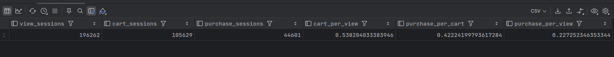

```sql
WITH session_flags AS (
    SELECT
        session_id,
        any(device) AS device,
        countIf(event_type = 'view') > 0 AS has_view,
        countIf(event_type = 'add_to_cart') > 0 AS has_cart,
        countIf(event_type = 'purchase') > 0 AS has_purchase
    FROM events
    GROUP BY session_id
)

SELECT
    device,
    countIf(has_view) AS view_sessions,
    countIf(has_cart) AS cart_sessions,
    countIf(has_purchase) AS purchase_sessions,
    countIf(has_cart) / nullIf(countIf(has_view), 0) AS cart_per_view,
    countIf(has_purchase) / nullIf(countIf(has_cart), 0) AS purchase_per_cart,
    countIf(has_purchase) / nullIf(countIf(has_view), 0) AS purchase_per_view
FROM session_flags
GROUP BY device;
```

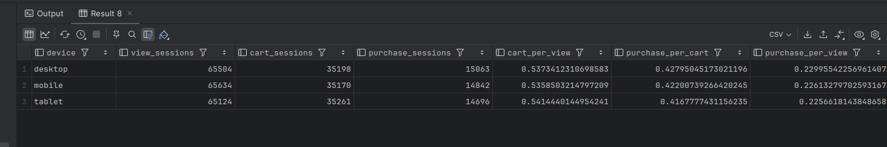

Zbuduj analogicznie wersję z GROUP BY device.

### **W komentarzu napisz**

- Na którym etapie lejka odpływ jest największy i co to oznacza dla
  biznesu — gdzie sklep traci klientów?

Największy odpływ w lejku występuje między pierwszym a drugim etapem. Prawie połowe klientów (46%) sklep traci zaraz po pierwszej interakcji - po oglądnięciu produktu klient nie dodaje go do koszyka.

- Czy lejek różni się między urządzeniami? Jeśli tak, co może być tego
  przyczyną?

Lejek między urządzeniami jest bardzo podobny. Współczynniki przejścia dla poszczególnych etapów różnią się tylko o kilka procent między sobą. Może to wynikać z drobnych różnic w wygodzie korzystania z interfejsu, wielkości ekranu lub sposobie przeglądania strony, ale ogólnie zachowanie użytkowników jest podobne.

- countIf zastępuje klasyczny wzorzec MAX(CASE WHEN ... THEN 1 ELSE 0
  END) ze standardowego SQL. W 2–3 zdaniach wyjaśnij, na czym polega
  różnica w podejściu i dlaczego wersja ClickHouse jest krótsza.

countIf w ClickHouse pozwala bezpośrednio policzyć liczbę wierszy spełniających dany warunek w funkcji agregującej. W standardowym SQL stosuje się MAX(CASE WHEN warunek THEN 1 ELSE 0 END), aby najpierw zamienić warunek na wartości 0 lub 1, a dopiero potem je zagregować. W ClickHouse podejście jest krótsze i czytelniejsze, bo warunek można bezpośrednio przekazać do countIf.

<div style="page-break-after: always;"></div>

# **2. Funkcje okna: rankingi i trend przychodów 2 pkt**

**Dlaczego to robimy**

Zwykłe GROUP BY zwija dane - dostajesz jeden wiersz na grupę. **Funkcje
okna** liczą wartości w kontekście innych wierszy bez zwijania wyników:
ranking krajów, suma narastająca, zmiana dzień do dnia bez
zagnieżdżonych podzapytań.

**Wybierz jedną bazę i napisz w niej obie części**

Zaznacz w sprawozdaniu, którą bazę wybrałeś.

**Wybrałam ClickHouse**

### **Część A - Ranking krajów**

Policz łączny przychód z zakupów dla każdego kraju i nadaj krajom
ranking według przychodu. Użyj RANK() albo DENSE_RANK().

Wynik powinien zawierać kolumny: country, revenue, rank_no.

**Wskazówka:** funkcję okna możesz zastosować bezpośrednio w SELECT obok
agregacji - nie musisz pisać podzapytania ani CTE.

```sql
select
    country,
    sum(price * quantity) as revenue,
    rank() over (order by sum(price * quantity) desc) as rank_no
from events
where event_type = 'purchase'
group by country
order by rank_no;
```

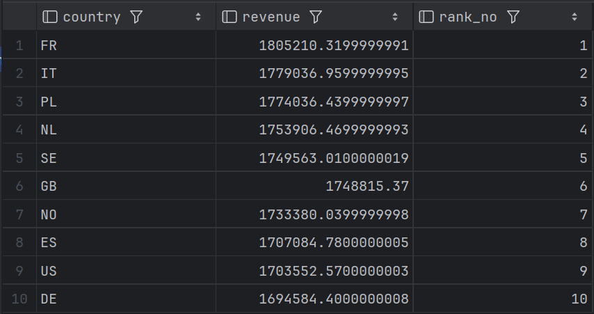

### **Część B - Narastający przychód i zmiana dzień do dnia**

Policz dzienny przychód ze zdarzeń purchase. Następnie w tym samym
zapytaniu oblicz:

- sumę narastającą - cumulative_revenue,

- przychód z poprzedniego dnia - prev_day_revenue,

- zmianę procentową względem poprzedniego dnia - pct_change.

Wynik powinien zawierać kolumny: day, daily_revenue, cumulative_revenue,
prev_day_revenue, pct_change.

**Wskazówki składniowe**

| Element            | PostgreSQL                    | ClickHouse                                                                  |
| ------------------ | ----------------------------- | --------------------------------------------------------------------------- |
| Data               | DATE(event_time)              | toDate(event_time)                                                          |
| Suma narastająca   | SUM(x) OVER (ORDER BY day)    | sum(x) OVER (ORDER BY day ROWS BETWEEN UNBOUNDED PRECEDING AND CURRENT ROW) |
| Poprzednia wartość | LAG(x, 1) OVER (ORDER BY day) | lagInFrame(x, 1) OVER (ORDER BY day ROWS ...)                               |

**Wskazówka:** zbuduj zapytanie w dwóch krokach - najpierw CTE z
dziennym przychodem (GROUP BY day), a dopiero do niego dołącz funkcje
okna.

```sql
with daily as (
    select
        toDate(event_time) as day,
        sum(quantity * price) as daily_revenue
    from events
    where event_type = 'purchase'
    group by day
),
daily_with_lag as (
    select
        day,
        round(daily_revenue, 2) as daily_revenue,
        round(sum(daily_revenue) over (order by day rows between unbounded preceding and current row), 2) as cumulative_revenue,
        lagInFrame(daily_revenue, 1) over (order by day rows between unbounded preceding and current row) as prev_day_revenue
    from daily
)
select
    day,
    daily_revenue,
    cumulative_revenue,
    prev_day_revenue,
    round(((daily_revenue / prev_day_revenue) - 1) * 100, 2) as pct_change
from daily_with_lag
order by day;
```

### **W komentarzu napisz**

- Czy suma narastająca rośnie równomiernie czy skokowo?

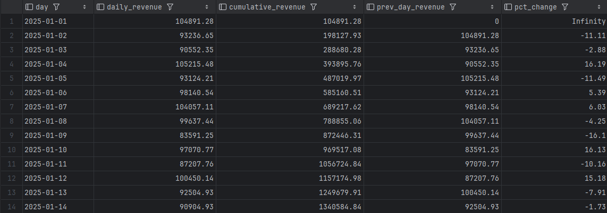

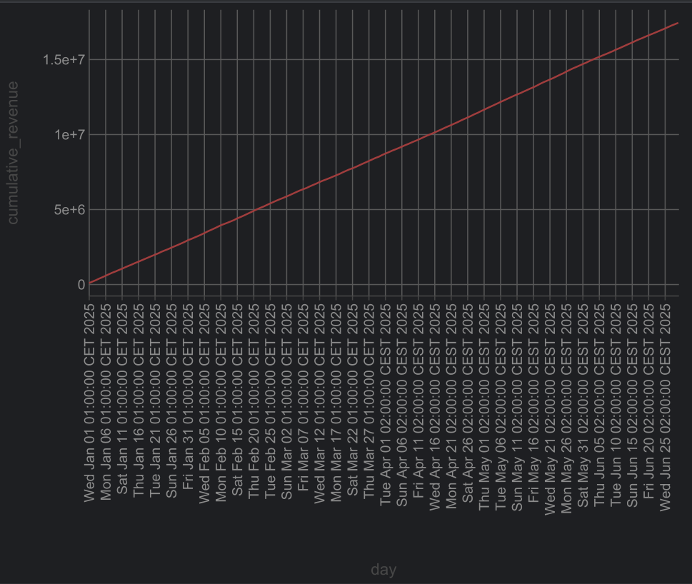

Suma narastająca rośnie równomiernie. Wykres ma kształt niemal idealnie
prostej linii, bez widocznych skoków. Dzienny przychód
oscyluje wokół stałego poziomu ~90-105 tys, co przekłada się na
równomierne tempo narastania.

- Czy widać konkretny dzień z wyraźną zmianą - ile wyniósł wzrost lub
  spadek w procentach?

Żeby znaleźć skrajne wartości, posortowałam wyniki po `pct_change`.

Największy spadek:

```sql
order by pct_change
```

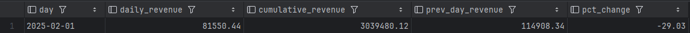

Największy spadek: 2025-02-01, pct_change = -29.03%

Największy wzrost:

```sql
order by pct_change desc
```

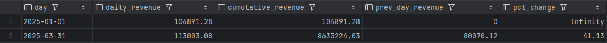

Największy wzrost: 2025-03-31, pct_change = +41.13%

- Co było dla Ciebie nowe w funkcjach okna i co sprawiło największą
  trudność?

Nowe było zagnieżdżanie funkcji okna na wyniku agregacji, intuicyjnie
chcialam pisać wszystko w jednym SELECT, a dopiero wskazówka uświadomiła
mi, że agregacja musi być gotowa zanim zastosujemy okno. Trudniejsza
okazała się składnia ClickHouse np dla `lagInFrame` z jawną ramką ROWS,
której PostgreSQL nie wymaga.

<div style="page-break-after: always;"></div>

# **3. Segmentacja użytkowników - metoda RFM - 2 pkt**

**Dlaczego to robimy**

**RFM** to prosta i skuteczna metoda segmentacji klientów stosowana w
marketingu od dekad:

- **R**ecency - jak dawno użytkownik ostatnio kupił?

- **F**requency - ile razy kupił?

- **M**onetary - ile łącznie wydał?

Na tej podstawie dzielisz klientów na segmenty: najlepszych nagradzasz,
uśpionych reaktywujesz, nowych zachęcasz do kolejnego zakupu.

**Wybierz jedną bazę i wykonaj zadanie w niej**

Zaznacz w sprawozdaniu, którą bazę wybrałeś.

### **Krok 1 — oblicz R, F, M dla każdego użytkownika**

```sql
WITH ref AS (
    SELECT max(event_time) AS ref_time
    FROM events
),
     purchases AS (
         SELECT
             user_id,
             count(*) AS frequency,
             sum(price * quantity) AS monetary,
             max(event_time) AS last_purchase_time
         FROM events
         WHERE event_type = 'purchase'
         GROUP BY user_id
     )

SELECT
    p.user_id,
    dateDiff('day', p.last_purchase_time, ref.ref_time) AS recency,
    p.frequency,
    p.monetary
FROM purchases p
         CROSS JOIN ref
ORDER BY monetary DESC;
```

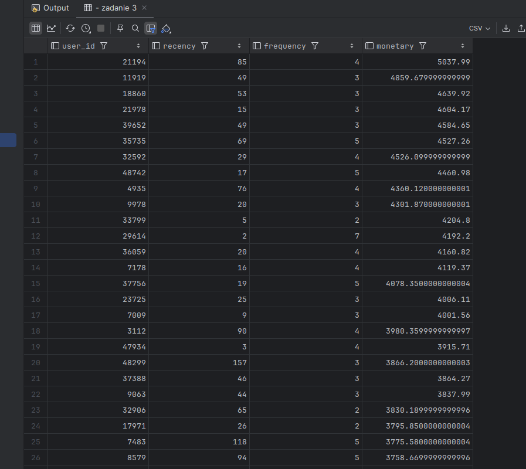

Zanim przejdziesz dalej — sprawdź zakres wartości, żeby świadomie dobrać
progi:

```sql
WITH purchases AS (
    SELECT
        user_id,
        count() AS frequency,
        sum(price * quantity) AS monetary
    FROM events
    WHERE event_type = 'purchase'
    GROUP BY user_id
)

SELECT
    count() AS users_count,
    min(monetary) AS min_m,
    max(monetary) AS max_m,
    avg(monetary) AS avg_m,
    min(frequency) AS min_f,
    max(frequency) AS max_f
FROM purchases;
```

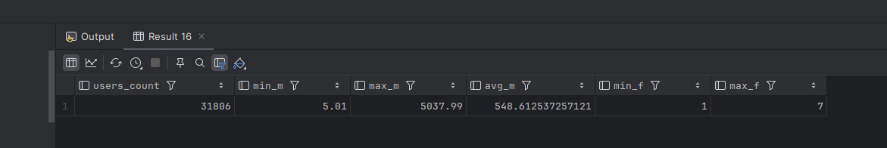

### **Krok 2 — podziel użytkowników na segmenty**

Na podstawie wyników z kroku 1 zbuduj trzy segmenty według kolumny
monetary. Progi dobierz samodzielnie na podstawie rozkładu danych z
powyższego kroku.

```sql
WITH purchases AS (
    SELECT
        user_id,
        count() AS frequency,
        sum(price * quantity) AS monetary
    FROM events
    WHERE event_type = 'purchase'
    GROUP BY user_id
)

SELECT
    user_id,
    frequency,
    monetary,
    CASE
        WHEN monetary >= 1500 THEN 'premium'
        WHEN monetary >= 300 THEN 'standard'
        ELSE 'okazjonalny'
        END AS segment
FROM purchases;
```

Dla każdego segmentu policz:

- liczbę użytkowników,

- łączny przychód segmentu,

- udział procentowy w całkowitym przychodzie wszystkich użytkowników.

```sql
WITH purchases AS (
    SELECT
        user_id,
        sum(price * quantity) AS monetary
    FROM events
    WHERE event_type = 'purchase'
    GROUP BY user_id
),

     segmented AS (
         SELECT
             user_id,
             monetary,
             CASE
                 WHEN monetary >= 1500 THEN 'premium'
                 WHEN monetary >= 300 THEN 'standard'
                 ELSE 'okazjonalny'
                 END AS segment
         FROM purchases
     ),

     segment_stats AS (
         SELECT
             segment,
             count() AS users_count,
             sum(monetary) AS segment_revenue
         FROM segmented
         GROUP BY segment
     ),

     total AS (
         SELECT
             count() AS total_users,
             sum(monetary) AS total_revenue
         FROM purchases
     )

SELECT
    s.segment,
    s.users_count,
    round(s.users_count / t.total_users * 100, 2) AS users_share_pct,
    s.segment_revenue,
    round(s.segment_revenue / t.total_revenue * 100, 2) AS revenue_share_pct
FROM segment_stats s
         CROSS JOIN total t
ORDER BY s.segment_revenue DESC;
```

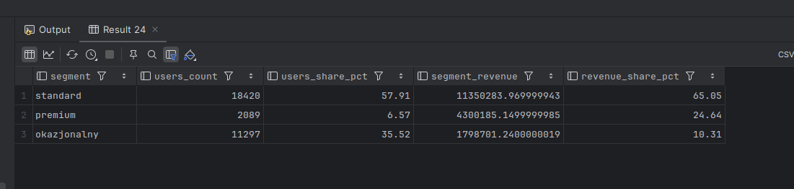

### **W komentarzu napisz**

- Jak dobrałeś progi i dlaczego - co konkretnie w danych na to wskazało?

Progi segmentów zostały dobrane na podstawie wartości monetary. Ustalono próg 300 jako granicę między klientami o niskiej i średniej wartości zakupów, natomiast próg 1500 (około 3לrednia) wyznacza grupę klientów o najwyższej wartości, stanowiących najbardziej dochodowy segment (premium). Rozkład danych jest prawoskośny, dlatego progi oparte zostały o obserwację rozkładu, a nie przez równe przedziały.

- Czy mała grupa użytkowników generuje dużą część przychodu - jaki
  procent użytkowników i jaki procent przychodu?

Najmniejsza grupa (premium), która stanowi tylko około 7% użytkowników, generuje prawie 25% przychodu.

- Czy widzisz coś zbliżonego do zasady Pareto?

Można zauważyć trend podobny do zasady Pareto (80/20 - około 80% efektów wynika z 20% przyczyn), ale nie jest on idealny. Około 65% użytkowników (segment standard + premium) generuje prawie 90% przychodu, co pokazuje silną koncentrację wartości w bardziej aktywnych klientach.

- Co wyniki mówią o lojalności klientów tego sklepu?

Wyniki sugerują, że sklep ma niewielką, ale bardzo wartościową grupę lojalnych klientów (premium), którzy generują znaczną część przychodów. Jednocześnie duża liczba klientów jest okazjonalna, co oznacza potencjał do zwiększenia przychodów poprzez działania zwiększające powtarzalność zakupów (np. programy lojalnościowe, personalizowane oferty).

<div style="page-break-after: always;"></div>

# **4. Benchmark i wnioski końcowe - 4 pkt**

**Dlaczego to robimy**

Przez całe laboratorium pisałeś zapytania analityczne. Teraz zmierzysz,
jak szybko obie bazy te zapytania wykonują - i odpowiesz na pytanie
będące sednem kursu: **kiedy i dlaczego ClickHouse wygrywa z
PostgreSQL?** To eksperyment: hipoteza, pomiar, wynik, interpretacja.

**Zasady pomiaru**

Dla każdego zapytania w każdej bazie:

- uruchom zapytanie 4 razy,

- **pierwszy wynik odrzuć** - jest rozgrzewkowy,

- zapisz 3 kolejne czasy,

- oblicz średnią.

**ClickHouse cache - krytyczne:** przed każdą serią pomiarów uruchom SET use_query_cache = 0.
Bez tego kolejne wykonania identycznego zapytania mogą zwrócić wynik z
pamięci podręcznej zamiast policzyć go od nowa — czasy będą sztucznie
niskie i nieporównywalne.

### **Trzy zapytania do zmierzenia**

Użyj zapytań, które już napisałeś w zadaniach 1–3 . Nie pisz nowych,
benchmark ma sens tylko wtedy, gdy mierzysz coś, co już rozumiesz.

#### B1 - proste - proste zapytanie agregujące z jednym GROUP BY, np.

przychód per kraj albo liczba zdarzeń per dzień – **może to być zadanie
z wcześniejszych laboratoriów**

ClickHouse

```sql
select
    country,
    sum(price * quantity) as revenue,
    rank() over (order by sum(price * quantity) desc) as rank_no
from events
where event_type = 'purchase'
group by country
order by rank_no;
```

PostgreSQL

```sql
select
    country,
    sum(price * quantity) as revenue,
    rank() over (order by sum(price * quantity) desc) as rank_no
from events
where event_type = 'purchase'
group by country
order by rank_no;
```

#### B2 - średnie - zapytanie z lejkiem konwersji z zadania 1

```sql
with session_flags as (
    select
        session_id,
        countIf(event_type = 'view') > 0 as has_view,
        countIf(event_type = 'cart') > 0 as has_cart,
        countIf(event_type = 'purchase') > 0 as has_purchase
    from events
    group by session_id
)
select
    countIf(has_view) as view_sessions,
    countIf(has_cart) as cart_sessions,
    countIf(has_purchase) as purchase_sessions,
    countIf(has_cart) / nullIf(countIf(has_view), 0) as cart_per_view,
    countIf(has_purchase) / nullIf(countIf(has_cart), 0) as purchase_per_cart,
    countIf(has_purchase) / nullIf(countIf(has_view), 0) as purchase_per_view
from session_flags;
```

PostgreSQL

```sql
with session_flags as (
    select
        session_id,
        sum(case when event_type = 'view' then 1 else 0 end) > 0 as has_view,
        sum(case when event_type = 'cart' then 1 else 0 end) > 0 as has_cart,
        sum(case when event_type = 'purchase' then 1 else 0 end) > 0 as has_purchase
    from events
    group by session_id
)
select
    sum(case when has_view then 1 else 0 end) as view_sessions,
    sum(case when has_cart then 1 else 0 end) as cart_sessions,
    sum(case when has_purchase then 1 else 0 end) as purchase_sessions,
    sum(case when has_cart then 1 else 0 end) / nullif(sum(case when has_view then 1 else 0 end), 0) as cart_per_view,
    sum(case when has_purchase then 1 else 0 end) / nullif(sum(case when has_cart then 1 else 0 end), 0) as purchase_per_cart,
    sum(case when has_purchase then 1 else 0 end) / nullif(sum(case when has_view then 1 else 0 end), 0) as purchase_per_view
from session_flags;
```

#### B3 - złożone - zapytanie z funkcją okna z zadania 2 lub segmentacja

RFM z zadania 3.

ClickHouse

```sql
with daily as (
    select
        toDate(event_time) as day,
        sum(quantity * price) as daily_revenue
    from events
    where event_type = 'purchase'
    group by day
),
daily_with_lag as (
    select
        day,
        round(daily_revenue, 2) as daily_revenue,
        round(sum(daily_revenue) over (order by day rows between unbounded preceding and current row), 2) as cumulative_revenue,
        lagInFrame(daily_revenue, 1) over (order by day rows between unbounded preceding and current row) as prev_day_revenue
    from daily
)
select
    day,
    daily_revenue,
    cumulative_revenue,
    prev_day_revenue,
    round(((daily_revenue / prev_day_revenue) - 1) * 100, 2) as pct_change
from daily_with_lag
order by day;
```

PostgreSQL

```sql
with daily as (
    select
        date(event_time) as day,
        sum(quantity * price) as daily_revenue
    from events
    where event_type = 'purchase'
    group by day
),
daily_with_lag as (
    select
        day,
        round(daily_revenue::numeric, 2) as daily_revenue,
        round(sum(daily_revenue) over (order by day)::numeric, 2) as cumulative_revenue,
        lag(daily_revenue, 1) over (order by day) as prev_day_revenue
    from daily
)
select
    day,
    daily_revenue,
    cumulative_revenue,
    prev_day_revenue,
    round((((daily_revenue / prev_day_revenue) - 1) * 100)::numeric, 2) as pct_change
from daily_with_lag
order by day;
```

**Uwaga:** jeśli zadania 2 lub 3 pisałeś tylko w ClickHouse, dostosuj
zapytanie B3 do PostgreSQL przed pomiarem. Różnice składniowe znajdziesz
w ściądze. To jest celowe zobaczysz, że logika jest taka sama, zmienia
się tylko dialekt.

### **Tabela wyników**

Wypełnij poniższą tabelę. Czasy podaj w milisekundach.

| Zapytanie    | Charakt.                                                           | PG p.1 | PG p.2 | PG p.3 | PG śr. | CH p.1 | CH p.2 | CH p.3 | CH śr. |
| ------------ | ------------------------------------------------------------------ | ------ | ------ | ------ | ------ | ------ | ------ | ------ | ------ |
| B1 — proste  | czyta 4 kolumny, agregacja SUM z GROUP BY po kraju i funkcja okna RANK()            | 100    | 103    | 83     | 95,33  | 66     | 39     | 28     | 44,33  |
| B2 — średnie | czyta 2 kolumny, CTE, GROUP BY po session_id, agregacje warunkowe countIf/CASE WHEN | 635    | 595    | 579    | 603    | 83     | 55     | 54     | 64     |
| B3 — złożone | czyta 4 kolumny, dwa CTE, GROUP BY po dniu, funkcje okna SUM i LAG/lagInFrame       | 117    | 85     | 86     | 96     | 26     | 30     | 32     | 29,33  |

W kolumnie „Charakterystyka" wpisz jednym zdaniem, co zapytanie robi:
ile kolumn czyta czy używa GROUP BY, COUNT(DISTINCT), funkcji okna, CTE.

### **Analiza planu wykonania**

Dla zapytania **B1** i **B3** uruchom:

```sql
-- PostgreSQL — wykonuje zapytanie i pokazuje realne czasy
EXPLAIN ANALYZE <zapytanie>;
-- ClickHouse — pokazuje plan bez wykonania
EXPLAIN <zapytanie>;
```

Nie jest wymagana pełna analiza techniczna. Napisz po **2–3 zdania** dla
każdego z czterech planów (B1 w PG, B1 w CH, B3 w PG, B3 w CH):

- gdzie w planie widać agregację i sortowanie,

- czy plan B3 jest wyraźnie bardziej rozbudowany niż B1,

- czym plan ClickHouse różni się od planu PostgreSQL - na co zwróciłeś
  uwagę.

#### **B1 - PostgreSQL**

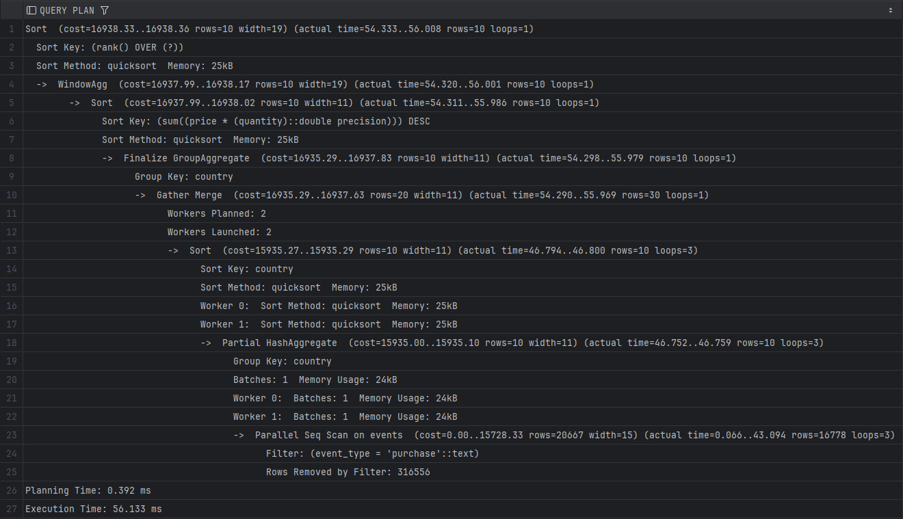

Agregacja jest w Partial HashAggregate i Finalize GroupAggregate (wiersze 18, 8),
sortowanie w Sort (wiersze 5, 13). PostgreSQL przeskanował całą tabelę wierszowo
(Parallel Seq Scan, wiersz 23), dopiero po odczycie odfiltrował rekordy z event_type = 'purchase'.
Żeby przyspieszyć skan, podzielił pracę między dwóch workerów, których wyniki scalił w Gather Merge (wiersz 10).

#### **B1 - ClickHouse**

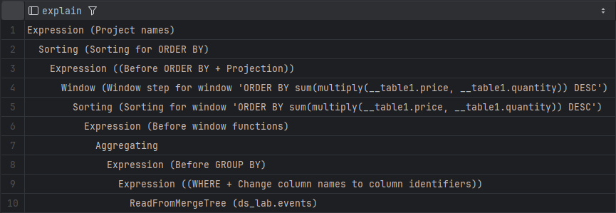

Agregacja jest w Aggregating (wiersz 7), sortowanie w Sorting (wiersze 2, 5).
ClickHouse czyta tylko potrzebne kolumny bezpośrednio z ReadFromMergeTree (wiersz 10),
filtrowanie WHERE odbywa się już podczas odczytu (wiersz 9), nie po nim.
Plan jest krótszy i płaski w porównaniu do postgresa.

#### **B3 - PostgreSQL**

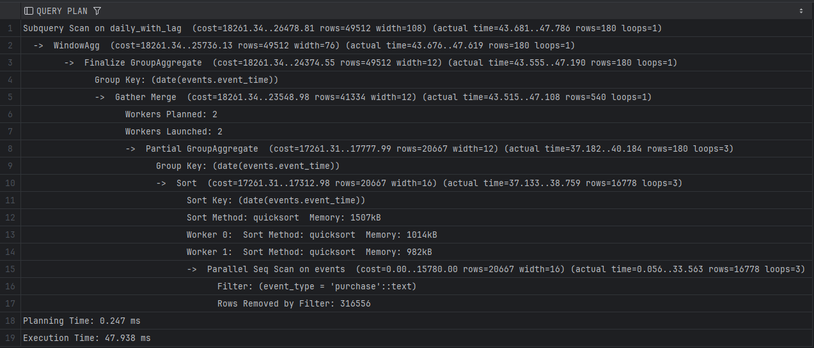

Agregacja jest w Partial GroupAggregate i Finalize GroupAggregate (wiersze 8, 3),
funkcja okna w WindowAgg (wiersz 2), sortowanie w Sort (wiersz 10).
Plan jest wyraźnie bardziej rozbudowany niż B1, pojawia się tam Subquery Scan on daily_with_lag
odpowiadający CTE, a zużycie pamięci na sortowanie wzrosło do 1507 kB wobec 25 kB w B1.
Podobnie jak w B1, postgres skanuje całą tabelę wierszowo i filtruje po odczycie.

#### **B3 - ClickHouse**

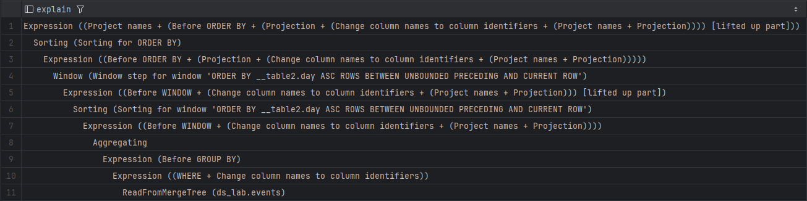

Agregacja jest w Aggregating (wiersz 8), funkcja okna w Window (wiersz 4),
sortowanie w Sorting (wiersze 2, 6). Plan jest dłuższy niż B1 o kilka kroków,
ale struktura pozostaje podobna. ClickHouse nadal czyta tylko potrzebne kolumny
z ReadFromMergeTree i filtruje podczas odczytu.

---

### **Refleksja końcowa – obowiązkowa**

Na podstawie pomiarów i planów napisz **5–8 zdań** odpowiadając na
poniższe pytania. To jest najważniejszy element całego laboratorium.

- Czy różnica czasu między bazami rosła wraz ze złożonością zapytania?

Różnica czasu między bazami rosła wraz ze złożonością, ale nie liniowo. Najwieksza przewaga
ClickHouse ujawniła się przy B2, gdzie postgres potrzebował średnio 603 ms,
a ClickHouse tylko 64 ms, czyli prawie 10x szybciej. Przy B1 i B3 przewaga była mniejsza, odpowiednio ok 2x i 3x. Zaskakujące jest że B3 z dwoma CTE i funkcjami okna okazało się szybsze
niż B1 zarówno w PostgreSQL jak i ClickHouse, może byc to spowodowane tym, że B3 agreguje dane
do poziomu dziennego przed zastosowaniem funkcji okna, co redukuje liczbę przetwarzanych wierszy.

- Przy którym zapytaniu przewaga ClickHouse była największa i jak to
  tłumaczysz?

Największa przewaga ClickHouse przy zapytaniu B2 wynika z tego, że lejek wymaga
przeskanowania całej tabeli i agregacji po session_id, co w postgresie oznacza pełny Seq Scan
przez wszystkie kolumny. ClickHouse czyta tylko te kolumny których potrzebuje (session_id i event_type)
i filtruje dane już podczas odczytu z dysku, zanim trafią do pamięci.

- Co plany wykonania mówią o tym, dlaczego ClickHouse jest szybszy dla
  tego rodzaju zapytań?

Plany wykonania potwierdzają tę różnicę. PostgreSQL zawsze zaczyna od Parallel Seq Scan,
czyli czyta wszystkie kolumny wiersz po wierszu i filtruje dopiero po odczycie. Clickhouse
zaczyna od ReadFromMergeTree i filtruje podczas odczytu, operując na danych kolumnowych
co przy zapytaniach agregujących kilka kolumn z milionów wierszy daje ogromną przewagę.

- Gdybyś był architektem systemu danych w firmie e-commerce obsługującej
  miliony zdarzeń dziennie - dla jakich zadań wybrałbyś ClickHouse, a
  dla jakich PostgreSQL? Uzasadnij konkretnie.

Jako architekt systemu e-commerce wybrałabym ClickHouse do wszystkich zapytań analitycznych czyli
raportowanie przychodow, lejki konwersji, segmentacja użytkowników, szczególnie gdy dane
liczone są w milionach wierszy dziennie. PostgreSQL zostawiłabym do operacji transakcyjnych
gdzie liczy się spójność danych czyli np. rejestrowanie zamówień, aktualizacja stanów magazynowych,
obsluga płatności, bo tam model wierszowy i gwarancje ACID są ważniejsze niż szybkość odczytu.

**Refleksja jest oceniana jako osobny punkt (1 pkt).** Oczekujemy
własnego rozumowania opartego na zmierzonych danych - nie powtórzenia
treści instrukcji.

**Zadanie dodatkowe — dla chętnych (bez dodatkowych punktów)**

Jeżeli skończyłeś wcześniej, wybierz jedną z poniższych opcji.

**Opcja A — agregacja tygodniowa** - przepisz zapytanie z zadania 2 tak,
aby grupowało dane tygodniowo. W ClickHouse użyj toStartOfWeek, w
PostgreSQL DATE_TRUNC('week', ...). Czy wyniki są identyczne? Czy jest
różnica w składni?

**Opcja B — uniq vs uniqExact** - w ClickHouse policz liczbę unikalnych
użytkowników per dzień używając najpierw uniqExact, potem uniq. Zmierz
czas obu wersji. O ile uniq jest szybsze i jak duży jest błąd
przybliżenia? Kiedy w prawdziwym projekcie zaakceptowałbyś wynik
przybliżony?

**Opcja C — własne pytanie analityczne** - zadaj sobie pytanie dotyczące
tabeli events, którego jeszcze nie badałeś, i odpowiedz na nie
zapytaniem SQL. Napisz, skąd wziął się pomysł, jak podszedłeś do
problemu i co odkryłeś.

**Co jest oceniane**

| **Element**                                                                 | **Punkty** |
| --------------------------------------------------------------------------- | ---------- |
| Zadanie 1 — lejek konwersji w ClickHouse + komentarz z wyjaśnieniem countIf | 2          |
| Zadanie 2 — funkcje okna: ranking i trend z LAG                             | 2          |
| Zadanie 3 — segmentacja RFM z własnym doborem progów                        | 2          |
| Zadanie 4 — pomiary benchmarkowe z wypełnioną tabelą                        | 1          |
| Zadanie 4 — analiza planów EXPLAIN                                          | 1          |
| Zadanie 4 — refleksja końcowa                                               | 1          |
| Jakość komentarzy i interpretacji we wszystkich zadaniach                   | 1          |
| Razem                                                                       | 10         |

Napisanie działającego kodu to warunek konieczny, nie wystarczający.
Jeżeli uruchomiłeś zapytanie i dostałeś wynik, ale nie rozumiesz, co z
niego wynika dla biznesu, oddałeś połowę zadania.
