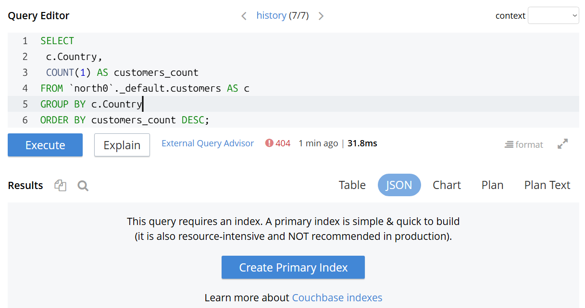
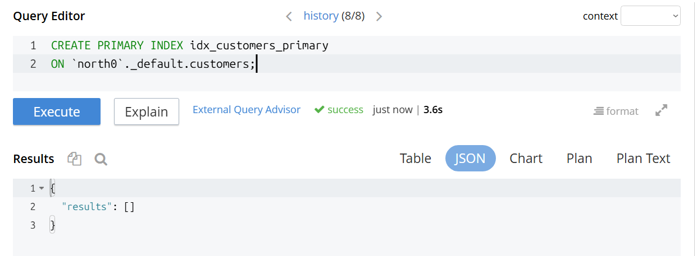
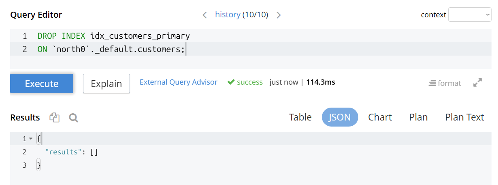
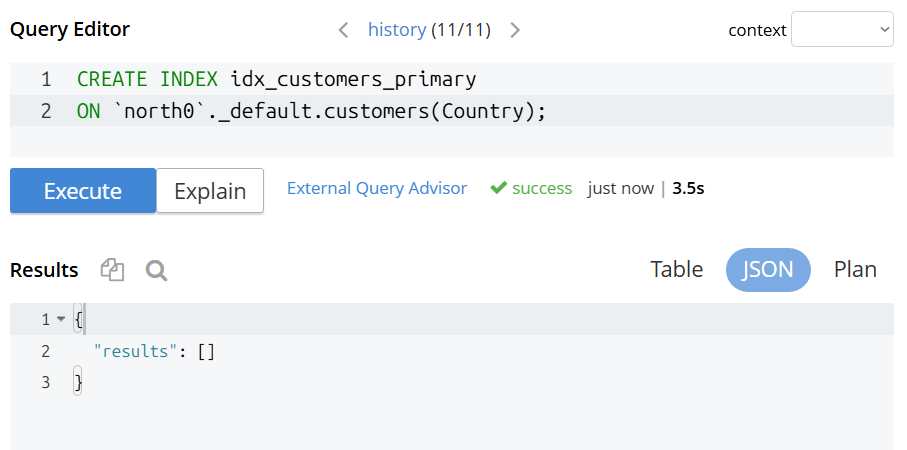
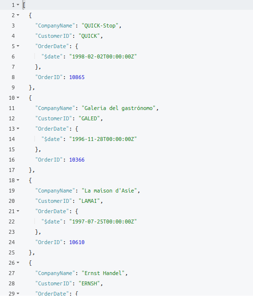
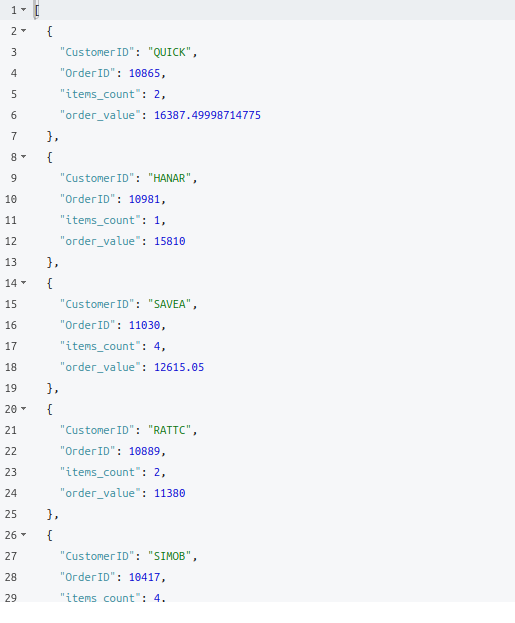
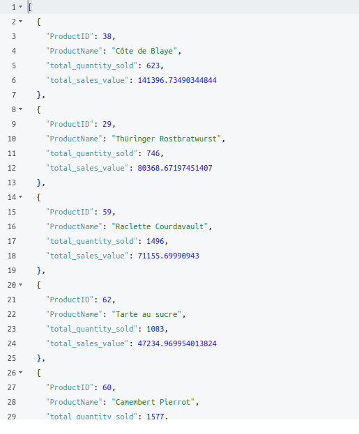
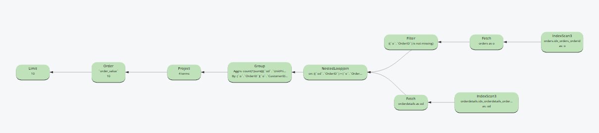
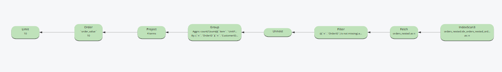

# Laboratorium - dokumentowe bazy danych: Couchbase

**Temat:** Couchbase, dokumenty JSON, indeksy, JOIN, UNNEST i analiza danych Northwind

**Baza:** Couchbase Community uruchomiony w Dockerze

**Bucket:** north0

**Scope:** \_default

**Główne kolekcje:** orders, orderdetails, customers, products, orders_nested

**Imię i nazwisko:** Patrycja Markiewicz, Karolina Węgrzyn

**Grupa:** 1

---

## Cel ćwiczenia

Po wykonaniu laboratorium student powinien umieć:

1. uruchomić i zweryfikować środowisko Couchbase,
2. poruszać się po panelu Couchbase i korzystać z Query Workbench,
3. rozumieć strukturę bucket → scope → collection,
4. wykonać podstawowe zapytania SQL++ / N1QL na dokumentach JSON,
5. wyjaśnić, dlaczego Couchbase wymaga indeksów do wykonywania zapytań,
6. odróżnić primary index od indeksu celowego,
7. wykonać JOIN między kolekcjami dokumentów,
8. porównać model niezagnieżdżony z modelem zagnieżdżonym,
9. użyć UNNEST do rozbijania tablicy zagnieżdżonej w dokumencie,
10. wykorzystać EXPLAIN do podstawowej interpretacji planu zapytania.

## Ważne informacje

W tym laboratorium pracujemy na danych Northwind załadowanych do Couchbase.

Dane są dostępne w dwóch wariantach modelowania:

### Model niezagnieżdżony

Dane są podzielone na osobne kolekcje:

- orders -- zamówienia,
- orderdetails -- pozycje zamówień,
- customers -- klienci,
- products -- produkty.

W tym wariancie, aby połączyć zamówienia z pozycjami zamówień, używamy JOIN.

### Model zagnieżdżony

Dodatkowo przygotowana jest kolekcja:

- orders_nested.

W tej kolekcji jeden dokument odpowiada jednemu zamówieniu, a pozycje zamówienia są zapisane wewnątrz dokumentu w tablicy items. W tym wariancie do rozbicia pozycji zamówienia używamy UNNEST.

### Jak korzystać ze ściągi

Do laboratorium dołączona jest ściąga Couchbase_SQLPP_sciaga.md. Korzystaj z niej jak z dokumentacji pomocniczej: sprawdzaj składnię JOIN, UNNEST, IFMISSINGORNULL, CREATE INDEX i EXPLAIN, ale nie kopiuj bezrefleksyjnie gotowych rozwiązań. Oceniane są również komentarze i interpretacja.

### Sprawozdanie

Oddawane sprawozdanie powinno zawierać:

- kod zapytań,
- wyniki zapytań jako tabele albo zrzuty ekranu,
- krótkie komentarze interpretacyjne,
- odpowiedzi na pytania wskazane w zadaniach.

**Format sprawozdania:** PDF albo Markdown.

**Kod SQL++ / N1QL formatuj jako bloki kodu.**

**Nie oddawaj samych zrzutów ekranu bez komentarza.**

### Punktacja

| Zadanie   | Temat                                                 | Punkty |
| --------- | ----------------------------------------------------- | ------ |
| 0         | Gotowość środowiska                                   | 0      |
| 1         | Pierwsze poznanie Couchbase i danych                  | 1      |
| 2         | Indeksy: brak indeksu, primary index, secondary index | 2      |
| 3         | JOIN na kolekcjach dokumentów                         | 2      |
| 4         | Model niezagnieżdżony vs zagnieżdżony: JOIN vs UNNEST | 2      |
| 5         | Agregacja biznesowa                                   | 1      |
| 6         | EXPLAIN i refleksja końcowa                           | 2      |
| **Razem** |                                                       | **10** |

---

## 0. Gotowość środowiska -- 0 pkt

To zadanie nie jest punktowane, ale jest warunkiem rozpoczęcia pracy.

### Wykonaj

1. Uruchom środowisko:

```bash
docker compose --profile init up -d
```

2. Sprawdź, czy działają kontenery:

```bash
docker ps
```

3. Wejdź do panelu Couchbase:

```
http://localhost:8091
```

4. Zaloguj się:

```
Login: student
Hasło: student
```

5. Sprawdź, czy widzisz bucket:

```
north0
```

6. Wejdź do Query Workbench i uruchom:

```sql
SELECT 1 AS test;
```

### Do sprawozdania

Nie trzeba dołączać pełnych logów. Wystarczy jedno zdanie:

Środowisko Couchbase zostało uruchomione, logowanie działa, bucket north0 jest widoczny, a Query Workbench wykonuje zapytania.

---

## 1. Pierwsze poznanie Couchbase i danych -- 1 pkt

### Cel

Poznaj podstawową strukturę danych w Couchbase i sprawdź, jakie kolekcje
są dostępne.

### Wykonaj

### 1. W panelu Couchbase za pomocą zakładek w menu bocznym np. 'Buckets', 'Documents', 'Query' zbadaj strukturę:

```sql
bucket → scope → collection
```

bucket - odpowiednik bazy danych w SQL, główny kontener danych, który zawiera w sobie scope'y

scope - odpowiednik schematu w SQL, logiczna grupa kolekcji

collection - odpowiednik tabeli w SQL, zawiera dokumenty JSON z danymi

### 2. W Query Workbench policz liczbę dokumentów w kolekcjach:

- orders,

- orderdetails,

- customers,

- products,

- orders_nested.

| Kolekcja      | Liczba dokumentów |
| ------------- | ----------------- |
| orders        | 830               |
| orderdetails  | 2155              |
| customers     | 91                |
| products      | 77                |
| orders_nested | 830               |

```sql
SELECT COUNT(1) AS orders_count
FROM `north0`._default.orders
FHERE OrderID IS NOT MISSING;
```

```sql
SELECT COUNT(1) AS orderdetails_count
FROM `north0`._default.orderdetails
WHERE OrderID IS NOT MISSING;
```

```sql
SELECT COUNT(1) AS customers_count
FROM `north0`._default.customers
WHERE CustomerID IS NOT MISSING;
```

```sql
CREATE INDEX idx_products_productid
ON `north0`._default.products(ProductID);
```

```sql
SELECT COUNT(1) AS products_count
FROM `north0`._default.products
WHERE ProductID IS NOT MISSING;
```

```sql
SELECT COUNT(1) AS orders_nested_count
FROM `north0`._default.orders_nested
WHERE OrderID IS NOT MISSING;
```

### 3. Podejrzyj kilka dokumentów z kolekcji orders.

```sql
SELECT o
FROM `north0`._default.orders AS o
WHERE o.OrderID IS NOT MISSING
LIMIT 3;
```

```json
[
  {
    "o": {
      "CustomerID": "VINET",
      "EmployeeID": 5,
      "Freight": 32.38,
      "OrderDate": {
        "$date": "1996-07-04T00:00:00Z"
      },
      "OrderID": 10248,
      "RequiredDate": {
        "$date": "1996-08-01T00:00:00Z"
      },
      "ShipAddress": "59 rue de l'Abbaye",
      "ShipCity": "Reims",
      "ShipCountry": "France",
      "ShipName": "Vins et alcools Chevalier",
      "ShipPostalCode": "51100",
      "ShipRegion": null,
      "ShipVia": 3,
      "ShippedDate": {
        "$date": "1996-07-16T00:00:00Z"
      },
      "_id": {
        "$oid": "63a060b9bb3b972d6f4e1fc6"
      }
    }
  },
  {
    "o": {
      "CustomerID": "TOMSP",
      "EmployeeID": 6,
      "Freight": 11.61,
      "OrderDate": {
        "$date": "1996-07-05T00:00:00Z"
      },
      "OrderID": 10249,
      "RequiredDate": {
        "$date": "1996-08-16T00:00:00Z"
      },
      "ShipAddress": "Luisenstr. 48",
      "ShipCity": "Münster",
      "ShipCountry": "Germany",
      "ShipName": "Toms Spezialitäten",
      "ShipPostalCode": "44087",
      "ShipRegion": null,
      "ShipVia": 1,
      "ShippedDate": {
        "$date": "1996-07-10T00:00:00Z"
      },
      "_id": {
        "$oid": "63a060b9bb3b972d6f4e1fc7"
      }
    }
  },
  {
    "o": {
      "CustomerID": "HANAR",
      "EmployeeID": 4,
      "Freight": 65.83,
      "OrderDate": {
        "$date": "1996-07-08T00:00:00Z"
      },
      "OrderID": 10250,
      "RequiredDate": {
        "$date": "1996-08-05T00:00:00Z"
      },
      "ShipAddress": "Rua do Paço, 67",
      "ShipCity": "Rio de Janeiro",
      "ShipCountry": "Brazil",
      "ShipName": "Hanari Carnes",
      "ShipPostalCode": "05454-876",
      "ShipRegion": "RJ",
      "ShipVia": 2,
      "ShippedDate": {
        "$date": "1996-07-12T00:00:00Z"
      },
      "_id": {
        "$oid": "63a060b9bb3b972d6f4e1fc8"
      }
    }
  }
]
```

### 4. Podejrzyj jeden dokument z kolekcji orders_nested.

```sql
SELECT o
FROM `north0`._default.orders_nested AS o
WHERE o.OrderID IS NOT MISSING
LIMIT 3;
```

```json
[
  {
    "o": {
      "CustomerID": "VINET",
      "EmployeeID": 5,
      "OrderDate": {
        "$date": "1996-07-04T00:00:00Z"
      },
      "OrderID": 10248,
      "ShipCity": "Reims",
      "ShipCountry": "France",
      "ShipName": "Vins et alcools Chevalier",
      "items": [
        {
          "Discount": 0,
          "LineValue": 98,
          "ProductID": 42,
          "Quantity": 10,
          "UnitPrice": 9.8
        },
        {
          "Discount": 0,
          "LineValue": 168,
          "ProductID": 11,
          "Quantity": 12,
          "UnitPrice": 14
        },
        {
          "Discount": 0,
          "LineValue": 174,
          "ProductID": 72,
          "Quantity": 5,
          "UnitPrice": 34.8
        }
      ],
      "type": "order_nested"
    }
  },
  {
    "o": {
      "CustomerID": "TOMSP",
      "EmployeeID": 6,
      "OrderDate": {
        "$date": "1996-07-05T00:00:00Z"
      },
      "OrderID": 10249,
      "ShipCity": "Münster",
      "ShipCountry": "Germany",
      "ShipName": "Toms Spezialitäten",
      "items": [
        {
          "Discount": 0,
          "LineValue": 167.4,
          "ProductID": 14,
          "Quantity": 9,
          "UnitPrice": 18.6
        },
        {
          "Discount": 0,
          "LineValue": 1696,
          "ProductID": 51,
          "Quantity": 40,
          "UnitPrice": 42.4
        }
      ],
      "type": "order_nested"
    }
  },
  {
    "o": {
      "CustomerID": "HANAR",
      "EmployeeID": 4,
      "OrderDate": {
        "$date": "1996-07-08T00:00:00Z"
      },
      "OrderID": 10250,
      "ShipCity": "Rio de Janeiro",
      "ShipCountry": "Brazil",
      "ShipName": "Hanari Carnes",
      "items": [
        {
          "Discount": 0,
          "LineValue": 77,
          "ProductID": 41,
          "Quantity": 10,
          "UnitPrice": 7.7
        },
        {
          "Discount": 0.15000000596046448,
          "LineValue": 214.19999849796295,
          "ProductID": 65,
          "Quantity": 15,
          "UnitPrice": 16.8
        },
        {
          "Discount": 0.15000000596046448,
          "LineValue": 1261.3999911546707,
          "ProductID": 51,
          "Quantity": 35,
          "UnitPrice": 42.4
        }
      ],
      "type": "order_nested"
    }
  }
]
```

Dokumenty z kolekcji orders i orders_nested różnią się sposobem modelowania danych.
Dokumenty z orders zawierają tylko dane nagłówkowe zamównienia - nie mają listy produktów składających sie na nie. Informacje te znajdują się w innej kolekcji, podejscie podobne do tego z SQL'a. Dokumenty z orders_nested zawierają całe zamówienie w jednym dokumencie - tablica iteams zawiera te dane w sobie. Nie trzeba więc łączyć danych jak w przypadku orders, żeby zobaczyc np. skład zamówienia, podejscie NoSQL.

**Wskazówki**

Przykład zapytania liczącego dokumenty:

```sql
SELECT COUNT(1) AS orders_count
FROM `north0`._default.orders
WHERE OrderID IS NOT MISSING;
```

Przykład podejrzenia dokumentu:

```sql
SELECT o
FROM `north0`._default.orders AS o
WHERE o.OrderID IS NOT MISSING
LIMIT 3;
```

### W komentarzu napisz

- Co oznaczają pojęcia bucket, scope i collection?

- Ile dokumentów znajduje się w kolekcjach orders, orderdetails,
  customers, products i orders_nested?

- Czym różni się dokument z kolekcji orders od dokumentu z kolekcji
  orders_nested?

---

## 2. Indeksy: brak indeksu, primary index, secondary index -- 2 pkt

### Cel

Zobacz, że Couchbase nie wykonuje zapytań bez odpowiedniego indeksu. Następnie porównaj indeks główny z indeksem celowym.

### Część A -- zapytanie bez indeksu

Wykonaj zapytanie:

```sql
SELECT
  c.Country,
  COUNT(1) AS customers_count
FROM `north0`._default.customers AS c
GROUP BY c.Country
ORDER BY customers_count DESC;
```



**Oczekiwane zachowanie**

W świeżo uruchomionym środowisku zapytanie powinno zakończyć się błędem informującym o braku indeksu. Jeżeli zapytanie działa od razu, oznacza to najczęściej, że w środowisku pozostał wcześniej utworzony indeks.

### Część B -- primary index

Utwórz primary index:

```sql
CREATE PRIMARY INDEX idx_customers_primary
ON `north0`._default.customers;
```



Powtórz zapytanie z części A.

```json
[
  {
    "Country": "USA",
    "customers_count": 13
  },
  {
    "Country": "France",
    "customers_count": 11
  },
  {
    "Country": "Germany",
    "customers_count": 11
  },
  {
    "Country": "Brazil",
    "customers_count": 9
  },
  {
    "Country": "UK",
    "customers_count": 7
  },
  {
    "Country": "Spain",
    "customers_count": 5
  },
  {
    "Country": "Mexico",
    "customers_count": 5
  },
  {
    "Country": "Venezuela",
    "customers_count": 4
  },
  {
    "Country": "Argentina",
    "customers_count": 3
  },
  {
    "Country": "Canada",
    "customers_count": 3
  },
  {
    "Country": "Italy",
    "customers_count": 3
  },
  {
    "Country": "Finland",
    "customers_count": 2
  },
  {
    "Country": "Denmark",
    "customers_count": 2
  },
  {
    "Country": "Austria",
    "customers_count": 2
  },
  {
    "Country": "Portugal",
    "customers_count": 2
  },
  {
    "Country": "Sweden",
    "customers_count": 2
  },
  {
    "Country": "Belgium",
    "customers_count": 2
  },
  {
    "Country": "Switzerland",
    "customers_count": 2
  },
  {
    "Country": "Ireland",
    "customers_count": 1
  },
  {
    "Country": "Norway",
    "customers_count": 1
  },
  {
    "Country": "Poland",
    "customers_count": 1
  }
]
```

### Część C -- indeks celowy

Usuń primary index:

```sql
DROP INDEX idx_customers_primary
ON `north0`._default.customers;
```



Utwórz indeks celowy na polu Country:

```sql
CREATE INDEX idx_customers_country
ON `north0`._default.customers(Country);
```



Wykonaj zapytanie z warunkiem indeksowym:

```sql
SELECT
  c.Country,
  COUNT(1) AS customers_count
FROM `north0`._default.customers AS c
WHERE c.Country IS NOT MISSING
GROUP BY c.Country
ORDER BY customers_count DESC;
```

```json
[
  {
    "Country": "USA",
    "customers_count": 13
  },
  {
    "Country": "France",
    "customers_count": 11
  },
  {
    "Country": "Germany",
    "customers_count": 11
  },
  {
    "Country": "Brazil",
    "customers_count": 9
  },
  {
    "Country": "UK",
    "customers_count": 7
  },
  {
    "Country": "Spain",
    "customers_count": 5
  },
  {
    "Country": "Mexico",
    "customers_count": 5
  },
  {
    "Country": "Venezuela",
    "customers_count": 4
  },
  {
    "Country": "Argentina",
    "customers_count": 3
  },
  {
    "Country": "Canada",
    "customers_count": 3
  },
  {
    "Country": "Italy",
    "customers_count": 3
  },
  {
    "Country": "Finland",
    "customers_count": 2
  },
  {
    "Country": "Belgium",
    "customers_count": 2
  },
  {
    "Country": "Austria",
    "customers_count": 2
  },
  {
    "Country": "Portugal",
    "customers_count": 2
  },
  {
    "Country": "Sweden",
    "customers_count": 2
  },
  {
    "Country": "Denmark",
    "customers_count": 2
  },
  {
    "Country": "Switzerland",
    "customers_count": 2
  },
  {
    "Country": "Ireland",
    "customers_count": 1
  },
  {
    "Country": "Poland",
    "customers_count": 1
  },
  {
    "Country": "Norway",
    "customers_count": 1
  }
]
```

### W komentarzu napisz

**Co się stało przy próbie wykonania zapytania bez indeksu?**

Couchbase zwrócił błąd informujący o braku indeksu na kolekcji customers. Zapytanie się nie wykonało w odróżnieniu od typowej bazy relacyjnej, gdzie brak indeksu skutkuje tylko wolniejszym czasem odpowiedzi, w Couchbase planner odmawia wykonania zapytania, jeśli nie znajdzie żadnego indeksu, z którego mógłby skorzystać.

**Czym różni się primary index od indeksu celowego?**

Primary index obejmuje klucze wszystkich dokumentów w kolekcji i pozwala plannerowi obsłużyć dowolne zapytanie, ale w praktyce wymusza pełen skan kolekcji. Indeks celowy jest zbudowany na konkretnym polu i działa skutecznie tylko dla zapytań, które tego pola używają w filtrach lub grupowaniach. W zamian indeks celowy jest dużo szybszy, ponieważ planner od razu sięga do uporządkowanej struktury z wartościami pola, bez przeglądania całych dokumentów.

**Dlaczego w zapytaniu po utworzeniu indeksu celowego dodano warunek WHERE c.Country IS NOT MISSING?**

Indeks celowy obejmuje wyłącznie dokumenty, które posiadają indeksowane pole. Warunek IS NOT MISSING jest sygnałem dla plannera, że zapytanie dotyczy tylko takich dokumentów, dzięki czemu indeks może zostać użyty. Bez tego warunku planner może uznać, że indeks nie pokrywa pełnego zbioru i odmówić jego wykorzystania.

**Dlaczego w środowisku produkcyjnym nie powinno się traktować primary index jako rozwiązania docelowego?**

Ponieważ wymusza operację Primary Scan, czyli pobieranie i sprawdzanie każdego dokumentu w kolekcji przy każdym zapytaniu. W środowisku produkcyjnym, gdzie danych są tysiące lub miliony, takie podejście jest niewydajne, bardzo wolne i niepotrzebnie obciąża procesor oraz pamięć serwera.

---

## 3.** JOIN **na kolekcjach dokumentów -- 2 pkt

### Cel

Zobacz, że Couchbase pozwala wykonywać JOIN podobny do SQL, ale pracuje
na dokumentach JSON i kolekcjach, a nie na klasycznych tabelach
relacyjnych.

### Część A -- zamówienia z nazwą klienta

Dla zamówień pokaż:

- OrderID,

- OrderDate,

- CustomerID,

- CompanyName.

Przed wykonaniem zapytania utwórz indeks potrzebny do łączenia z
kolekcją customers:

```sql
  CREATE INDEX idx_customers_customerid
  ON `north0`._default.customers(CustomerID);
```

Jeżeli indeks już istnieje, Couchbase zwróci komunikat o istniejącym
indeksie. W takiej sytuacji przejdź do kolejnego kroku.

Następnie przygotuj zapytanie łączące orders z customers.

```sql
SELECT
    o.OrderID,
    o.OrderDate,
    o.CustomerID,
    c.CompanyName
FROM `north0`._default.orders AS o
JOIN `north0`._default.customers AS c
ON o.CustomerID = c.CustomerID;
```



### Część B -- zamówienia i pozycje zamówień

Dla pozycji zamówień pokaż:

- OrderID,

- CustomerID,

- ProductID,

- UnitPrice,

- Quantity,

- Discount.

Wykorzystaj kolekcje:

- orders,

- orderdetails.

**Uwaga:** indeksy idx_orders_orderid oraz idx_orderdetails_orderid
zostały utworzone automatycznie podczas inicjalizacji środowiska. Nie
trzeba ich zakładać ręcznie. Jeżeli mimo to spróbujesz je utworzyć,
Couchbase poinformuje, że indeks już istnieje -- to nie jest błąd.

```sql
SELECT
    o.OrderID,
    o.CustomerID,
    od.ProductID,
    od.UnitPrice,
    od.Quantity,
    od.Discount
FROM `north0`._default.orders AS o
JOIN `north0`._default.orderdetails AS od
ON o.OrderID = od.OrderID;
```

### Część C -- wartość zamówienia

Policz wartość zamówienia według wzoru:

```sql
wartość pozycji = UnitPrice * Quantity * (1 - Discount)
```

Brak rabatu traktuj jako 0.

**Wskazówka:** w dokumentach JSON pole Discount może nie istnieć albo
mieć wartość null. W Couchbase do obsługi takich sytuacji służy funkcja
IFMISSINGORNULL(od.Discount, 0), która zwraca 0, jeżeli pole nie
istnieje lub jest puste.

Dla każdego zamówienia oblicz:

- OrderID,

- CustomerID,

- order_value,

- liczbę pozycji zamówienia.

Pokaż 10 zamówień o najwyższej wartości.

```sql
SELECT
    o.OrderID,
    o.CustomerID,
    SUM(
        od.UnitPrice * od.Quantity *
        (1 - IFMISSINGORNULL(od.Discount, 0))
    ) AS order_value,
    COUNT(1) AS items_count
FROM `north0`._default.orders AS o
JOIN `north0`._default.orderdetails AS od
ON o.OrderID = od.OrderID
GROUP BY o.OrderID, o.CustomerID
ORDER BY order_value DESC
LIMIT 10;
```



### W komentarzu napisz

- Czy JOIN w Couchbase przypomina składnię znaną z SQL?

Tak, bardzo są podobne obie składnie.

- Czym różni się takie łączenie od relacji w klasycznej bazie relacyjnej
  (np. czy baza wymusza klucze obce i spójność relacji tak jak w typowym
  modelu relacyjnym)?

W SQL relacje są wymuszone przez klucze obce i baza pilnuje spójności danych. W Couchbase nie ma kluczy obcych i wymuszania relacji. JOIN działa na poziomie zapytania łącząc dokumenty, ale nie muszą być one spójne - baza nie pilnuje spójności danych.

- Dlaczego indeks po stronie dołączanej kolekcji jest ważny?

Indeks po stronie dołączanej kolekcji jest ważny, bo decyduje on czy JOIN szybko wyszuka pasujących dokumentów, czy wykona pełne skanowanie.

- Czy największe zamówienia mają zawsze największą liczbę pozycji?

Nie, największe zamówienia maja 1-2 pozycje, a mniejsze posiadają nawet 5 pozycji - wyniki tylko z pierwszych 10 dokumentów.

---

## 4. Model niezagnieżdżony vs zagnieżdżony: JOIN vs UNNEST -- 2 pkt

### Cel

Porównaj dwa sposoby modelowania tych samych danych:

1. model niezagnieżdżony: orders + orderdetails,
2. model zagnieżdżony: orders_nested, gdzie pozycje zamówienia są tablicą items.

### Część A -- obejrzyj dokument zagnieżdżony

Podejrzyj dokument zamówienia o numerze 10248 z kolekcji orders_nested.

Zwróć uwagę na pole:

```
items
```

Zapytanie:

```sql
SELECT n
FROM `north0`._default.orders_nested AS n
WHERE n.OrderID = 10248;
```

```json
[
  {
    "o": {
      "CustomerID": "VINET",
      "EmployeeID": 5,
      "OrderDate": {
        "$date": "1996-07-04T00:00:00Z"
      },
      "OrderID": 10248,
      "ShipCity": "Reims",
      "ShipCountry": "France",
      "ShipName": "Vins et alcools Chevalier",
      "items": [
        {
          "Discount": 0,
          "LineValue": 98,
          "ProductID": 42,
          "Quantity": 10,
          "UnitPrice": 9.8
        },
        {
          "Discount": 0,
          "LineValue": 168,
          "ProductID": 11,
          "Quantity": 12,
          "UnitPrice": 14
        },
        {
          "Discount": 0,
          "LineValue": 174,
          "ProductID": 72,
          "Quantity": 5,
          "UnitPrice": 34.8
        }
      ],
      "type": "order_nested"
    }
  }
]
```

### Część B -- rozbij tablicę items przez UNNEST

Dla zamówienia 10248 pokaż wszystkie pozycje zamówienia z tablicy items.

Wynik powinien zawierać:

- OrderID,
- CustomerID,
- ProductID,
- UnitPrice,
- Quantity,
- Discount,
- LineValue.

**Wskazówka składniowa**

UNNEST rozbija tablicę zagnieżdżoną w dokumencie na osobne rekordy. Każdy element tablicy staje się oddzielnym wierszem w wyniku:

```sql
SELECT
  n.OrderID,
  item.ProductID
FROM `north0`._default.orders_nested AS n
UNNEST n.items AS item
WHERE n.OrderID = 10248;
```

Rozbuduj to zapytanie o pozostałe kolumny wymienione powyżej.

```sql
SELECT
  n.OrderID,
  n.CustomerID,
  item.ProductID,
  item.UnitPrice,
  item.Quantity,
  item.Discount,
  item.LineValue
FROM `north0`._default.orders_nested AS n
UNNEST n.items AS item
WHERE n.OrderID = 10248;
```

```json
[
  {
    "CustomerID": "VINET",
    "Discount": 0,
    "LineValue": 98,
    "OrderID": 10248,
    "ProductID": 42,
    "Quantity": 10,
    "UnitPrice": 9.8
  },
  {
    "CustomerID": "VINET",
    "Discount": 0,
    "LineValue": 168,
    "OrderID": 10248,
    "ProductID": 11,
    "Quantity": 12,
    "UnitPrice": 14
  },
  {
    "CustomerID": "VINET",
    "Discount": 0,
    "LineValue": 174,
    "OrderID": 10248,
    "ProductID": 72,
    "Quantity": 5,
    "UnitPrice": 34.8
  }
]
```

### Część C -- policz wartość zamówień z modelu zagnieżdżonego

Na kolekcji orders_nested policz:

- OrderID,
- CustomerID,
- order_value,
- liczbę pozycji.

Użyj UNNEST.

Pokaż 10 zamówień o najwyższej wartości.

```sql
SELECT
  n.OrderID,
  n.CustomerID,
  ROUND(SUM(item.UnitPrice * item.Quantity * (1 - IFMISSINGORNULL(item.Discount, 0))), 2) AS order_value,
  COUNT(1) AS items_count
FROM `north0`._default.orders_nested AS n
UNNEST n.items AS item
WHERE n.OrderID IS NOT MISSING
GROUP BY n.OrderID, n.CustomerID
ORDER BY order_value DESC
LIMIT 10;
```

```json
[
  {
    "CustomerID": "QUICK",
    "OrderID": 10865,
    "items_count": 2,
    "order_value": 16387.5
  },
  {
    "CustomerID": "HANAR",
    "OrderID": 10981,
    "items_count": 1,
    "order_value": 15810
  },
  {
    "CustomerID": "SAVEA",
    "OrderID": 11030,
    "items_count": 4,
    "order_value": 12615.05
  },
  {
    "CustomerID": "RATTC",
    "OrderID": 10889,
    "items_count": 2,
    "order_value": 11380
  },
  {
    "CustomerID": "SIMOB",
    "OrderID": 10417,
    "items_count": 4,
    "order_value": 11188.4
  },
  {
    "CustomerID": "KOENE",
    "OrderID": 10817,
    "items_count": 4,
    "order_value": 10952.84
  },
  {
    "CustomerID": "HUNGO",
    "OrderID": 10897,
    "items_count": 2,
    "order_value": 10835.24
  },
  {
    "CustomerID": "RATTC",
    "OrderID": 10479,
    "items_count": 4,
    "order_value": 10495.6
  },
  {
    "CustomerID": "QUICK",
    "OrderID": 10540,
    "items_count": 4,
    "order_value": 10191.7
  },
  {
    "CustomerID": "QUICK",
    "OrderID": 10691,
    "items_count": 5,
    "order_value": 10164.8
  }
]
```

### Część D -- porównaj wynik z modelem niezagnieżdżonym

Porównaj wynik z części C z wynikiem otrzymanym wcześniej przez JOIN na orders i orderdetails (zadanie 3C).

Minimum: porównaj wizualnie top 10 zamówień z obu podejść i napisz, czy wyniki są zgodne.

```sql
SELECT
  o.OrderID,
  o.CustomerID,
  ROUND(SUM(od.UnitPrice * od.Quantity * (1 - IFMISSINGORNULL(od.Discount, 0))), 2) AS order_value,
  COUNT(1) AS items_count
FROM `north0`._default.orders AS o
JOIN `north0`._default.orderdetails AS od
  ON od.OrderID = o.OrderID
WHERE o.OrderID IS NOT MISSING
GROUP BY o.OrderID, o.CustomerID
ORDER BY order_value DESC
LIMIT 10;
```

```json
[
  {
    "CustomerID": "QUICK",
    "OrderID": 10865,
    "items_count": 2,
    "order_value": 16387.5
  },
  {
    "CustomerID": "HANAR",
    "OrderID": 10981,
    "items_count": 1,
    "order_value": 15810
  },
  {
    "CustomerID": "SAVEA",
    "OrderID": 11030,
    "items_count": 4,
    "order_value": 12615.05
  },
  {
    "CustomerID": "RATTC",
    "OrderID": 10889,
    "items_count": 2,
    "order_value": 11380
  },
  {
    "CustomerID": "SIMOB",
    "OrderID": 10417,
    "items_count": 4,
    "order_value": 11188.4
  },
  {
    "CustomerID": "KOENE",
    "OrderID": 10817,
    "items_count": 4,
    "order_value": 10952.84
  },
  {
    "CustomerID": "HUNGO",
    "OrderID": 10897,
    "items_count": 2,
    "order_value": 10835.24
  },
  {
    "CustomerID": "RATTC",
    "OrderID": 10479,
    "items_count": 4,
    "order_value": 10495.6
  },
  {
    "CustomerID": "QUICK",
    "OrderID": 10540,
    "items_count": 4,
    "order_value": 10191.7
  },
  {
    "CustomerID": "QUICK",
    "OrderID": 10691,
    "items_count": 5,
    "order_value": 10164.8
  }
]
```

Opcjonalnie: jeżeli chcesz potwierdzić zgodność formalnie, możesz napisać zapytanie z WITH, które porówna wartości zamówień z obu modeli dla wszystkich 830 zamówień.

```sql
WITH
  flat AS (
    SELECT
      o.OrderID,
      SUM(od.UnitPrice * od.Quantity * (1 - IFMISSINGORNULL(od.Discount, 0))) AS value_flat
    FROM `north0`._default.orders AS o
    JOIN `north0`._default.orderdetails AS od ON od.OrderID = o.OrderID
    WHERE o.OrderID IS NOT MISSING
    GROUP BY o.OrderID
  ),
  nested AS (
    SELECT
      n.OrderID,
      SUM(item.UnitPrice * item.Quantity * (1 - IFMISSINGORNULL(item.Discount, 0))) AS value_nested
    FROM `north0`._default.orders_nested AS n
    UNNEST n.items AS item
    WHERE n.OrderID IS NOT MISSING
    GROUP BY n.OrderID
  )
SELECT
  flat.OrderID,
  ROUND(flat.value_flat, 2) AS value_flat,
  ROUND(nested.value_nested, 2) AS value_nested,
  ROUND(ABS(flat.value_flat - nested.value_nested), 2) AS diff
FROM flat
JOIN nested ON nested.OrderID = flat.OrderID
WHERE ABS(flat.value_flat - nested.value_nested) > 0.01
ORDER BY diff DESC;
```

```json
{
  "results": []
}
```

Zrobiłam jeszcze wersję z EXCEPT:

```sql
(SELECT
   n.OrderID,
   n.CustomerID,
   ROUND(SUM(item.UnitPrice * item.Quantity * (1 - IFMISSINGORNULL(item.Discount, 0))), 2) AS order_value,
   COUNT(1) AS items_count
 FROM `north0`._default.orders_nested AS n
 UNNEST n.items AS item
 WHERE n.OrderID IS NOT MISSING
 GROUP BY n.OrderID, n.CustomerID
 ORDER BY order_value DESC
 LIMIT 10)
EXCEPT
(SELECT
   o.OrderID,
   o.CustomerID,
   ROUND(SUM(od.UnitPrice * od.Quantity * (1 - IFMISSINGORNULL(od.Discount, 0))), 2) AS order_value,
   COUNT(1) AS items_count
 FROM `north0`._default.orders AS o
 JOIN `north0`._default.orderdetails AS od ON od.OrderID = o.OrderID
 WHERE o.OrderID IS NOT MISSING
 GROUP BY o.OrderID, o.CustomerID
 ORDER BY order_value DESC
 LIMIT 10);
```

```json
{
  "results": []
}
```

### W komentarzu napisz

**Na czym polega różnica między JOIN i UNNEST?**

JOIN łączy dwie osobne kolekcje przez warunek na wspólnym polu, używamy go wtedy, kiedy dane są rozdzielone między różne dokumenty. UNNEST rozbija tablicę, która już jest wewnątrz jednego dokumentu, na osobne wiersze. Wynik jest taki sam, ale punkt wyjścia jest zupełnie inny, JOIN wymaga, żeby dane do połączenia istniały w dwóch miejscach, UNNEST zakłada, że są w jednym.

**Dlaczego w modelu zagnieżdżonym nie trzeba łączyć orders z orderdetails?**

Bo nie ma osobnej kolekcji orderdetails. Pozycje są w dokumencie zamówienia jako tablica items. Wystarczy odczytać dokument i rozbić tę tablicę. Nie ma czego z czym łączyć.

**Czy oba podejścia dają ten sam wynik biznesowy?**

Tak. Top 10 zamówień z obu zapytań wyszło identycznie - te same numery, te same wartości, te same liczby pozycji.

**Kiedy zagnieżdżanie pozycji zamówienia w dokumencie może być wygodne?**

Wtedy, kiedy aplikacja prawie zawsze czyta pozycje razem z zamówieniem, np. wyświetla szczegóły zamówienia, generuje fakturę, pokazuje historię klienta. W takiej sytuacji jedno pobranie dokumentu zwraca komplet danych, bez konieczności łączenia z drugą kolekcją. Działa też dobrze, kiedy pozycji jest niedużo i kiedy aktualizują się atomowo razem z zamówieniem.

**Kiedy lepiej zostawić dane w osobnych kolekcjach?**

Kiedy pozycje są analizowane niezależnie od zamówień, np. raporty sprzedaży po produktach, gdzie agregujemy pozycje z setek różnych zamówień. W zagnieżdżonym modelu trzeba by za każdym razem rozbijać tablice ze wszystkich zamówień, żeby dostać się do pozycji. Drugi powód to rozmiar. Jeśli pozycji mogłoby być tysiące w jednym zamówieniu, dokument urośnie do nieprzyzwoitych rozmiarów i każda aktualizacja stanie się droga.

---

## 5. Agregacja biznesowa -- 1 pkt

### Cel

Wykonaj prostą analizę biznesową na danych dokumentowych.

### Wybierz jeden wariant

Do zaliczenia zadania wybierz jeden wariant. Jeżeli skończysz wcześniej,
wykonaj drugi wariant jako ćwiczenie dodatkowe.

### Wariant A -- top 10 produktów po wartości sprzedaży

Dla produktów policz:

- ProductID,

- ProductName,

- łączną liczbę sprzedanych sztuk,

- łączną wartość sprzedaży.

Wykorzystaj kolekcje:

- orderdetails,

- products.

Przed zapytaniem może być potrzebny indeks:

```sql
CREATE INDEX idx_products_productid
ON `north0`._default.products(ProductID);

CREATE INDEX idx_orderdetails_productid
ON `north0`._default.orderdetails(ProductID);
```

Jeżeli indeks już istnieje, Couchbase zwróci komunikat o istniejącym
indeksie --- to nie jest błąd.

```sql
SELECT
    p.ProductID,
    p.ProductName,
    SUM(od.Quantity) AS total_quantity_sold,
    SUM(
        od.UnitPrice * od.Quantity *
        (1 - IFMISSINGORNULL(od.Discount, 0))
    ) AS total_sales_value
FROM `north0`._default.products AS p
JOIN `north0`._default.orderdetails AS od
ON p.ProductID = od.ProductID
GROUP BY p.ProductID, p.ProductName
ORDER BY total_sales_value DESC;
```



### W komentarzu napisz

- Który produkt albo klient ma najwyższą wartość sprzedaży?

Najwyższą wartość sprzedaży ma Côte de Blaye.

- Czy wynik jest łatwy do biznesowej interpretacji?

Wynik jest łatwy do interpretacji biznesowej, bo przedstawia ranking produktów według sprzedaży, ale w formie tabeli byłby jeszcze bardziej czytelny niż jako JSON.

- Czy zapytanie bardziej przypomina klasyczny SQL/BI, czy pracę z
  dokumentami JSON?

Zapytanie bardziej przypomina klasyczny SQL, mimo, że dane są dokumentowe.

---

## 6. EXPLAIN i refleksja końcowa -- 2 pkt

### Cel

Nie wystarczy wiedzieć, że zapytanie działa. Trzeba jeszcze rozumieć, w jaki sposób baza je wykonuje.

### Część A -- plan dla zapytania z JOIN

Wybierz zapytanie z zadania 3 albo 5 i uruchom je z EXPLAIN (albo za pomocą przycisku w menu).

Przykład:

```sql
EXPLAIN
SELECT
  o.OrderID,
  o.CustomerID,
  ROUND(SUM(od.UnitPrice * od.Quantity * (1 - IFMISSINGORNULL(od.Discount, 0))), 2) AS order_value,
  COUNT(1) AS items_count
FROM `north0`._default.orders AS o
JOIN `north0`._default.orderdetails AS od
  ON od.OrderID = o.OrderID
WHERE o.OrderID IS NOT MISSING
GROUP BY o.OrderID, o.CustomerID
ORDER BY order_value DESC
LIMIT 10;
```



### Część B -- plan dla zapytania z UNNEST

Wybierz zapytanie z zadania 4 i uruchom je z EXPLAIN.

```sql
EXPLAIN
SELECT
  n.OrderID,
  n.CustomerID,
  ROUND(SUM(item.UnitPrice * item.Quantity * (1 - IFMISSINGORNULL(item.Discount, 0))), 2) AS order_value,
  COUNT(1) AS items_count
FROM `north0`._default.orders_nested AS n
UNNEST n.items AS item
WHERE n.OrderID IS NOT MISSING
GROUP BY n.OrderID, n.CustomerID
ORDER BY order_value DESC
LIMIT 10;
```



### Część C -- porównanie

Porównaj oba plany na poziomie ogólnym.

Nie opisuj całego planu. Wystarczy wskazać, z jakich indeksów korzysta zapytanie, czy pojawia się JOIN albo UNNEST, oraz gdzie widać agregację i sortowanie.

Wskaż elementy typu:

- IndexScan,
- Fetch,
- NestedLoopJoin,
- Unnest,
- Group,
- Order,
- Limit.

Najwyraźniejsza różnica to obecność NestedLoopJoin w planie A i Unnest w planie B. Plan A musi pracować z dwoma kolekcjami i dwoma indeksami - dla każdego zamówienia z orders planner sięga przez idx_orderdetails_orderid po pasujące pozycje, a potem dociąga je drugim Fetch. Plan B obchodzi się jedną kolekcją i jednym indeksem, bo pozycje są już wewnątrz dokumentu zamówienia, wystarczy je rozwinąć operatorem Unnest. Indeks idx_orders_nested_orderid w planie B służy tylko do wyboru zamówień, sam Unnest indeksu nie potrzebuje, bo operuje na danych z dokumentu pobranego wczesniej przez Fetch. W planie A drugi indeks jest konieczny, bo dla każdego zamówienia trzeba odnaleźć pasujące pozycje w osobnej kolekcji. Końcówka obu planów (agregacja → projekcja → sortowanie z limitem) jest praktycznie identyczna.

### W komentarzu końcowym napisz

Odpowiedz w kilku zdaniach:

**Co było największą różnicą między Couchbase a klasyczną bazą relacyjną?**

Najbardziej widać to w dwóch rzeczach. Po pierwsze, elastyczność dokumentu. W bazie relacyjnej kolumna albo ma wartość, albo jest NULL. W Couchbase pole może w ogóle nie istnieć MISSING, więc trzeba świadomie pisać IFMISSINGORNULL albo IS NOT MISSING, żeby zapytania działały sensownie na różnych dokumentach. Po drugie, rola indeksów. W bazie relacyjnej indeks to optymalizacja, bez niego zapytanie po prostu działa wolniej. W Couchbase bez pasujacego indeksu zapytanie często się nie wykona, bo planner odmawia. To wymusza inny styl pracy, w którym indeksy projektuje się równolegle do zapytań, nie po fakcie.

**Dlaczego indeksy są tak ważne w Couchbase?**

Bo to podstawowa struktura, z której korzysta planner. Bez indeksu nie ma jak dotrzeć do dokumentów inaczej niż przez ich klucz, a tego klucza zwykle nie znamy z góry, bo szukamy po polach wewnątrz JSONa. Dzięki indeksom zamiast szukać wśród wszystkich dokumentów można znaleźć konkretne wartości w posortowanej strukturze.

**Co pokazało porównanie JOIN i UNNEST?**

Pokazało, że ten sam wynik można uzyskać dwoma drogami, ale plan wykonania wygląda inaczej. JOIN potrzebuje dwóch indeksów, dwóch operacji Fetch i operatora łączącego NestedLoopJoin. UNNEST obchodzi się jednym indeksem, jednym Fetch i rozbiciem tablicy Unnest. To nie jest tylko różnica składniowa, ale konsekwencja decyzji, czy dane trzymamy osobno, czy zagnieżdżamy.

**Czy dokumentowy model danych wyklucza analizę i raportowanie?**

Nie. Couchbase ma wszystkie elementy potrzebne do raportów, czyli agregacje, sortowanie, grupowanie, JOIN-y. Różnica jest taka, że klasyczna hurtownia danych jest projektowana pod analitykę, a baza dokumentowa zwykle pod aplikację.

**Gdybyś projektował system zamówień, kiedy rozważyłbyś zagnieżdżenie pozycji zamówienia w dokumencie zamówienia?**

Wtedy, kiedy aplikacja prawie zawsze odczytuje pozycje razem z zamówieniem, czyli przy szczegółach w panelu klienta, fakturze, potwierdzeniu na maila. Jedno pobranie dokumentu zamiast JOIN-a to konkretna oszczędność. Drugi argument to atomowość, bo pozycje zmieniają się razem z zamówieniem, więc nie da się przypadkiem zaktualizować jednego bez drugiego. Z drugiej strony, gdyby pozycje miały być analizowane masowo niezależnie od zamówień (np raporty po produktach) albo gdyby ich liczba w jednym zamówieniu mogła być duża, wtedy zagnieżdżanie zaczyna przeszkadzać i lepiej trzymać dane w osobnych kolekcjach.

---

## Zadanie dodatkowe dla chętnych

### Materializacja KPI klienta

Utwórz kolekcję customer_kpis, a następnie zapisz do niej gotowe dokumenty z metrykami klienta:

- CustomerID,
- CompanyName,
- Revenue,
- OrdersCount.

Następnie wykonaj zapytanie raportowe na kolekcji customer_kpis.

**Uwaga**: wskazówki do rozwiązania zadania znajdziesz w ściądze.

W komentarzu napisz:

- czym różni się liczenie raportu „w locie" od czytania gotowej kolekcji KPI,
- kiedy takie podejście może być użyteczne,
- jakie jest ryzyko materializowania wyników, jeśli dane źródłowe się zmieniają.
