# Raport

# Przetwarzanie i analiza danych przestrzennych

# Oracle spatial

---

**Imiona i nazwiska:**

Karolina Węgrzyn, Patrycja Markiewicz

---

Celem ćwiczenia jest zapoznanie się ze sposobem przechowywania, przetwarzania i analizy danych przestrzennych w bazach danych
(na przykładzie systemu Oracle spatial)

Swoje odpowiedzi wpisuj w miejsca oznaczone jako:

---

> Wyniki, zrzut ekranu, komentarz

```sql
--  ...
```

---

Do wykonania ćwiczenia (zadania 1 – 6) i wizualizacji danych wykorzystaj Oracle SQL Develper. Alternatywnie możesz wykonać analizy w środowisku Python/Jupyter Notebook

Do wykonania zadania 7 wykorzystaj środowisko Python/Jupyter Notebook

Raport należy przesłać w formacie pdf.

Należy też dołączyć raport zawierający kod w formacie źródłowym.

Np.

- plik tekstowy .sql z kodem poleceń
- plik .md zawierający kod wersji tekstowej
- notebook programu jupyter – plik .ipynb

Zamieść kod rozwiązania oraz zrzuty ekranu pokazujące wyniki, (dołącz kod rozwiązania w formie tekstowej/źródłowej)

Zwróć uwagę na formatowanie kodu

<div style="page-break-after: always;"></div>

# Zadanie 1

Zwizualizuj przykładowe dane

US_STATES

> Wyniki, zrzut ekranu, komentarz

```sql
select * from us_states
```

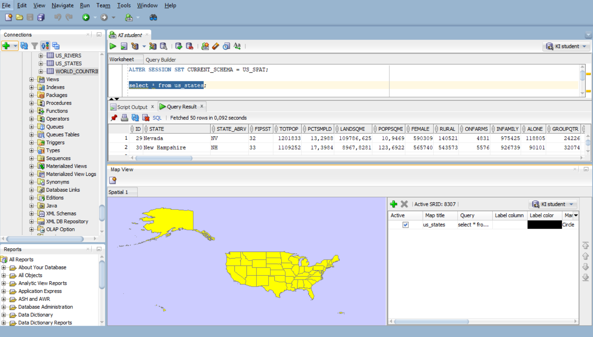

US_INTERSTATES

> Wyniki, zrzut ekranu, komentarz

```sql
select * from us_interstates
```

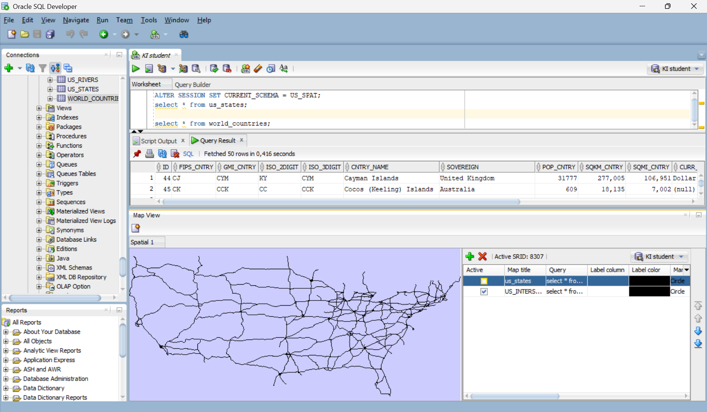
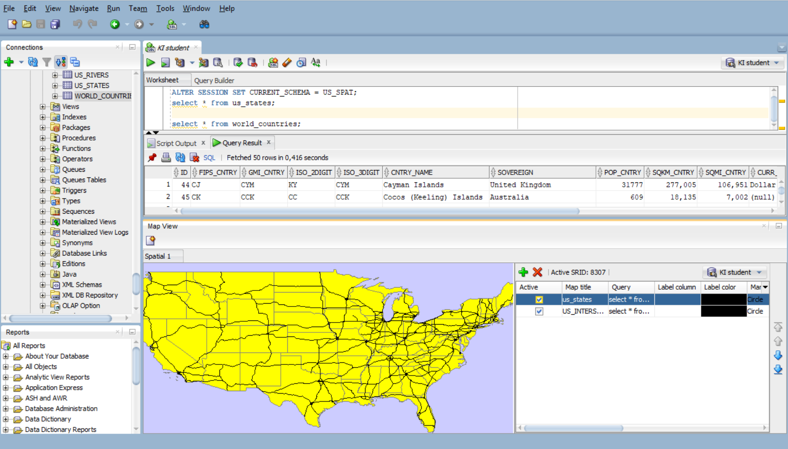

US_CITIES

> Wyniki, zrzut ekranu, komentarz

```sql
select * from us_cities
```

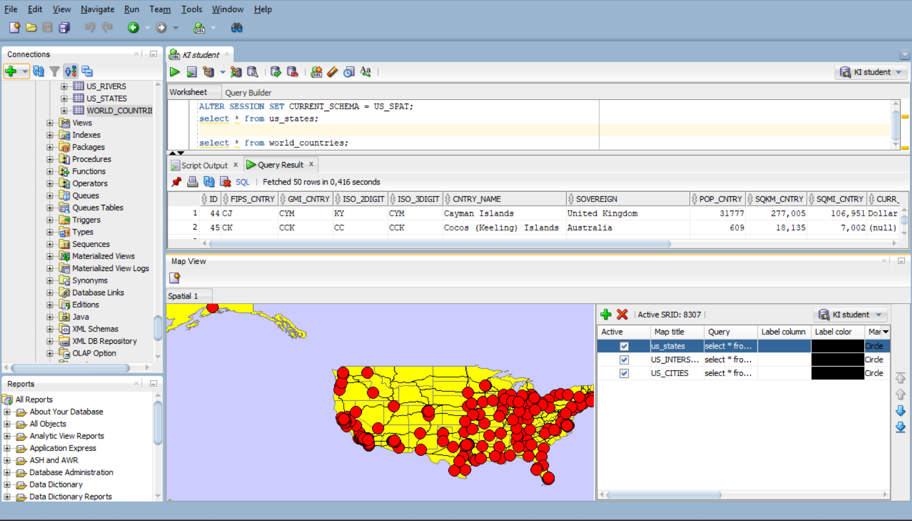

```sql
select * from us_cities
where state_abrv = 'FL'
```

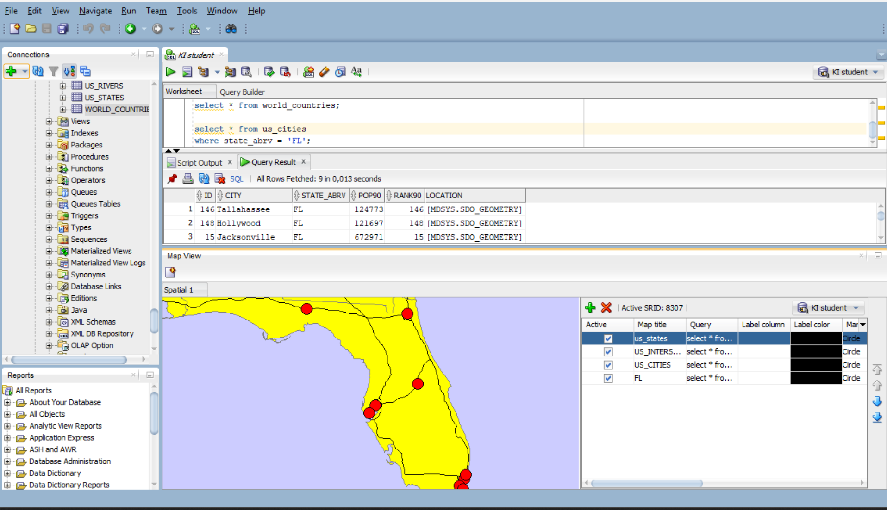

US_RIVERS

> Wyniki, zrzut ekranu, komentarz

```sql
select * from us_rivers
```

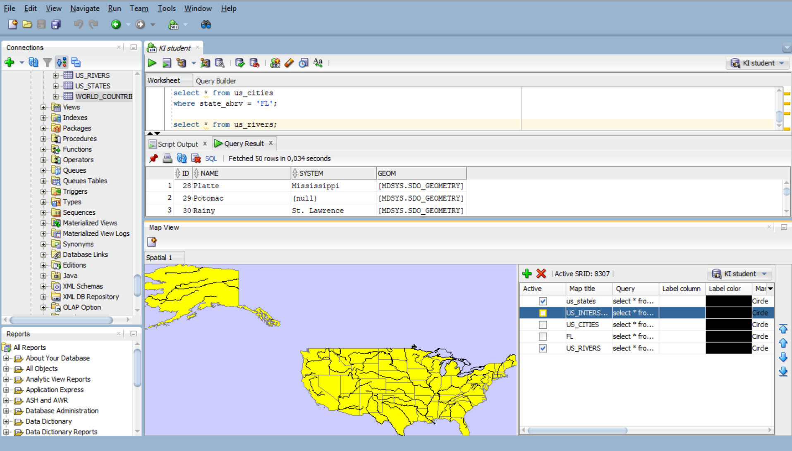

US_COUNTIES

> Wyniki, zrzut ekranu, komentarz

```sql
select * from us_counties
```

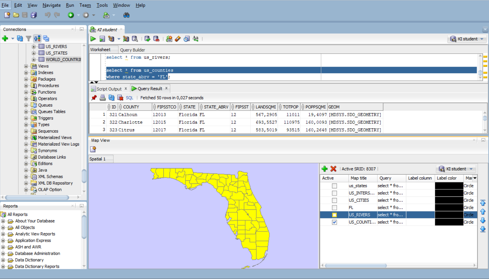

US_PARKS

> Wyniki, zrzut ekranu, komentarz

```sql
select * from us_parks
where id < 50
```

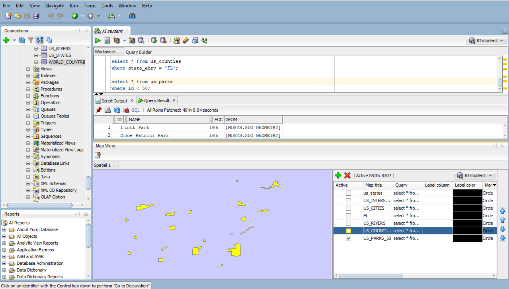

# Zadanie 2

Znajdź wszystkie stany (us_states) których obszary mają część wspólną ze wskazaną geometrią (prostokątem)

Pokaż wynik na mapie.

prostokąt

```sql
SELECT  sdo_geometry (2003, 8307, null,
sdo_elem_info_array (1,1003,3),
sdo_ordinate_array ( -117.0, 40.0, -90., 44.0)) g
FROM dual
```

> Wyniki, zrzut ekranu, komentarz

```sql
--  ...
```

Użyj funkcji SDO_FILTER

```sql
SELECT state, geom FROM us_states
WHERE sdo_filter (geom,
sdo_geometry (2003, 8307, null,
sdo_elem_info_array (1,1003,3),
sdo_ordinate_array ( -117.0, 40.0, -90., 44.0))
) = 'TRUE';
```

Zwróć uwagę na liczbę zwróconych wierszy (16)

> Wyniki, zrzut ekranu, komentarz

```sql
--  ...
```

Użyj funkcji SDO_ANYINTERACT

```sql
SELECT state, geom FROM us_states
WHERE sdo_anyinteract (geom,
sdo_geometry (2003, 8307, null,
sdo_elem_info_array (1,1003,3),
sdo_ordinate_array ( -117.0, 40.0, -90., 44.0))
) = 'TRUE';
```

Porównaj wyniki sdo_filter i sdo_anyinteract

Pokaż wynik na mapie

> Wyniki, zrzut ekranu, komentarz

```sql
--  ...
```

# Zadanie 3

Znajdź wszystkie parki (us_parks) których obszary znajdują się wewnątrz stanu Wyoming

Użyj funkcji SDO_INSIDE

```sql
SELECT p.name, p.geom
FROM us_parks p, us_states s
WHERE s.state = 'Wyoming'
      AND SDO_INSIDE (p.geom, s.geom ) = 'TRUE';
```

W przypadku wykorzystywania narzędzia SQL Developer, w celu wizualizacji na mapie użyj podzapytania

```sql
SELECT pp.name, pp.geom FROM us_parks pp
WHERE id IN
(
      SELECT p.id
      FROM us_parks p, us_states s
      WHERE s.state = 'Wyoming'
            AND SDO_INSIDE (p.geom, s.geom ) = 'TRUE'
)
```

> Wyniki, zrzut ekranu, komentarz

```sql
--  ...
```

```sql
SELECT state, geom FROM us_statesIdeConnections%2523K1student//STUDENT/QUEUE+TABLE
WHERE state = 'Wyoming'
```

> Wyniki, zrzut ekranu, komentarz

```sql
--  ...
```

Porównaj wynik z:

```sql
SELECT p.name, p.geom
FROM us_parks p, us_states s
WHERE s.state = 'Wyoming'
AND SDO_ANYINTERACT (p.geom, s.geom ) = 'TRUE';
```

W celu wizualizacji użyj podzapytania

> Wyniki, zrzut ekranu, komentarz

```sql
--  ...
```

# Zadanie 4

Znajdź wszystkie jednostki administracyjne (us_counties) wewnątrz stanu New Hampshire

```sql
SELECT c.county, c.state_abrv, c.geom
FROM us_counties c, us_states s
WHERE s.state = 'New Hampshire'
AND SDO_RELATE ( c.geom,s.geom, 'mask=INSIDE+COVEREDBY') = 'TRUE';

SELECT c.county, c.state_abrv, c.geom
FROM us_counties c, us_states s
WHERE s.state = 'New Hampshire'
AND SDO_RELATE ( c.geom,s.geom, 'mask=INSIDE') = 'TRUE';

SELECT c.county, c.state_abrv, c.geom
FROM us_counties c, us_states s
WHERE s.state = 'New Hampshire'
AND SDO_RELATE ( c.geom,s.geom, 'mask=COVEREDBY') = 'TRUE';
```

W przypadku wykorzystywania narzędzia SQL Developer, w celu wizualizacji danych na mapie należy użyć podzapytania (podobnie jak w poprzednim zadaniu)

> Wyniki, zrzut ekranu, komentarz

```sql
--- map g1
SELECT c.county,
       c.state_abrv,
       c.geom
FROM us_counties c
WHERE c.id IN
(
    SELECT c2.id
    FROM us_counties c2,
         us_states s
    WHERE s.state = 'New Hampshire'
      AND SDO_RELATE(
            c2.geom,
            s.geom,
            'mask=INSIDE+COVEREDBY'
          ) = 'TRUE'
);

--- map g2
SELECT c.county,
       c.state_abrv,
       c.geom
FROM us_counties c
WHERE c.id IN
(
    SELECT c2.id
    FROM us_counties c2,
         us_states s
    WHERE s.state = 'New Hampshire'
      AND SDO_RELATE(
            c2.geom,
            s.geom,
            'mask=INSIDE'
          ) = 'TRUE'
);

--- map g3
SELECT c.county,
       c.state_abrv,
       c.geom
FROM us_counties c
WHERE c.id IN
(
    SELECT c2.id
    FROM us_counties c2,
         us_states s
    WHERE s.state = 'New Hampshire'
      AND SDO_RELATE(
            c2.geom,
            s.geom,
            'mask=TOUCH'
          ) = 'TRUE'
);
```

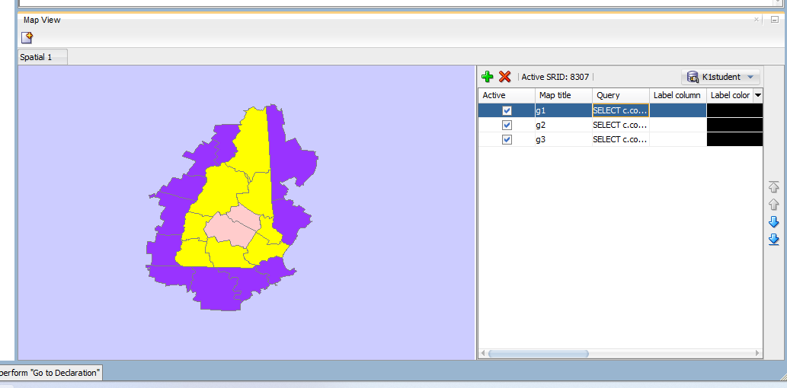

Zapytanie g1 zwraca wszystkie hrabstwa znajdujące się w New Hampshire - całkowicie wewnętrzne (INSIDE) oraz te, które mogą leżeć na granicy stanu (COVEREDBY).

Zapytanie g2 zawiera tylko te hrabstwa, które w pełni są zawarte wewnątrz stanu New Hampshire.

Zapytanie g3 zwraca hrabstwa, które mają kontakt graniczny ze stanem New Hampshire -  stykają się z granicą stanu, ale nie mają wspólnego wnętrza.


# Zadanie 5

Znajdź wszystkie miasta w odległości 50 mili od drogi (us_interstates) I4

Pokaż wyniki na mapie

```sql
SELECT * FROM us_interstates
WHERE interstate = 'I4'

SELECT * FROM us_states
WHERE state_abrv = 'FL'

SELECT c.city, c.state_abrv, c.location
FROM us_cities c
WHERE ROWID IN
(
SELECT c.rowid
FROM us_interstates i, us_cities c
WHERE i.interstate = 'I4'
AND sdo_within_distance (c.location, i.geom,'distance=50 unit=mile') = 'TRUE'
)
```

> Wyniki, zrzut ekranu, komentarz

```sql
--  ...
```

Dodatkowo:

a)    Znajdz wszystkie drogi które przecinają rzekę Mississippi

b)    Znajdz wszystkie miasta w odlegości od 15 do 30 mil od drogi 'I275'

c)      Itp. (własne przykłady)

> Wyniki, zrzut ekranu, komentarz
> (dla każdego z podpunktów)

```sql
--  ...
```

# Zadanie 6

Znajdz 5 miast najbliższych drogi I4

```sql
SELECT c.city, c.state_abrv, c.location
FROM us_interstates i, us_cities c
WHERE i.interstate = 'I4'
AND sdo_nn(c.location, i.geom, 'sdo_num_res=5') = 'TRUE';
```

> Wyniki, zrzut ekranu, komentarz

```sql
--- map fl
SELECT s.state,
       s.geom
FROM us_states s
WHERE s.state = 'Florida';

--- map city
SELECT c.city,
       c.state_abrv,
       c.location
FROM us_cities c
WHERE c.id IN
(
    SELECT c2.id
    FROM us_cities c2,
         us_interstates i
    WHERE i.interstate = 'I4'
      AND SDO_NN(c2.location, i.geom, 'sdo_num_res=5') = 'TRUE'
);

--- road
SELECT i.interstate,
       i.geom
FROM us_interstates i
WHERE i.interstate = 'I4';
```

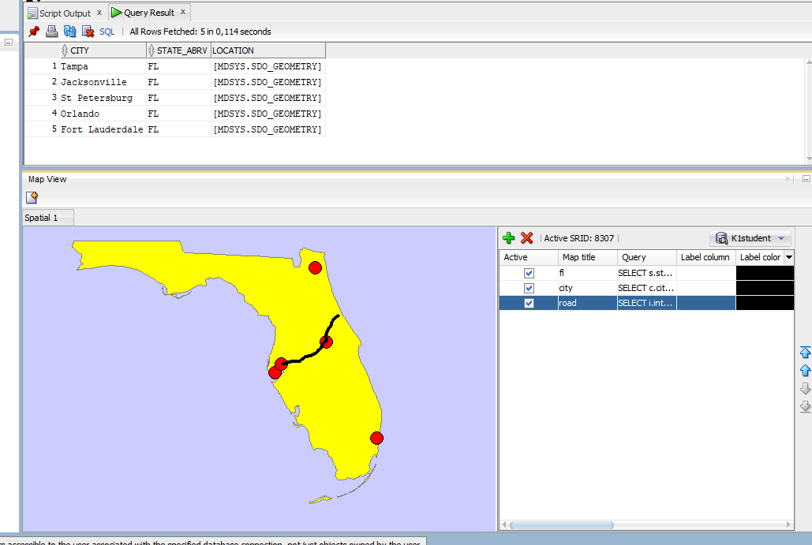

SDO_NN - znajdź najbliższe obiekty geograficzne

Dodatkowo:

a) Podaj 3 parki narodowe do których jest najbliżej z Nowego Jorku, oblicz odległości do tych parków

```sql
SELECT p.name,
       p.geom,
       SDO_NN_DISTANCE(1) AS distance_km
FROM us_parks p,
     us_cities c
WHERE c.city = 'New York'
  AND c.state_abrv = 'NY'
  AND SDO_NN(
        p.geom,
        c.location,
        'sdo_num_res=3 unit=km',
        1
      ) = 'TRUE'
ORDER BY distance_km;
```

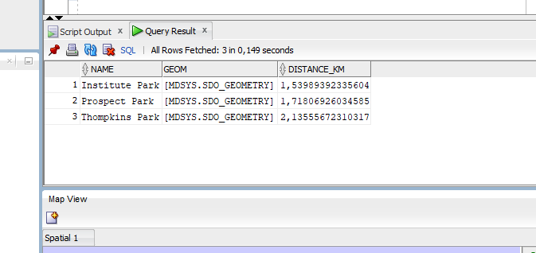

b) Znajdz 5 najbliższych dużych miast (o populacji powyżej 300 tys) od drogi  'I170'

```sql
SELECT *
FROM (
    SELECT c.city,
           c.state_abrv,
           c.pop90,
           c.location
    FROM us_cities c,
         us_interstates i
    WHERE i.interstate = 'I170'
      AND c.pop90 > 300000
      AND SDO_NN(c.location, i.geom) = 'TRUE'
)
WHERE ROWNUM <= 5;
```

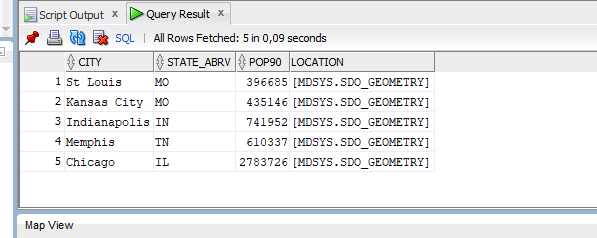

WHERE ROWNUM <= 5 jako znane LIMIT 5, żeby ograniczyć liczbę wyświetlanych wyników. Jeżeli damy ograniczenie do środka SDO_NN to potem sprawdzany jest warunek populacji przez co zmniejsza się liczba wierszy w wyniku - nie otrzymujemy 5.

c)  Itp. (własne przykłady).

- np. przetestuj działanie funkcji
  - sdo_intersection, sdo_union, sdo_difference
  - sdo_buffer
  - sdo_centroid, sdo_mbr, sdo_convexhull, sdo_simplify

> Wyniki, zrzut ekranu, komentarz
> (dla każdego z podpunktów)

```sql
--  ...
```

# Zadanie 7

Wykonaj kilka własnych przykładów/analiz

> Wyniki, zrzut ekranu, komentarz

```sql
--  ...
```

Punktacja

|       |     |
| ----- | --- |
| zad   | pkt |
| 1     | 0,5 |
| 2     | 0,5 |
| 3     | 0,5 |
| 4     | 0,5 |
| 5     | 1   |
| 6     | 2   |
| 7     | 2   |
| razem | 7   |
